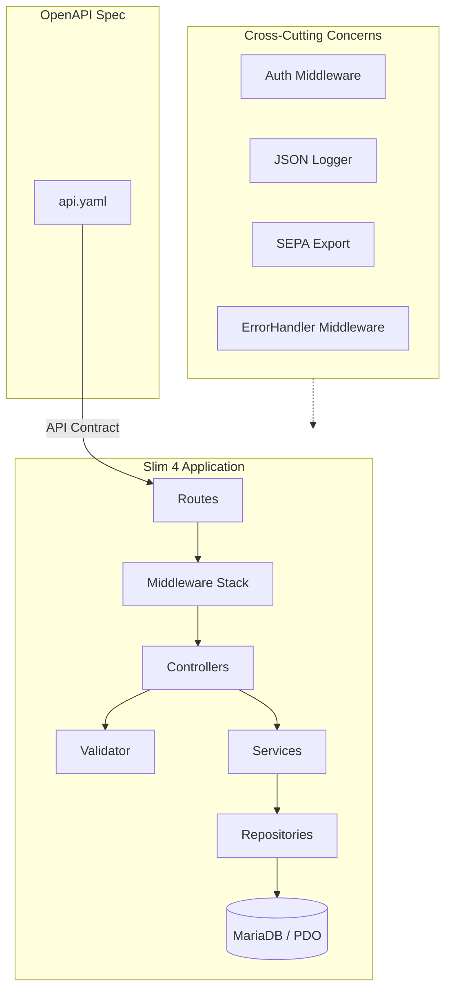

# Backend – Technology Stack and Architecture

## Technologies

| Layer | Technology | Responsibility |
|-------|------------|----------------|
| **Runtime** | PHP 8.3 | Server environment |
| **Framework** | Slim 4 | PSR-15 routing, middleware, PSR-7 request/response |
| **Database** | PDO + MariaDB/MySQL | Raw SQL queries, prepared statements |
| **API Spec** | OpenAPI 3.0 | API documentation |
| **Code Patterns** | DTOs, Enums, Services, Repositories | Type-safe data transfer, business logic isolation (see `backend/patterns/`) |
| **Auth** | Custom middleware | Session-based admin auth, Bearer token terminal auth |
| **Validation** | Custom Validator | Rule-based input validation with PDO-backed unique checks |
| **Logging** | Custom Logger (JSON) | Structured logging, daily log files |
| **SEPA Export** | digitick/sepa-xml | pain.008 XML generation |
| **Testing** | PHPUnit + Playwright | Unit tests + E2E API tests |
| **DI Container** | ServiceFactory | Manual DI implementing PSR ContainerInterface |

---

## Architecture Layers

| Layer | Responsibility |
|-------|----------------|
| **OpenAPI Spec** | API contract (Single Source of Truth) |
| **Routes** | Slim routing: URL → Controller mapping |
| **Middleware** | Auth, CORS, JSON parsing, error handling (PSR-15) |
| **Controllers** | Request/Response routing (thin, no business logic) |
| **Validator** | Input validation in controllers (Pattern 001) |
| **Services** | Business logic, orchestration (Pattern 004) |
| **Repositories** | Data access via PDO prepared statements (Pattern 005) |
| **DTOs** | Type-safe response data with `fromRow()` / `toArray()` (Pattern 003) |
| **Enums** | Type-safe domain values (Pattern 002) |
| **Exceptions** | Centralized error handling via middleware (Pattern 007) |
| **ServiceFactory** | DI container and dependency wiring (Pattern 008) |
| **Exports** | SEPA XML/CSV generation |

---

## Architecture Diagram



---

## Components in Detail

### 1. Slim 4 Routing (PSR-15)

Routes defined in `src/routes.php` using Slim's `RouteCollectorProxy`:

```php
return function (App $app): void {
    $app->get('/api/health', [HealthController::class, 'check']);
    $app->group('/api/sync', function (RouteCollectorProxy $group) {
        $group->get('/members', [MembersSyncController::class, 'index']);
    })->add(TerminalTokenAuth::class);
};
```

### 2. Database Access (PDO / Raw SQL)

| Entity | Table | Access Pattern |
|--------|-------|----------------|
| Members | `members` | PDO prepared statements |
| Products | `products` | PDO prepared statements |
| Transactions | `transactions` | Append-only (ADR-0004) |
| Settlements | `settlements` | PDO prepared statements |
| Admin Users | `admin_users` | PDO prepared statements |

### 3. Authentication (Custom Middleware)

| Aspect | Implementation |
|--------|----------------|
| **Admin Auth** | Session-based (`AdminSessionAuth` middleware) |
| **Terminal Auth** | Bearer token (`TerminalTokenAuth` middleware) |
| **Session Storage** | Server-side PHP sessions |
| **Token Storage** | `terminals` table, SHA-256-hashed with a bounded lifetime (Pattern 012). Not bcrypt — a 256-bit random token needs no slow hash, and a fast one is an indexed lookup |
| **RFID** | Member identification (not authentication) |

### 4. Logging (JSON, Daily Files)

| Log Type | Channel | Content |
|----------|---------|---------|
| **Application** | Daily JSON files | Errors, warnings, info |
| **Audit** | `audit_log` table | Admin actions, data changes |

### 5. SEPA Export (digitick/sepa-xml)

| Export | Format | Usage |
|--------|--------|-------|
| **SEPA XML** | pain.008.001.08 | Bank upload |
| **CSV** | Semicolon, UTF-8 BOM | Verification, Backup |

---

## Deployment

| Environment | Setup |
|-------------|-------|
| **Development** | Docker Compose (nginx + PHP-FPM + MariaDB) |
| **Production** | nginx + PHP-FPM, MariaDB |

Minimum server requirements: PHP 8.3, Composer, MariaDB/MySQL.

---

## Code Patterns

Backend architecture uses proven patterns to maintain code quality, consistency, and testability across modules. Reference `backend/patterns/` for detailed implementation guides:

| Pattern | Purpose | ADR Link |
|---------|---------|----------|
| **Validator** | Rule-based input validation with typed rules | ADR-0017 (Input Validation) |
| **Enums** | Type-safe domain values (languages, transaction types, statuses) | ADR-0018 (Modularity) |
| **DTOs** | Type-safe response data with `fromRow()` / `toArray()` | ADR-0018 (Type-Safe Responses) |
| **Service Layer** | Business logic isolated from HTTP; reusable across consumers | ADR-0018 (Clean Separation) |
| **Repository** | Data access via PDO prepared statements | ADR-0018 (Independence) |
| **Thin Controllers** | Controllers route PSR-7 requests → Service → Response | ADR-0018 (Clean Separation) |
| **ErrorHandler** | Centralized error responses via PSR-15 middleware | ADR-0018 (Shared Infrastructure) |
| **ServiceFactory** | Manual DI container implementing PSR ContainerInterface | ADR-0018 (Dependency Inversion) |

**Key architectural flow:**
```
HTTP Request
  ↓
Middleware (CORS, JSON parsing, Auth)
  ↓
Controller (thin, routing only)
  ↓
Validator (input validation)
  ↓
Service (business logic)
  ↓
Repository (PDO data access)
  ↓
DTO (type-safe response)
  ↓
JSON Response
```

All code must follow these patterns to maintain consistency with ADR-0018 (Modular Admin Interface Architecture). Patterns apply across all backend modules: members, products, transactions, settlements, etc.

---
