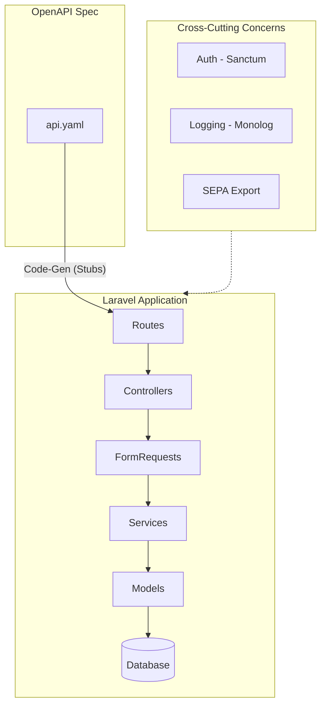

# Backend – Technology Stack and Architecture

## Technologies

| Layer | Technology | Responsibility |
|-------|------------|----------------|
| **Runtime** | PHP 8.3 | Server environment |
| **Framework** | Laravel 11 | Routing, Middleware, DI, Validation |
| **ORM** | Eloquent | DB mapping, Migrations, Relationships |
| **API Spec** | OpenAPI 3.0 | API documentation, Code generation |
| **Code Gen** | openapi-generator | Controller stubs, Request validation |
| **Code Patterns** | DTOs, Enums, Services, Repositories | Type-safe data transfer, business logic isolation (see `backend/patterns/`) |
| **Auth** | Laravel Sanctum | Token-based authentication |
| **Logging** | Monolog | Structured logging, Audit trail |
| **SEPA Export** | digitick/sepa-xml | pain.008 XML generation |
| **Testing** | PHPUnit + Pest | Unit + Feature tests |
| **DB** | SQLite / MySQL | Persistence |

---

## Architecture Layers

| Layer | Responsibility |
|-------|----------------|
| **OpenAPI Spec** | API contract (Single Source of Truth) |
| **Routes** | URL → Controller mapping |
| **Controllers** | Request/Response routing (thin, no business logic) |
| **FormRequests** | Input validation with typed accessors (Pattern 001) |
| **Services** | Business logic, orchestration (Pattern 004) |
| **Repositories** | Data access abstraction (Pattern 005) |
| **Models** | Eloquent entities (immutable-safe) |
| **DTOs** | Type-safe response data (Pattern 003) |
| **Enums** | Type-safe domain values (Pattern 002) |
| **Exceptions** | Centralized error handling (Pattern 007) |
| **Service Providers** | DI configuration and bindings (Pattern 008) |
| **Exports** | SEPA XML/CSV generation |

---

## Architecture Diagram



---

## Components in Detail

### 1. OpenAPI → Code Generation

| Artifact | Generated | Manual |
|----------|-----------|--------|
| **Controller Stubs** | ✓ Interface/Signature | Implementation |
| **FormRequests** | ✓ Validation rules | - |
| **Routes** | ✓ | - |
| **DTOs/Resources** | ✓ | - |

```bash
# Generation
openapi-generator-cli generate \
  -i openapi/api.yaml \
  -g php-laravel \
  -o app/Generated/
```

### 2. Eloquent ORM (DB Mapping)

| Model | Table | Relationships |
|-------|-------|---------------|
| `User` | `users` | hasMany(Transaction) |
| `Product` | `products` | hasMany(Transaction) |
| `Transaction` | `transactions` | belongsTo(User, Product) |
| `Settlement` | `settlements` | hasMany(SettlementItem) |
| `SettlementItem` | `settlement_items` | belongsTo(Settlement, User) |
| `Admin` | `admins` | - |

### 3. Authentication (Sanctum)

| Aspect | Implementation |
|--------|----------------|
| **Method** | Token-based (Bearer) |
| **Token Creation** | On login |
| **Token Storage** | `personal_access_tokens` table |
| **Validity** | Configurable (e.g., 24h) |
| **Middleware** | `auth:sanctum` |

### 4. Logging (Monolog)

| Log Type | Channel | Content |
|----------|---------|---------|
| **Application** | `daily` | Errors, Warnings |
| **Audit** | `audit` | Admin actions, Changes |
| **SEPA** | `sepa` | Export operations |

### 5. SEPA Export (digitick/sepa-xml)

| Export | Format | Usage |
|--------|--------|-------|
| **SEPA XML** | pain.008.001.02 | Bank upload |
| **CSV** | Semicolon, UTF-8 BOM | Verification, Backup |

---

## Deployment

| Environment | Setup |
|-------------|-------|
| **Development** | `php artisan serve`, SQLite |
| **Production** | nginx + PHP-FPM, MySQL/SQLite |
| **Docker** | Optional, single container sufficient |

Minimum server requirements: PHP 8.3, Composer, SQLite or MySQL.

---

## Code Patterns

Backend architecture uses proven patterns to maintain code quality, consistency, and testability across modules. Reference `backend/patterns/` for detailed implementation guides:

| Pattern | Purpose | ADR Link |
|---------|---------|----------|
| **Form Requests** | Declarative input validation with type-safe accessors | ADR-0017 (Input Validation) |
| **Enums** | Type-safe domain values (languages, transaction types, statuses) | ADR-0018 (Modularity) |
| **DTOs** | Type-safe response data transfer with consistent formatting | ADR-0018 (Type-Safe Responses) |
| **Service Layer** | Business logic isolated from HTTP; reusable across consumers | ADR-0018 (Clean Separation) |
| **Repository Interface** | Abstract data access to enable testing and implementation swapping | ADR-0018 (Independence) |
| **Thin Controllers** | Controllers route HTTP → Service → Response (no business logic) | ADR-0018 (Clean Separation) |
| **Exception Handler** | Centralized error responses and logging | ADR-0018 (Shared Infrastructure) |
| **Service Provider** | Dependency injection and lifecycle management | ADR-0018 (Dependency Inversion) |

**Key architectural flow:**
```
HTTP Request
  ↓
FormRequest (validation)
  ↓
Controller (thin, routing only)
  ↓
Service (business logic)
  ↓
Repository (data access)
  ↓
DTO (type-safe response)
  ↓
JSON Response
```

All code must follow these patterns to maintain consistency with ADR-0018 (Modular Admin Interface Architecture). Patterns apply across all backend modules: members, products, transactions, settlements, etc.

---
