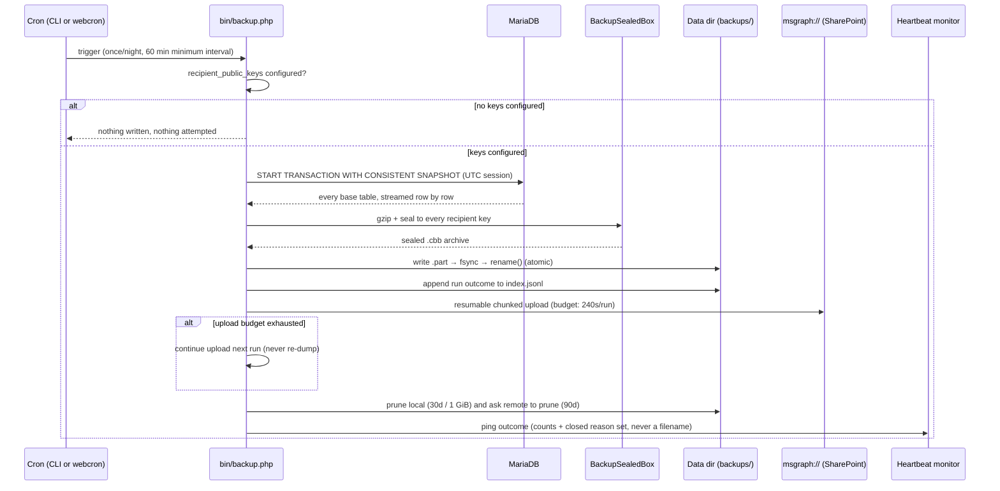
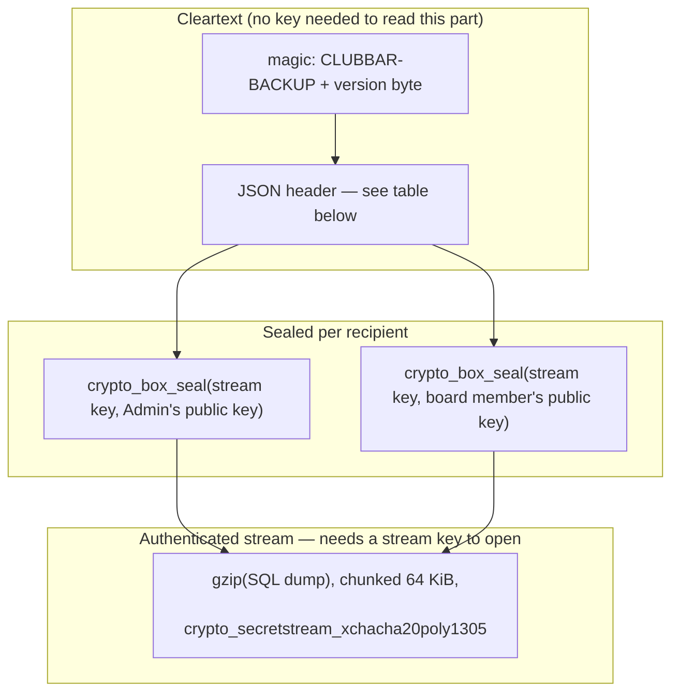
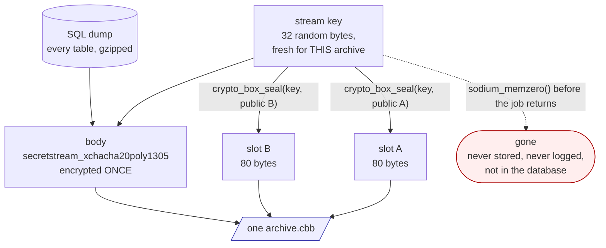
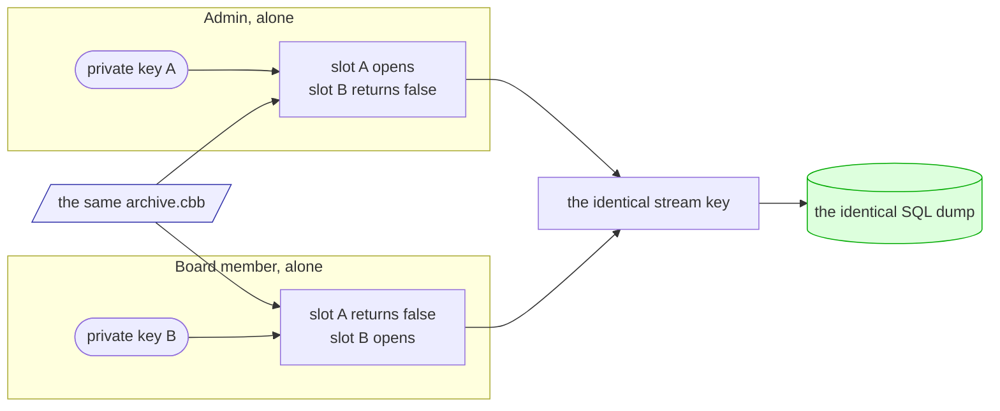
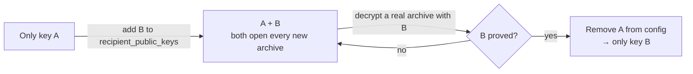
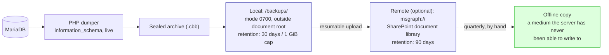

# Backups

How Club Bar gets a member database off a shared-hosting account that has no
shell, no `crontab` and no `mysqldump` — encrypted so the server that makes an
archive cannot read it back, and without adding a service, a subscription, or a
third-party backup product to run.

**Full rationale**: [ADR-0049](../adr/0049-encrypted-offsite-backups-on-shared-hosting.md).
**Provisioning the optional remote target**: [m365-backup-target.md](./m365-backup-target.md).
**Restoring, repairing a table, or responding to a compromise**: [runbook-backup-recovery.md](./runbook-backup-recovery.md).
**The use case**: [UC-A83](../use-cases/admin/UC-A83-database-backup.md).

---

## 1. What "no complex dependencies" means here

Every other backup approach considered in ADR-0049 pulled in something Club
Bar's target host — ordinary shared webhosting — does not have: a shell for
`mysqldump`, a long-lived credential for a pull-based CI job, a third-party
backup SaaS with its own data-processing agreement. All were rejected for the
same reason: **the product ships as a ZIP other clubs self-host**, so a backup
that depends on infrastructure the maintainer controls is not a backup for
them.

What ships instead runs entirely inside the application the club already has:

| Instead of | Club Bar uses | Because |
|---|---|---|
| `mysqldump` | A hand-written PHP dumper reading `information_schema` | The reference host has no `mysqldump` binary and no shell |
| A backup SaaS or agent | The application's own scheduled job (CLI or URL trigger) | No new processor, no new bill, no new thing to configure on a host the maintainer never sees |
| GPG / a passphrase file | A [libsodium](https://libsodium.gitbook.io/doc/) sealed box, the same primitive family already used for IBANs (ADR-0036, ADR-0048) | One crypto library the codebase already depends on and already audits, not a second one |
| A server-side restore tool | A static, offline HTML page (`tools/backup-decryptor.html`) | Restoring must not need SSH either — the reference host doesn't have that, so the restore tool can't need it |
| A backup admin screen | `config.php`, written once by the installer | A restore would revert a database-stored setting — see [§6](#6-why-there-is-no-admin-screen) |

Nothing here talks to a package registry at runtime, spawns a subprocess, or
requires a binary beyond what the PHP `sodium` and `zlib` extensions already
provide.

---

## 2. What happens every night



Two things this diagram is deliberately faithful to:

- **The dump and the upload are different problems with different failure
  modes.** A dump must be atomic — a snapshot that ran out of time is aborted
  outright, never resumed, because a resumed dump produces a torn file that
  *looks* like a backup and isn't. An upload, by contrast, is safe to resume:
  it is bytes going out, not a database being read, so a run that runs out of
  its 240-second upload budget picks the same archive back up next night.
- **Configuring a key is the on/off switch.** There is no separate "backups
  enabled" flag anywhere in `config.php`. A flag could disagree with the keys,
  and the only way it could disagree is an installation switched on with no
  key — which would fail every night rather than back up. So the job checks
  one thing, and reports honestly either way: nothing configured means
  nothing attempted, not a silent no-op that looks like success.

---

## 3. Encryption: sealed to people, not to a password

The archive format (`backend/src/Shared/Security/BackupSealedBox.php`,
version 3) is a **sealed box to a list of recipients** — a construction
already in production for IBANs (ADR-0036) — layered with an authenticated
stream cipher over the payload, so a party without any private key gets
neither the data nor the ability to tamper with it undetected.



The arrows above are **byte order, not data flow** — the two sealed slots do
not feed the body, they sit beside it. How the pieces actually relate is
[§3.1](#31-one-archive-two-holders).

**Why the header sits outside the encryption.** It carries no secret — table
names and row counts are not member data — and a future holder needs to know
*which key opens this* before being asked to produce one. Everything that
could change the plaintext is inside the authenticated stream instead, whose
tags also make silent truncation or reordering detectable.

| Header field | What it's for |
|---|---|
| `version`, `algorithm` | What this build can read, stated rather than probed |
| `created_at` (UTC) | Which archive is which, for retention and for a restore |
| `recipients[]` — `{fingerprint, label}` | *Which envelope in the safe opens this*, answerable from the file alone, years later |
| `instance` — id, club name, database | An archive found on a shared drive is attributable to a club |
| `schema_version` | Which application version can load this; whether an upgrade must follow the restore |
| `dump_format` | The SQL dialect contract between the dumper and the restore tooling |
| `manifest` — `{table: row_count}` | What's inside without decrypting — and what the decryptor's per-table split can name |
| `compression` | How to turn the decrypted stream back into SQL, stated rather than sniffed |
| `plaintext_bytes`, `plaintext_sha256` | A restore can prove it decrypted exactly what was sealed |

**Not the IBAN keypair.** The Kassenwart legitimately holds a copy of the IBAN
private key, because SEPA collection is impossible without it (ADR-0044) — but
a backup carries the audit log, every admin's TOTP ciphertext and the database
password, so sealing it to that same key would hand the Kassenwart reach far
beyond their office. Backups get their **own** keypair, belonging to the
Admin — whoever holds the server.

**Two recipients, not one — and this is organisational, not cryptographic.**
The realistic failure in a Verein is *"der Vorstand hat gewechselt und niemand
hat den Schlüssel"* — the one holder moved away. The Admin and a second board
member each hold a private half, generated offline and never uploaded to the
server, so one volunteer disappearing does not take the archives with them.

### 3.1 One archive, two holders

Two recipients does **not** mean two archives, two dumps, or two copies of the
data. There is one random **stream key** per archive; the body is encrypted
once under it, and only that 32-byte key is sealed separately to each holder.



A second holder costs **84 bytes** — an 80-byte sealed key plus its length
prefix — not a second archive. The cost is constant, whatever the database
weighs.

Opening runs the same picture backwards, and either holder does it **alone**:



Three consequences worth stating plainly:

- **Neither holder needs the other.** No key-splitting, no threshold, no
  coordination — and neither can read the other's slot. A private half that
  fits no slot is refused with a message naming the archive's recipients from
  the cleartext header, so a wrong envelope from the safe is obvious.
- **You supply only your own private key.** The decryptor derives the matching
  public half itself (`crypto_scalarmult_base`) and finds your slot by trying
  each one, so you never have to know which recipient you are.
- **Either private half alone reads the whole database** — audit log, every
  admin's TOTP ciphertext, the database password ([§5](#5-whats-in-an-archive)).
  Two holders therefore doubles the places a full compromise can start. That is
  the accepted trade against *"niemand hat den Schlüssel"*, and it is why the
  two private halves belong in separate physical custody, not in two entries of
  one shared password manager.

**Two is a recommendation, not a requirement.** One recipient backs up
perfectly well; the security self-check simply raises a warning against it
(*"one key holder leaving, or one lost envelope, currently makes every
existing archive unreadable forever"*). Only sealing to **nobody** is refused
outright. So a club may start with one key and add the second later — rotation
is additive, and archives written in between stay sealed to whoever was
configured at the time.

| Recipients | Behaviour |
|---|---|
| 0 | Backups off — nothing written, nothing attempted |
| 1 | Works; self-check **warns** |
| 2 or more | Works; self-check passes |

**The server can never open what it just wrote.** It holds the public keys
only; the stream key it needed existed in RAM for one function call and was
zeroed before it returned. That is the whole property in one sentence — and
the reason there is no escrow and no reset: anything able to recover an
archive without a private half would also be reachable by whoever compromises
the host.

### Key lifecycle



Rotation is **additive and event-driven** — a key holder leaves, or a key is
believed compromised — never an annual chore (a scheduled rotation nobody
performs is a warning nobody reads). Removing a key from
`backup.recipient_public_keys` stops it from sealing *new* archives; it does
not, and must not, delete the *old* ones — "rotated" means dead for writing,
not for reading. Archives already sealed to the retired key stay openable
until local/remote retention drains them (about four months by default), and
the retired private key must be kept exactly that long, archived like the key
to the safe. There is no delete step in the software for this: retention
retires the key by itself.

A **compromised** key and a **compromised** key *plus* reachable ciphertext
are different incidents with different remedies — deleting archives closes
exposure only in the first case, and is a data breach with GDPR notification
duties in the second. That decision tree, and the exact order of operations
(rotate → fresh backup → prove it opens → *then* destroy), lives in
[runbook-backup-recovery.md §4](./runbook-backup-recovery.md#4-compromise) —
software's part in it is deliberately small: every archive already names the
keys it was sealed to in its own header, so finding what a compromised key can
still open is a directory scan and a listing of the remote store, not a
lookup against a register the application would have to keep in sync.

---

## 4. Where archives go



**Local is staging, never "the backup."** It satisfies *undo an operator
mistake an hour ago*; it lives on the same account as everything else, so a
suspended, deleted, or compromised hosting account takes it along too.

**Remote is optional, and the DSN mirrors the mail transport's shape**
(`mail.dsn`, ADR-0038), so the storage target is swappable without touching
the dumper:

```
msgraph://<tenant-id>/<client-id>@drive/<drive-id>/<folder>
```

Only `msgraph://` (Microsoft 365 / SharePoint, via app-only Graph API
credentials) is implemented today. `s3://` with object-lock versioning is
named in ADR-0049 as the upgrade path for a club that wants **genuine**
append-only storage rather than the retention-based mitigation below — it
is not built, and nothing stops a future transport from sitting behind the
same DSN shape. An empty `dsn` means local-only: still useful, still
encrypted, just not off the host.

**What retention on the remote library buys, honestly.** The application's
upload credential can delete as well as write — there is no create-only role
in the permission model used — so *"the credential cannot delete"* is not a
guarantee this design makes. What it does buy: library retention makes a
delete recoverable rather than catastrophic, and a **quarterly manual copy**
to a medium the application has never had write access to is the mitigation
that actually survives a full host-and-credential compromise. That copy is a
recurring duty, not a nice-to-have — see [procedures.md](./procedures.md).

### Retention defaults

| Setting | Default | Config key |
|---|---|---|
| Local retention | 30 days | `backup.local_retention_days` |
| Local size cap | 1 GiB | `backup.local_max_bytes` |
| Remote retention | 90 days | `backup.remote_retention_days` |

The byte cap is a refusal, not a licence to delete early — pruning removes the
oldest archives first, and never deletes down past what retention already
requires.

---

## 5. What's in an archive

**Everything, unconditionally — every base table, enumerated live from
`information_schema` at run time.** There is no per-table classification and
no skip list: an earlier draft of this feature kept one (three classes, a
hand-maintained map, a CI test policing the map against the schema) and it was
removed, because the map itself was the drift risk — its own first version
still listed a table a migration had already dropped. A schema-evolution-proof
backup was worth more than the bytes a skip list would have saved.

That "everything" is deliberate about what it includes:

- **Every member's data** — names, addresses, birth dates, the full
  transaction history, mandate references and IBAN last-4 digits **in the
  clear**. IBANs themselves stay sealed under their own keypair (ADR-0036)
  even inside the backup — a dump doesn't undo that encryption, it just
  carries the ciphertext along.
- **`config.php`**, appended as inert SQL comments, so a restore onto a fresh
  host stays loginable — without the TOTP encryption key every admin's second
  factor locks out; without the IBAN fingerprint key, mandate-change detection
  breaks.
- **Reference data and rate-limit counters** (`bank_codes`, login-attempt
  tables) — restoring a few stale hours of counters is harmless, and shipping
  them means a restored installation works immediately rather than needing a
  repopulation endpoint.

What it explicitly does **not** include: mandate PDF documents (out of scope
per ADR-0037 / UC-A83) and any application-side "backup ran" state — there is
no `backup_runs` table, no `backup_keys` table. **The database never records
that a backup happened.** That was tried and removed: a backup that writes
state into the thing it protects is self-referential, and a restore would
resurrect a half-finished "running" row, or silently revert a compromise
blocklist recorded before the archive was taken. Instead:

| Where the record lives | What it holds |
|---|---|
| The archive's own header | Everything in the table in [§3](#3-encryption-sealed-to-people-not-to-a-password) — self-describing, no key needed to read it |
| `index.jsonl` beside the archives | One line per run attempt and outcome — a convenience for the self-check, never authoritative |
| `config.php` | The only configuration surface: recipient keys, DSN, client secret + expiry, retention overrides |

**The database is pinned to a specific session** when the dump is taken and
must be restored under the same pinning (`time_zone = '+00:00'`, a specific
`SQL_MODE`, `NAMES utf8mb4`) — the schema has 53 `TIMESTAMP` columns that
silently shift by the session's UTC offset otherwise, with no visible symptom
until settlement dates and audit timestamps are wrong. The archive states its
own session requirements; the restore tooling honours them. Full detail in
[runbook-backup-recovery.md](./runbook-backup-recovery.md).

---

## 6. Why there is no admin screen

Every other configurable thing in the system — mail, credit limits, instance
settings — has a Settings screen. Backups deliberately do not, for three
reasons, strongest first:

1. **A restore would revert it.** Backup settings kept in the database travel
   *inside* every archive. Restoring a six-month-old archive would silently
   reinstate six-month-old recipient keys — including one whose private half
   was destroyed when its holder left the board — and a `dsn` naming a tenant
   the club no longer has. The thing the club relies on to recover is the
   thing recovery would break.
2. **A "change where backups are sent" control is an exfiltration
   primitive.** Reaching an admin screen needs only a password; writing
   `config.php` needs filesystem access. Collapsing those credentials here
   would let one phished admin password redirect every future copy of the
   entire member database to attacker-controlled storage, sealed to a key
   only they hold, while the panel keeps reporting success.
3. **The bootstrap is circular.** A backup exists for the case where the
   database is gone or untrustworthy. A switch stored *in* that database is
   unavailable in exactly the situation the backup was built for.

The mitigation isn't a panel — it's that the **installer** owns the file. Its
Backups step (`package/install.php`) writes `config.php` through a verifying
writer, validates the recipient-key list and the DSN with the same parsers the
nightly job uses, and stays reachable after the initial install through the
updater route (`?step=6&update=1`) — so configuring or changing backups later
is a supported operation, performed by whoever already holds the credential
that guards the server, not a hand-edit of a live file.

---

## 7. Configuration reference

All configuration lives in `config.php` under the `backup` key — see
`package/config.sample.php` in this repository, or `backend/config.sample.php`
on an installed release, for the fully commented template. Nothing below has a
working default that turns backups **on**; only a recipient key does.

| Key | Purpose |
|---|---|
| `recipient_public_keys` | `['label:hex_public_key', ...]` — presence of at least one entry **is** the on/off switch |
| `dsn` | `msgraph://tenant/client@drive/drive-id/folder` — empty means local-only |
| `client_secret` | The DSN credential's secret half, kept out of the DSN string itself |
| `client_secret_expires_at` | `YYYY-MM-DD` — Entra client secrets expire silently; this is what lets the job warn in advance |
| `heartbeat_url` | A push-monitor URL for the backup job specifically, separate from the mail drain's monitor |
| `local_retention_days` / `local_max_bytes` / `remote_retention_days` | Retention overrides above the compiled defaults (§4) |

Generate the keypairs offline, once, with `tools/keypair-generator.html` —
the **hex**-encoded "Backup archive keys" output, not the base64 IBAN keypair
above it on the same page. Private halves never touch the server.

**Running the job:**

```bash
# Preferred: CLI, nightly
php /path/to/htdocs/backend/bin/backup.php

# Fallback for hosts with no crontab: same shared cron.secret as the mail drain
curl -sS -H 'X-Cron-Secret: <secret>' https://your-domain.com/api/cron/backup
```

The URL trigger always answers `204` with an empty body — it never serves an
archive — and refuses to run again within 60 minutes of the last attempt, so a
caller in a retry loop cannot fill the webspace quota with dumps. Like the
mail drain's route, it is **not mounted at all** without both a configured
cron secret and at least one recipient key.

---

## 8. Restoring, and proving it works

**A restore is proved, not assumed.** The dumper is hand-written PHP, which is
exactly the kind of code that can silently mangle a binary column, a JSON
column, or an unusual codepoint and still produce a file that looks fine right
up until the day it's needed. Two independent checks exist so "the dumper is
correct" is a tested fact:

```mermaid
flowchart TD
    subgraph CI["Every CI run"]
        S1["Seed a database"] --> S2["Run the real backup path"]
        S2 --> S3["Decrypt, restore into a second schema"]
        S3 --> S4["Assert row-for-row AND schema equality<br/>(DDL, indexes, FKs, CHECK constraints)"]
    end
    subgraph Oracle["CI only — mariadb-dump exists there, not on the target host"]
        O1["Same seed data"] --> O2["mariadb-dump"]
        O2 --> O3["Restore into a scratch schema"]
        O3 --> O4["Diff against the PHP dumper's restored schema"]
    end
    subgraph Drill["Annually, by a human — procedures.md"]
        D1["Download a real archive"] --> D2["Decrypt with tools/backup-decryptor.html, offline"]
        D2 --> D3["Import through phpMyAdmin"]
        D3 --> D4["Confirms the archive, the key, AND the procedure"]
    end
```



A test proves the *code*; only the annual drill proves the *procedure, the
archive and the key* together — which is why it's a standing duty
(`procedures.md`) and not something the test suite is trusted to stand in for.

**The restore path assumes no shell**, matching the reference host exactly:
download the archive, open `tools/backup-decryptor.html` offline in a
browser, provide a private key, and import the resulting SQL through
whatever database tool the host offers (phpMyAdmin on most shared-hosting
tariffs). The decryptor shows the cleartext header — recipients, table
manifest, instance identity — before it ever asks for a key, and verifies the
plaintext SHA-256 after decrypting. It also offers a per-table split, because
a single file from a grown database will not fit through phpMyAdmin's upload
limit at all.

**Restoring everything is the wrong remedy for partial damage — and partial
damage is the common case.** A damaged index needs no archive: `ALTER TABLE t
ENGINE=InnoDB` rebuilds it in place. A single lost table needs its own
section restored, not a full restore that discards every transaction since
the dump. Full step-by-step procedures for both, plus rotation on handover and
the compromise runbook, live in
**[runbook-backup-recovery.md](./runbook-backup-recovery.md)**.

---

## 9. Being told when it stops

The backup job pings its own heartbeat monitor (`backup.heartbeat_url`) —
deliberately **not** the mail drain's monitor, so a storage problem doesn't
turn a legally-relevant mail-delivery check red for an unrelated reason. The
ping body carries counts and a closed set of failure reasons only: never a
table name, a filename, or a key. Recommended monitor settings: a 1-day period
with a 6-hour grace window — a job that misses one night is worth surfacing
the next morning, not five minutes after 03:00.

The backup does **not** gate anything else in the system — a missing or
failing backup cron is a self-check finding and a notice to the Admin, never a
lockout. No promise to a member rides on a backup existing the way one does on
an announced SEPA collection (ADR-0038).

---

## 10. Related documents

| Document | Covers |
|---|---|
| [ADR-0049](../adr/0049-encrypted-offsite-backups-on-shared-hosting.md) | The full decision record — every trade-off, every rejected alternative, and why |
| [ADR-0036](../adr/0036-iban-encryption-sealed-box.md) | The sealed-box construction this reuses, and why backups get a separate keypair |
| [ADR-0038](../adr/0038-transactional-mail-outbox-on-shared-hosting.md) | The scheduler pattern (`bin/cron.php` + URL trigger) this feature joins, and the DSN shape it mirrors |
| [m365-backup-target.md](./m365-backup-target.md) | Provisioning the optional Microsoft 365 / SharePoint destination |
| [runbook-backup-recovery.md](./runbook-backup-recovery.md) | Restore end to end, repair one table, rotate a key, respond to a compromise |
| [UC-A83](../use-cases/admin/UC-A83-database-backup.md) | The use case: actor, trigger, flows, acceptance criteria |
| [procedures.md](./procedures.md) | The recurring human duties this feature depends on — quarterly offline copy, annual restore drill |
| [security-concept.md](./security-concept.md) | Where backup encryption fits in the system's overall defense in depth |
