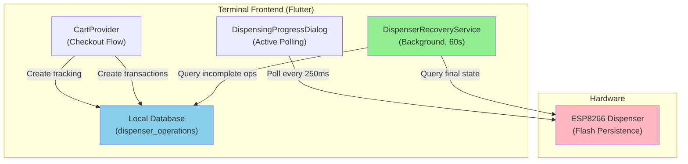
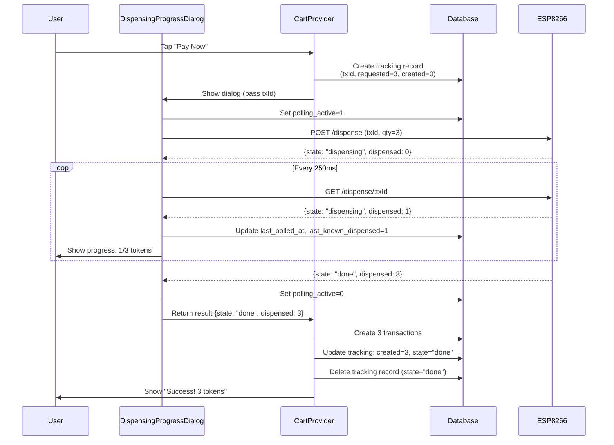
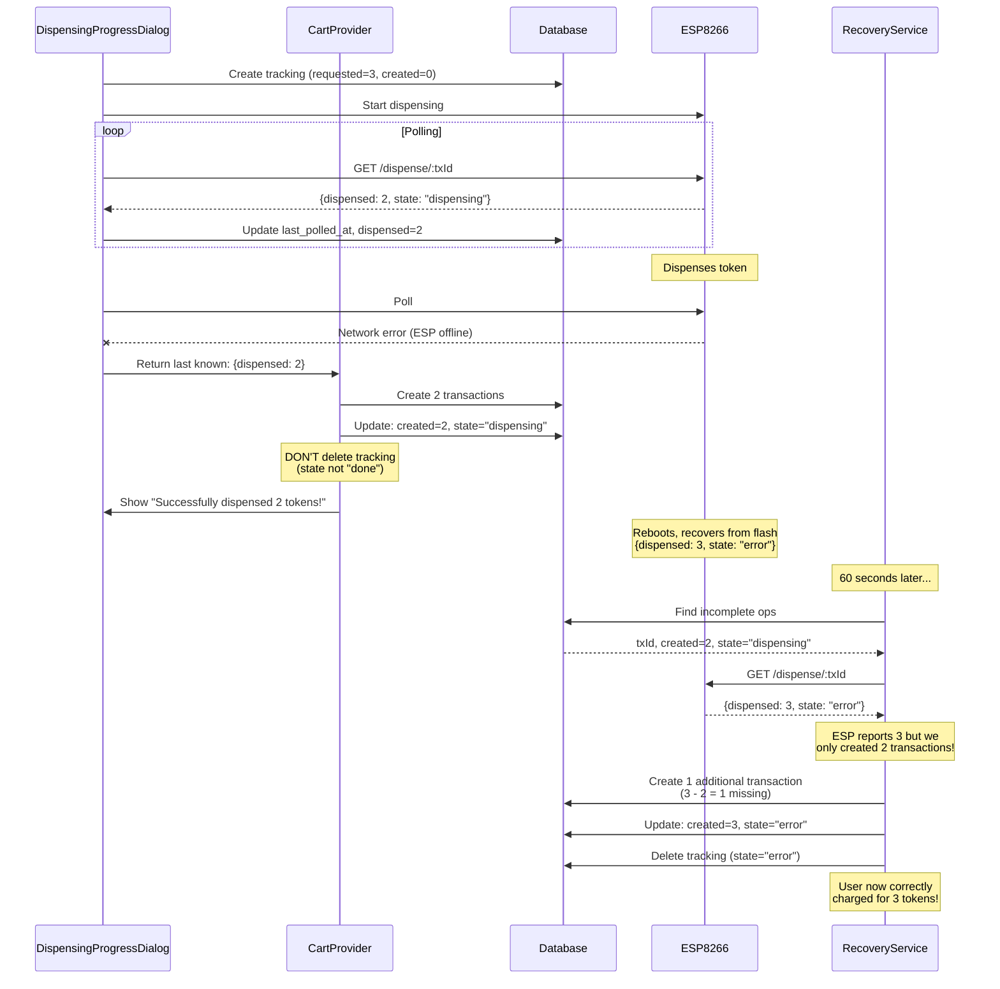
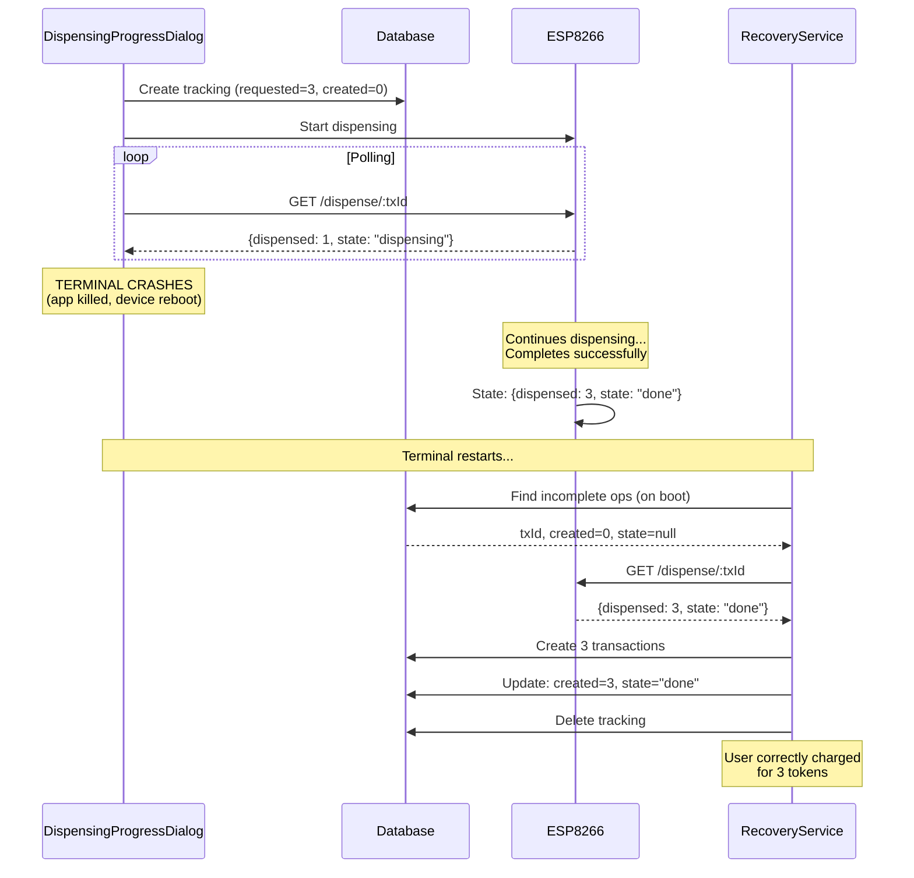
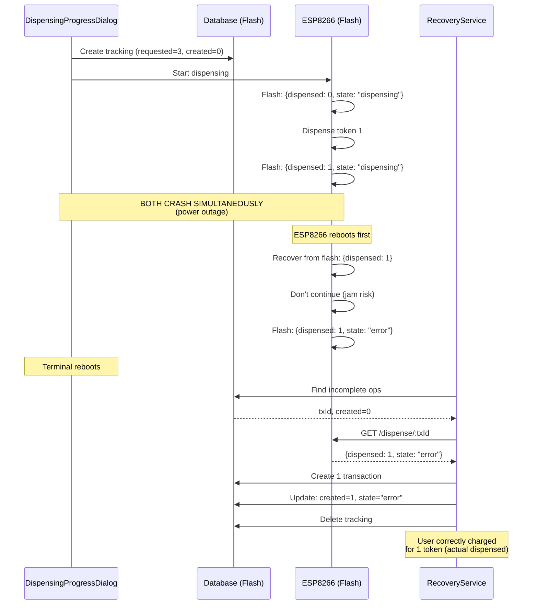
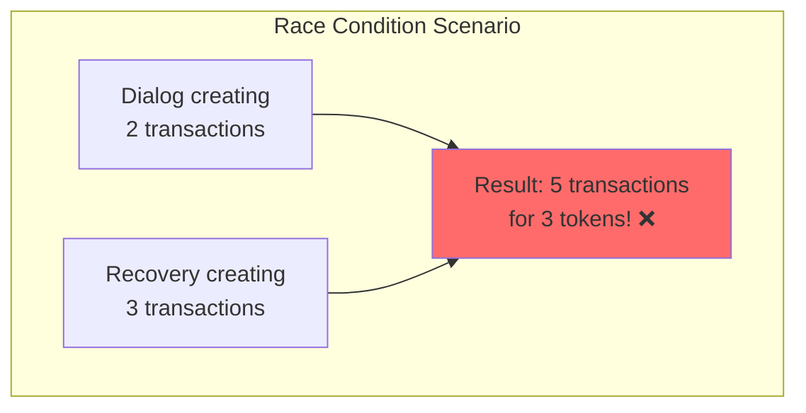
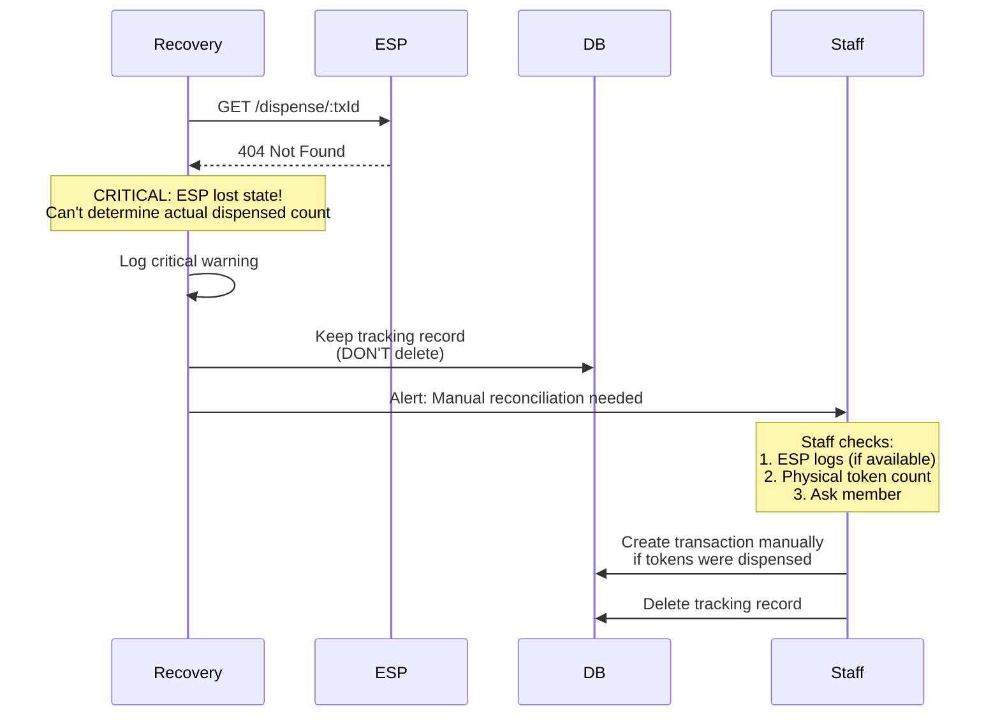
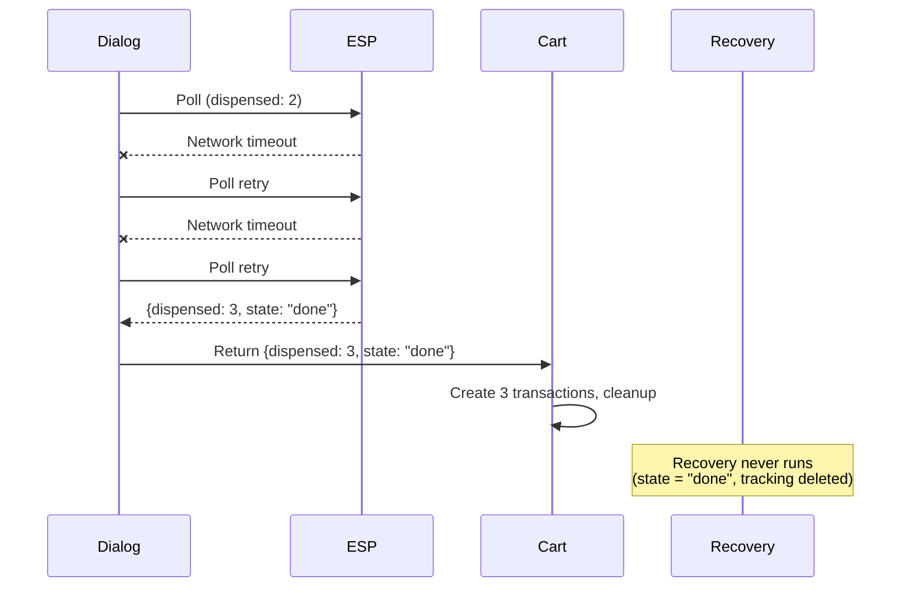
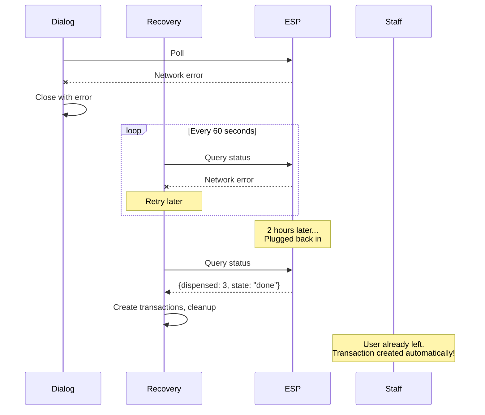
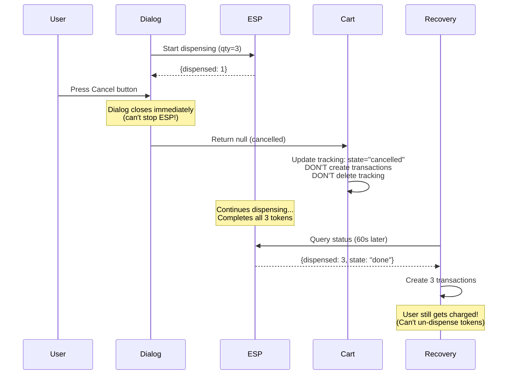

# Dispenser Crash Recovery & Reconciliation

## Overview

The token dispenser crash recovery system ensures users are charged accurately for tokens they receive, even when crashes occur during dispensing. This document explains the architecture, flows, and edge cases.

## Problem Statement

### The Challenge

Token dispensing involves three independent systems that can fail:
1. **Terminal (Flutter app)** - Can crash or lose network
2. **ESP8266 dispenser** - Can crash, lose power, or lose network
3. **Network** - Can fail during critical operations

**Critical scenario:**
```
User requests 3 tokens
ESP8266 dispenses token 1 ✓
ESP8266 dispenses token 2 ✓
ESP8266 dispenses token 3 ✓
ESP8266 CRASHES (power loss)
Terminal's next poll fails → last known state: 2 tokens
Terminal creates 2 transactions
User got 3 tokens, charged for 2 → Revenue loss!
```

### Requirements

1. **Accuracy** - Users charged for exactly the tokens they received
2. **Crash resilience** - Handle crashes of terminal, ESP8266, or both
3. **No duplicates** - Never create duplicate transactions
4. **No interference** - Background recovery doesn't interfere with active operations
5. **Audit trail** - All recovery actions logged and traceable

## Architecture

### Components



### Database Schema

**dispenser_operations** tracking table:

```sql
CREATE TABLE dispenser_operations (
  dispenser_tx_id TEXT PRIMARY KEY,
  member_id TEXT NOT NULL,
  product_id TEXT NOT NULL,
  price_cents INTEGER NOT NULL,
  requested_qty INTEGER NOT NULL,
  created_at TEXT NOT NULL,
  
  -- Reconciliation fields
  transactions_created INTEGER DEFAULT 0,
  last_known_state TEXT,           -- "dispensing", "done", "error"
  last_known_dispensed INTEGER DEFAULT 0,
  last_polled_at TEXT,              -- ISO timestamp
  polling_active INTEGER DEFAULT 0  -- 0=false, 1=true
);
```

**Key fields:**
- `transactions_created` - How many transactions we already created
- `polling_active` - Prevents recovery from interfering with active dialog
- `last_polled_at` - Prevents recovery during active polling
- `last_known_state` - Determines if we need to keep reconciling

## Flow Diagrams

### Normal Flow (No Crashes)



### ESP8266 Crash During Dispensing



### Terminal Crash During Dispensing



### Both Terminal and ESP8266 Crash



## Race Condition Prevention

### Problem: Concurrent Operations



### Solution: Multiple Safeguards

```mermaid
flowchart TD
    Start["Recovery Service Runs"] --> CheckActive{polling_active = 1?}
    CheckActive -->|Yes| Skip1["Skip this operation<br/>(Dialog still open)"]
    CheckActive -->|No| CheckRecent{last_polled_at<br/>< 30s ago?}
    
    CheckRecent -->|Yes| Skip2["Skip this operation<br/>(Recent poll, might be active)"]
    CheckRecent -->|No| CheckCreated{transactions_created > 0?}
    
    CheckCreated -->|Yes| QueryESP["Query ESP8266"]
    CheckCreated -->|No| QueryESP
    
    QueryESP --> Compare["Compare:<br/>ESP count vs created count"]
    Compare --> CreateDiff["Create difference only<br/>(ESP count - created count)"]
    CreateDiff --> UpdateDB["Update transactions_created"]
    UpdateDB --> CheckState{ESP state = "done"<br/>or "error"?}
    
    CheckState -->|Yes| Cleanup["Delete tracking record"]
    CheckState -->|No| Keep["Keep tracking record<br/>(will retry in 60s)"]
    
    Skip1 --> End
    Skip2 --> End
    Cleanup --> End
    Keep --> End
    
    style Skip1 fill:#90EE90
    style Skip2 fill:#90EE90
    style CreateDiff fill:#87CEEB
```

### Safeguard Table

| Scenario | Safeguard | Behavior |
|----------|-----------|----------|
| Dialog still open | `polling_active = 1` | Recovery skips operation |
| Dialog just closed | `last_polled_at` < 30s | Recovery skips operation |
| Transactions already created | `transactions_created` field | Recovery only creates difference |
| ESP still dispensing | `state = "dispensing"` | Recovery skips cleanup, retries later |
| Network error | Exception handling | Recovery skips, retries on next cycle |

## Edge Cases

### 1. ESP8266 Returns 404 (Lost State)

**Scenario:** ESP8266 crashes and loses flash data (hardware failure)



**Handling:**
- Keep tracking record (don't delete)
- Log critical warning: "Manual reconciliation required"
- Staff procedure: Check ESP logs, ask member, create transaction manually

### 2. Network Flaky During Polling

**Scenario:** Network drops during polling, comes back



**Handling:** Dialog retries polls, eventually succeeds, no recovery needed.

### 3. ESP8266 Offline for Extended Period

**Scenario:** ESP8266 unplugged for hours



**Handling:** Recovery retries every 60s until ESP comes back online.

### 4. Multiple Token Products in Cart

**Scenario:** User buys 2 different token products (e.g., sauna + massage)

**Current Limitation:** ESP8266 only dispenses one product type (tokens are fungible).

**Handling:**
- Group all token products together
- Dispense total quantity
- Create transactions for first token product only
- **Future improvement:** Support multiple product types in single dispense operation

### 5. User Cancels During Dispensing

**Scenario:** User taps "Cancel" button while tokens are dispensing



**Handling:**
- Dialog closes immediately when cancelled
- ESP8266 continues dispensing (can't stop mechanical process)
- Recovery service creates transactions for actual dispensed tokens
- **User is charged for tokens dispensed**, even if they cancelled

**UI Note:** "Cancel" button should warn user: "Tokens may still dispense. You will be charged for any tokens received."

## Recovery Service Configuration

### Timing Parameters

```dart
class RecoveryConfig {
  // How often to run reconciliation
  static const reconciliationInterval = Duration(seconds: 60);
  
  // Skip operations polled within this window (active polling)
  static const activePollingWindow = Duration(seconds: 30);
  
  // How long to keep tracking records before manual review
  static const manualReviewThreshold = Duration(hours: 24);
}
```

### Startup vs Periodic Reconciliation

| Phase | When | Purpose |
|-------|------|---------|
| **Startup Recovery** | App boot | Handle terminal crashes overnight |
| **Periodic Reconciliation** | Every 60s | Handle ESP crashes during active use |

**Why both?**
- Startup: Terminal might not restart for days
- Periodic: Catches ESP crashes within 60 seconds

## Testing Scenarios

### Test Matrix

| # | Terminal | ESP8266 | Network | Expected Result |
|---|----------|---------|---------|-----------------|
| 1 | Running | Running | Stable | Normal flow, immediate cleanup |
| 2 | Running | Crash (2/3) | Stable | Recovery creates 3rd transaction |
| 3 | Crash (0/3) | Running | Stable | Recovery creates 3 transactions |
| 4 | Crash | Crash | Stable | Recovery creates actual dispensed |
| 5 | Running | Running | Flaky | Retries succeed, no recovery needed |
| 6 | Running | Offline | Down | Recovery retries until ESP returns |
| 7 | Running | 404 (lost state) | Stable | Manual reconciliation required |
| 8 | Running | Running | Stable (user cancels) | Recovery creates all dispensed |

### Test Procedure

**Test 2: ESP8266 Crash Mid-Dispense**

```bash
# Setup
1. Start terminal, initiate checkout for 3 tokens
2. Observe polling in dialog (should show 1, 2 tokens)
3. Kill ESP8266 power after 2 tokens dispensed

# Expected Terminal Behavior
- Dialog shows network error after last poll
- Dialog closes with "Successfully dispensed 2 tokens!"
- cart_provider creates 2 transactions
- Tracking record NOT deleted (state = "dispensing")

# Restore ESP8266
4. Restore ESP8266 power
5. ESP8266 boots, recovers state: {dispensed: 3, state: "error"}

# Expected Recovery Behavior (within 60 seconds)
- Recovery service queries ESP8266
- Detects 3 dispensed vs 2 transactions created
- Creates 1 additional transaction
- Deletes tracking record

# Verification
- Check database: 3 transactions with same dispenserTxId
- Check tracking table: record deleted
- Check member balance: decreased by 3 * price
```

## Monitoring & Alerts

### Log Messages

**Normal Operation:**
```
INFO: Dispenser transaction abc123 completed successfully (3/3 tokens)
```

**Recovery Success:**
```
WARN: Reconciliation: ESP8266 reports 3 dispensed, but only 2 transactions exist.
      Creating 1 additional transaction for member xyz, txId abc123.
INFO: Recovery completed for txId abc123 (created 1 additional transaction)
```

**Manual Review Required:**
```
CRITICAL: Transaction abc123 not found on ESP8266. Tokens may have been dispensed 
          but ESP8266 lost state. Manual reconciliation required for member xyz.
          Requested: 3 tokens, Created: 2 transactions.
```

### Staff Dashboard (Future)

Display unreconciled operations:
- txId
- Member name
- Requested tokens
- Transactions created
- Last known ESP state
- Action: "Create transaction" / "Mark as resolved"

## Performance Considerations

### Database Queries

Recovery service runs every 60 seconds:
```sql
-- Find incomplete operations (efficient with index on polling_active)
SELECT * FROM dispenser_operations 
WHERE polling_active = 0 
  AND (last_polled_at IS NULL OR last_polled_at < datetime('now', '-30 seconds'))
  AND (last_known_state IS NULL OR last_known_state != 'done');
```

**Index Required:**
```sql
CREATE INDEX idx_dispenser_ops_recovery 
ON dispenser_operations(polling_active, last_polled_at, last_known_state);
```

### Network Load

- Each recovery cycle: 1 query per incomplete operation
- Typical: 0-2 incomplete operations
- Max network calls: ~2 per minute
- Negligible impact

## Future Improvements

1. **Exponential Backoff** - Reduce polling frequency for long-offline ESP8266
2. **Staff Dashboard** - UI for manual reconciliation
3. **Multiple Product Types** - Support different token products in one dispense
4. **Cancel Prevention** - Lock dialog during dispensing (UX decision)
5. **Metrics** - Track recovery success rate, manual review frequency

> **Note:** Transaction notes ("Auto-created by recovery service") are already implemented as of v1.0.

## Summary

### Key Principles

1. **Never delete tracking records prematurely** - Only when ESP state is final
2. **Always compare counts** - ESP count vs transactions created
3. **Prevent race conditions** - Multiple safeguards (polling_active, last_polled_at, transactions_created)
4. **Periodic reconciliation** - Don't rely on startup only
5. **Audit trail** - Every recovery action logged and traceable

### Failure Modes

| Failure | Impact | Mitigation |
|---------|--------|------------|
| ESP crashes mid-dispense | User undercharged | Periodic reconciliation recovers within 60s |
| Terminal crashes | User undercharged | Startup recovery + periodic reconciliation |
| Both crash | User undercharged | ESP flash + startup recovery |
| ESP loses flash | Unknown dispensed count | Manual reconciliation (tracking record preserved) |
| Network fails | Temporary delay | Retry every 60s until success |

### Guarantees

✅ **User charged accurately** - For tokens actually received  
✅ **No duplicates** - Multiple safeguards prevent double-charging  
✅ **Crash resilient** - Handles all crash combinations  
✅ **Fast recovery** - Within 60 seconds for ESP crashes  
✅ **Audit trail** - All operations traceable  

---

**Document Version:** 1.0  
**Last Updated:** 2026-02-15  
**Author:** Claude Code  
