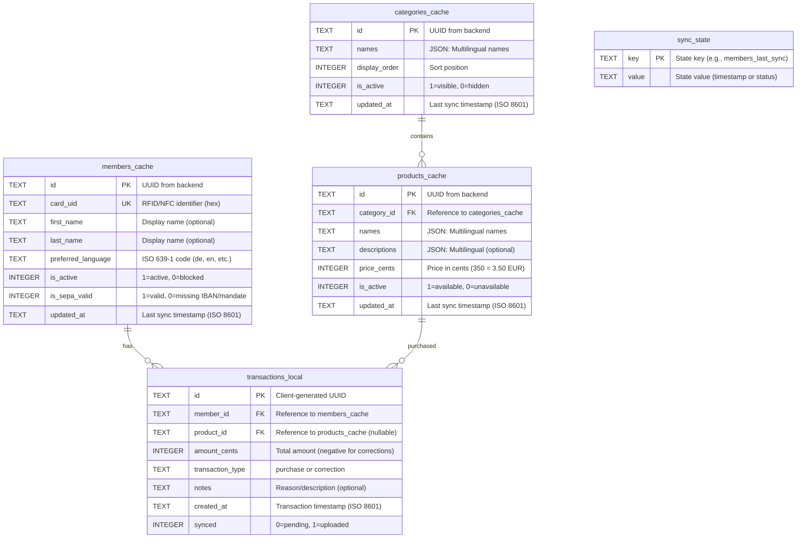
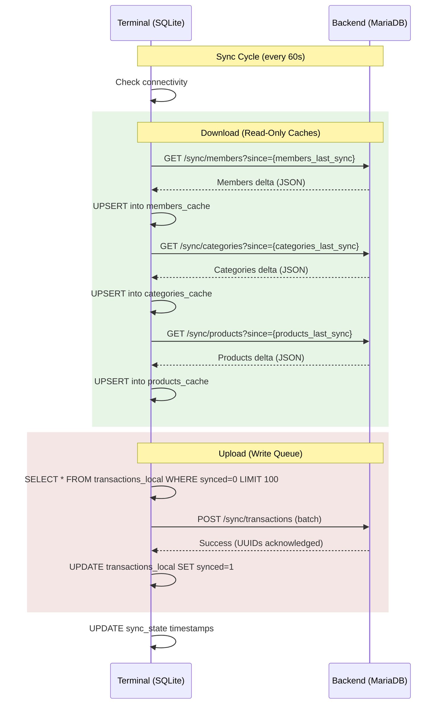

# Frontend (Terminal) SQLite Database - Entity-Relationship Model

This document describes the Entity-Relationship Model for the Terminal application's local SQLite database. The terminal uses an offline-first architecture with eventual consistency.

## Overview

The terminal SQLite database serves three purposes:

1. **Cache backend data** (members, products, categories) for offline operation
2. **Queue transactions** locally before upload to backend
3. **Track sync state** for delta synchronization

**Key Principles:**
- Members, products, and categories are **read-only caches** (backend is authoritative)
- Transactions are **append-only** (created locally, synced to backend)
- **Data minimization**: Only operationally necessary fields are cached
- **Offline-first**: Full functionality without network connectivity

---

## Entity-Relationship Diagram



---

## Table Specifications

### members_cache

Read-only cache of member data synced from backend. Used for RFID card lookups.

| Column | Type | Constraints | Description |
|--------|------|-------------|-------------|
| `id` | TEXT | PRIMARY KEY | UUID from backend |
| `card_uid` | TEXT | UNIQUE, NULL | RFID/NFC card identifier (8-20 hex chars, uppercase); indexed |
| `first_name` | TEXT | NULL | First name (for display) |
| `last_name` | TEXT | NULL | Last name (for display) |
| `preferred_language` | TEXT | NOT NULL | ISO 639-1 language code |
| `is_active` | INTEGER | NOT NULL, DEFAULT 1 | 1=active, 0=blocked |
| `is_sepa_valid` | INTEGER | NOT NULL | 1=valid SEPA data, 0=missing IBAN or mandate |
| `updated_at` | TEXT | NOT NULL | Last modification timestamp (ISO 8601) |

**Indexes:**
- `idx_members_cache_card_uid` on `card_uid` (critical for fast card lookups)
- `idx_members_cache_updated_at` on `updated_at` (for sync queries)

**Data NOT cached** (privacy/data minimization):
- IBAN, mandate_reference, mandate_signed_at
- Contact details (email)
- deleted_at (anonymized members are removed from cache)

**SEPA Validation**: `is_sepa_valid` is calculated by backend during sync as `(iban IS NOT NULL AND mandate_reference IS NOT NULL)`. Terminal blocks access if `is_sepa_valid = 0`.

---

### categories_cache

Read-only cache of product categories synced from backend.

| Column | Type | Constraints | Description |
|--------|------|-------------|-------------|
| `id` | TEXT | PRIMARY KEY | UUID from backend |
| `names` | TEXT | NOT NULL | JSON string: `{"de": "Getränke", "en": "Beverages"}` |
| `display_order` | INTEGER | NOT NULL | Sort position for tab ordering |
| `is_active` | INTEGER | NOT NULL, DEFAULT 1 | 1=visible, 0=hidden |
| `updated_at` | TEXT | NOT NULL | Last modification timestamp (ISO 8601) |

**Indexes:**
- `idx_categories_cache_display_order` on `display_order`
- `idx_categories_cache_is_active` on `is_active`
- `idx_categories_cache_updated_at` on `updated_at` (for sync queries)

**Terminal Display**: Only show categories where `is_active = 1`. Products in inactive categories are hidden regardless of product's own `is_active` status.

---

### products_cache

Read-only cache of product catalog synced from backend.

| Column | Type | Constraints | Description |
|--------|------|-------------|-------------|
| `id` | TEXT | PRIMARY KEY | UUID from backend |
| `category_id` | TEXT | NOT NULL, FK | Reference to `categories_cache.id` |
| `names` | TEXT | NOT NULL | JSON string: `{"de": "Bier 0,5L", "en": "Beer 0.5L"}` |
| `descriptions` | TEXT | NULL | JSON string: Multilingual descriptions (optional) |
| `price_cents` | INTEGER | NOT NULL | Price in cents (350 = 3.50 EUR) |
| `is_active` | INTEGER | NOT NULL, DEFAULT 1 | 1=available, 0=unavailable |
| `updated_at` | TEXT | NOT NULL | Last modification timestamp (ISO 8601) |

**Indexes:**
- `idx_products_cache_category_id` on `category_id`
- `idx_products_cache_is_active` on `is_active`
- `idx_products_cache_updated_at` on `updated_at` (for sync queries)

**Note:** All translations are always synced. Terminal displays product name based on member's `preferred_language`.

---

### transactions_local

Local write queue for transactions. Created on terminal, uploaded to backend during sync.

| Column | Type | Constraints | Description |
|--------|------|-------------|-------------|
| `id` | TEXT | PRIMARY KEY | Client-generated UUID (idempotency key) |
| `member_id` | TEXT | NOT NULL, FK | Reference to `members_cache.id` |
| `product_id` | TEXT | NULL, FK | Reference to `products_cache.id` (NULL for manual adjustments) |
| `amount_cents` | INTEGER | NOT NULL | Amount in cents (positive = charge; negative = credit/reversal; non-zero) |
| `transaction_type` | TEXT | NOT NULL, DEFAULT 'purchase' | Type: 'purchase' or 'correction' |
| `notes` | TEXT | NULL | Reason/description (optional) |
| `created_at` | TEXT | NOT NULL | Transaction timestamp (ISO 8601) |
| `synced` | INTEGER | NOT NULL, DEFAULT 0 | 0=pending upload, 1=synced to backend |

**Indexes:**
- `idx_transactions_synced` on `synced` (for batch upload queries)
- `idx_transactions_member_id` on `member_id`
- `idx_transactions_created_at` on `created_at`

**Key Properties:**
- **Append-only**: No UPDATE/DELETE after creation
- **Idempotent**: UUID-based deduplication at backend
- **Batch upload**: Max 100 transactions per sync request

---

### sync_state

Metadata table tracking delta synchronization state.

| Column | Type | Constraints | Description |
|--------|------|-------------|-------------|
| `key` | TEXT | PRIMARY KEY | State key identifier |
| `value` | TEXT | NOT NULL | State value (timestamp or status) |

**Common Keys:**
- `members_last_sync`: ISO 8601 timestamp of last members sync
- `products_last_sync`: ISO 8601 timestamp of last products sync
- `categories_last_sync`: ISO 8601 timestamp of last categories sync
- `last_sync_attempt`: ISO 8601 timestamp of last sync attempt
- `last_sync_success`: ISO 8601 timestamp of last successful sync

**Usage:** The `*_last_sync` values are sent as the `since` parameter in delta sync requests.

---

## Synchronization Flow



---

## Data Flow Architecture


---

## Offline Capabilities

### Fully Functional Offline

| Feature | Data Source |
|---------|-------------|
| RFID card scanning | `members_cache` lookup by `card_uid` |
| Member identification | `members_cache` (name, language) |
| SEPA validity check | `members_cache.is_sepa_valid` |
| Category tabs | `categories_cache` (names, display_order) |
| Product catalog | `products_cache` (names, prices) |
| Product selection | `products_cache` |
| Transaction recording | Insert into `transactions_local` |
| Local balance display | `SUM(amount_cents)` from `transactions_local` |

### Requires Network Connectivity

| Feature | Reason |
|---------|--------|
| New member recognition | Member not yet in cache |
| Product/category updates | Until next sync cycle |
| Member status changes | Blocked/deleted members |
| SEPA status changes | Until next sync cycle |
| Accurate total balance | Backend aggregates all terminals |

---

## Error Handling

| Scenario | Behavior |
|----------|----------|
| Network unreachable | Continue local operation; transactions queued |
| Sync interrupted | Retry in next cycle; partial sync acceptable |
| Duplicate transaction sent | Backend deduplicates via UUID (`INSERT IGNORE`) |
| Response lost after upload | Terminal resends; backend ignores duplicate |
| Terminal restart | Sync state persisted; resumes cleanly |
| Unknown card scanned | Display "Unknown member" message |
| Member deleted after cache | Shows stale data until sync; then removed |
| Member SEPA invalid | Display "SEPA data required" message; block transaction |

---

## SQL Schema

```sql
-- Enable foreign keys
PRAGMA foreign_keys = ON;

-- Members cache (read-only, synced from backend)
CREATE TABLE IF NOT EXISTS members_cache (
    id TEXT PRIMARY KEY,
    card_uid TEXT UNIQUE,
    first_name TEXT,
    last_name TEXT,
    preferred_language TEXT NOT NULL DEFAULT 'de',
    is_active INTEGER NOT NULL DEFAULT 1,
    is_sepa_valid INTEGER NOT NULL DEFAULT 0,
    updated_at TEXT NOT NULL
);

CREATE INDEX IF NOT EXISTS idx_members_cache_card_uid ON members_cache(card_uid);
CREATE INDEX IF NOT EXISTS idx_members_cache_updated_at ON members_cache(updated_at);

-- Categories cache (read-only, synced from backend)
CREATE TABLE IF NOT EXISTS categories_cache (
    id TEXT PRIMARY KEY,
    names TEXT NOT NULL,
    display_order INTEGER NOT NULL,
    is_active INTEGER NOT NULL DEFAULT 1,
    updated_at TEXT NOT NULL
);

CREATE INDEX IF NOT EXISTS idx_categories_cache_display_order ON categories_cache(display_order);
CREATE INDEX IF NOT EXISTS idx_categories_cache_is_active ON categories_cache(is_active);
CREATE INDEX IF NOT EXISTS idx_categories_cache_updated_at ON categories_cache(updated_at);

-- Products cache (read-only, synced from backend)
CREATE TABLE IF NOT EXISTS products_cache (
    id TEXT PRIMARY KEY,
    category_id TEXT NOT NULL REFERENCES categories_cache(id),
    names TEXT NOT NULL,
    descriptions TEXT,
    price_cents INTEGER NOT NULL,
    is_active INTEGER NOT NULL DEFAULT 1,
    updated_at TEXT NOT NULL
);

CREATE INDEX IF NOT EXISTS idx_products_cache_category_id ON products_cache(category_id);
CREATE INDEX IF NOT EXISTS idx_products_cache_is_active ON products_cache(is_active);
CREATE INDEX IF NOT EXISTS idx_products_cache_updated_at ON products_cache(updated_at);

-- Transactions (local write queue)
CREATE TABLE IF NOT EXISTS transactions_local (
    id TEXT PRIMARY KEY,
    member_id TEXT NOT NULL REFERENCES members_cache(id),
    product_id TEXT REFERENCES products_cache(id),
    amount_cents INTEGER NOT NULL,
    transaction_type TEXT NOT NULL DEFAULT 'purchase',
    notes TEXT,
    created_at TEXT NOT NULL,
    synced INTEGER NOT NULL DEFAULT 0
);

CREATE INDEX IF NOT EXISTS idx_transactions_synced ON transactions_local(synced);
CREATE INDEX IF NOT EXISTS idx_transactions_member_id ON transactions_local(member_id);
CREATE INDEX IF NOT EXISTS idx_transactions_created_at ON transactions_local(created_at);

-- Sync state (metadata for delta sync)
CREATE TABLE IF NOT EXISTS sync_state (
    key TEXT PRIMARY KEY,
    value TEXT NOT NULL
);

-- Initialize sync state rows
INSERT OR IGNORE INTO sync_state (key, value) VALUES ('members_last_sync', '');
INSERT OR IGNORE INTO sync_state (key, value) VALUES ('products_last_sync', '');
INSERT OR IGNORE INTO sync_state (key, value) VALUES ('categories_last_sync', '');
INSERT OR IGNORE INTO sync_state (key, value) VALUES ('last_sync_attempt', '');
INSERT OR IGNORE INTO sync_state (key, value) VALUES ('last_sync_success', '');
```

---

## Related Documentation

- [ADR-0001](../adr/0001-monetary-values-as-integer-cents.md): Monetary values as integer cents
- [ADR-0002](../adr/0002-product-internationalization.md): Product internationalization (JSON multilingual)
- [ADR-0003](../adr/0003-gzip-compression-http.md): GZIP compression for HTTP
- [ADR-0004](../adr/0004-immutable-transaction-storage.md): Immutable transaction storage
- [ADR-0012](../adr/0012-eventual-consistency-frontend-caching.md): Eventual consistency and frontend caching
- [ADR-0014](../adr/0014-rfid-scanning-integration.md): RFID scanning integration
- [ADR-0020](../adr/0020-sepa-mandate-requirement-terminal-access.md): SEPA mandate requirement for terminal access
