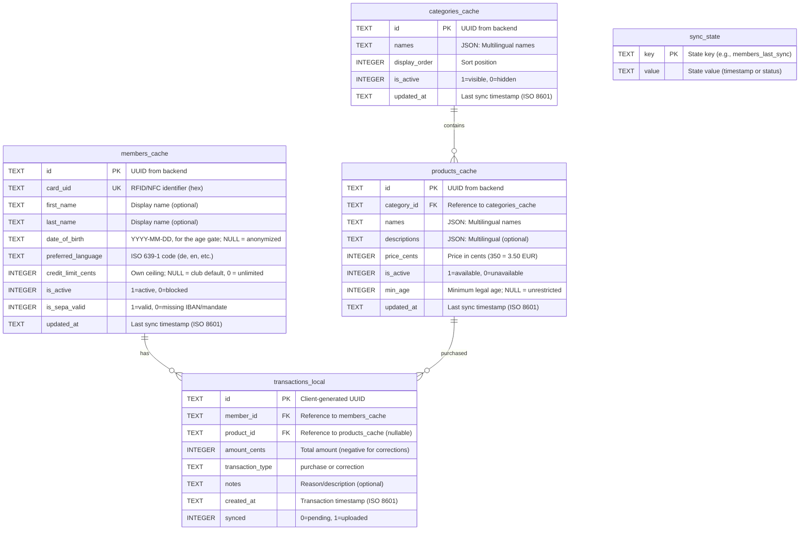
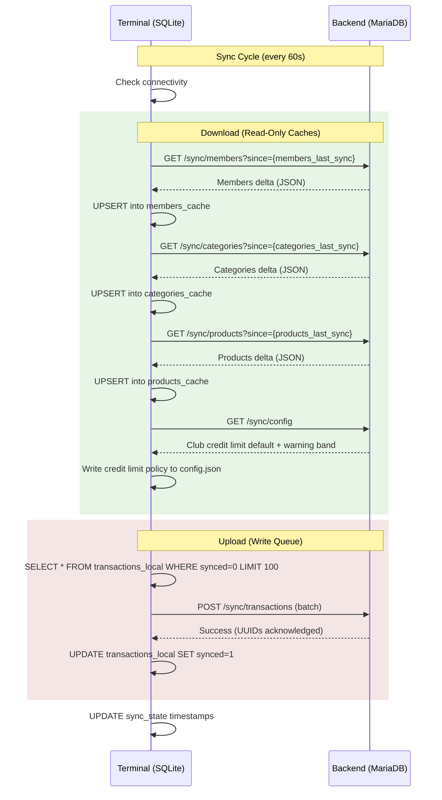
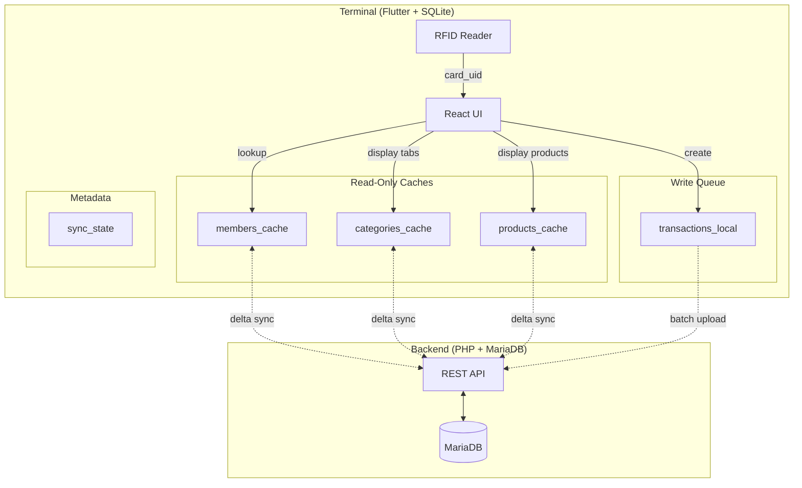

# Frontend (Terminal) SQLite Database - Entity-Relationship Model

This document describes the Entity-Relationship Model for the Terminal application's local SQLite database. The terminal uses an offline-first architecture with eventual consistency.

## Overview

The terminal SQLite database serves three purposes:

1. **Cache backend data** (members, products, categories) for offline operation
2. **Queue transactions** locally before upload to backend
3. **Track sync state** for delta synchronization

**Key Principles:**
- Members, products, and categories are **read-only caches** (backend is authoritative)
- Transactions are **append-only** (created locally, synced to backend)
- **Data minimization**: Only operationally necessary fields are cached — including, since [ADR-0045](../adr/0045-age-restricted-products.md), the member's `date_of_birth`, because JuSchG § 9 has to be enforced offline
- **Offline-first**: Full functionality without network connectivity

---

## Entity-Relationship Diagram

---

## Table Specifications

### members_cache

Read-only cache of member data synced from backend. Used for RFID card lookups.

| Column | Type | Constraints | Description |
|--------|------|-------------|-------------|
| `id` | TEXT | PRIMARY KEY | UUID from backend |
| `card_uid` | TEXT | UNIQUE, NULL | RFID/NFC card identifier (8-20 hex chars, uppercase); indexed |
| `first_name` | TEXT | NULL | First name (for display) |
| `last_name` | TEXT | NULL | Last name (for display) |
| `date_of_birth` | TEXT | NULL | `YYYY-MM-DD`. The **raw date**, for the Jugendschutz check ([ADR-0045](../adr/0045-age-restricted-products.md)) — see below |
| `preferred_language` | TEXT | NOT NULL | ISO 639-1 language code |
| `credit_limit_cents` | INTEGER | NULL | This member's own Deckel ceiling in cents ([ADR-0047](../adr/0047-configurable-credit-limits.md)). NULL means *follow the club default*, which the terminal holds in `config.json` and refreshes from `GET /api/sync/config`; `0` means *no ceiling for this member*. `CreditLimitPolicy.forMember` resolves the pair with `override ?? clubDefault` — the same one-line rule the backend applies |
| `is_active` | INTEGER | NOT NULL, DEFAULT 1 | 1=active, 0=blocked |
| `is_sepa_valid` | INTEGER | NOT NULL | 1=valid SEPA data, 0=missing IBAN or mandate |
| `updated_at` | TEXT | NOT NULL | Last modification timestamp (ISO 8601) |

**Indexes:**
- `idx_members_cache_card_uid` on `card_uid` (critical for fast card lookups)
- `idx_members_cache_updated_at` on `updated_at` (for sync queries)

**Data NOT cached** (privacy/data minimization):
- IBAN, mandate reference, mandate signature date (now `mandates` rows on the backend — see `erm-master.md`)
- Contact details (email, phone)
- Postal address, account holder name

**Cached, deliberately: `date_of_birth`.** This document used to say the terminal
holds no sensitive personal data. That stopped being true with
[ADR-0045](../adr/0045-age-restricted-products.md), and the trade is worth
stating rather than glossing:

- **Why the raw date and not an age.** JuSchG § 9 has to be enforced at the
  moment the drink is handed over, at a kiosk that may not have reached the
  server for weeks. An age in years computed server-side is wrong from the
  member's next birthday until the next sync — silently, and in the direction
  that serves a minor. The date is stable for life; the age is not.
- **Why not a boolean.** Two thresholds (16 and 18) cannot be answered by one
  flag, and a pair of flags is the same stale-derived-value problem twice.
- **What limits the exposure.** One field, and only this one. No contact
  details, no banking data, no address. The kiosk **never renders it** and never
  renders an age derived from it (rule 6) — the screen is read by whoever is
  standing at the bar, so a refusal names what the *drink* requires, never what
  the member is.
- **What takes it back off again.** Erasure rides the ordinary delta sync: an
  anonymized member arrives on the normal cursor with `date_of_birth` nulled and
  `deleted_at` set. There is no separate cache-busting mechanism to forget, and
  no terminal that can keep a birth date the server has already erased — beyond
  the length of one sync interval.
- **NULL means anonymized, never unknown.** The field is required when a member
  is created, so there is no third state. A member with no cached birth date is
  refused any product carrying a `min_age`; there is no fail-open branch
  (rule 3).

**Tombstones, not deletion**: an anonymized member is **not** removed from the
cache. `transactions_local.member_id` references the row, so deleting it fails
the foreign key and wedges the sync cycle. `deleted_at` is set instead and the
card scans as unknown.

**SEPA Validation**: Banking data moved off `members` onto its own append-only `mandates` table ([#164](https://github.com/dgloeckner/clubbar/issues/164)), so `is_sepa_valid` is now calculated by the backend during sync as *"does this member have an active mandate"* (a lookup, not an IBAN/reference presence check). Terminal blocks access if `is_sepa_valid = 0`.

---

### categories_cache

Read-only cache of product categories synced from backend.

| Column | Type | Constraints | Description |
|--------|------|-------------|-------------|
| `id` | TEXT | PRIMARY KEY | UUID from backend |
| `names` | TEXT | NOT NULL | JSON string: `{"de": "Getränke", "en": "Beverages"}` |
| `display_order` | INTEGER | NOT NULL | Sort position for tab ordering |
| `is_active` | INTEGER | NOT NULL, DEFAULT 1 | 1=visible, 0=hidden |
| `updated_at` | TEXT | NOT NULL | Last modification timestamp (ISO 8601) |

**Indexes:**
- `idx_categories_cache_display_order` on `display_order`
- `idx_categories_cache_is_active` on `is_active`
- `idx_categories_cache_updated_at` on `updated_at` (for sync queries)

**Terminal Display**: Only show categories where `is_active = 1`. Products in inactive categories are hidden regardless of product's own `is_active` status.

---

### products_cache

Read-only cache of product catalog synced from backend.

| Column | Type | Constraints | Description |
|--------|------|-------------|-------------|
| `id` | TEXT | PRIMARY KEY | UUID from backend |
| `category_id` | TEXT | NOT NULL, FK | Reference to `categories_cache.id` |
| `names` | TEXT | NOT NULL | JSON string: `{"de": "Bier 0,5L", "en": "Beer 0.5L"}` |
| `descriptions` | TEXT | NULL | JSON string: Multilingual descriptions (optional) |
| `price_cents` | INTEGER | NOT NULL | Price in cents (350 = 3.50 EUR) |
| `is_active` | INTEGER | NOT NULL, DEFAULT 1 | 1=available, 0=unavailable |
| `requires_dispenser` | INTEGER | NOT NULL, DEFAULT 0 | 1=poured by a dispenser, 0=handed over |
| `min_age` | INTEGER | NULL | Minimum legal age to buy this product ([ADR-0045](../adr/0045-age-restricted-products.md)); NULL — the ordinary state of most of a drinks list — means unrestricted |
| `updated_at` | TEXT | NOT NULL | Last modification timestamp (ISO 8601) |

**Indexes:**
- `idx_products_cache_category_id` on `category_id`
- `idx_products_cache_is_active` on `is_active`
- `idx_products_cache_updated_at` on `updated_at` (for sync queries)

**Note:** All translations are always synced. Terminal displays product name based on member's `preferred_language`.

**Age gate**: `min_age` is compared against the age computed on this device from
`members_cache.date_of_birth`, at checkout, with no network call
([ADR-0045](../adr/0045-age-restricted-products.md)). `CartService` is the single
authority; the product grid greying a tile out is a courtesy that shares the same
`mayBuyAtAge` function so the two cannot disagree. A limit reached the terminal on
the ordinary delta sync, so a kiosk that has not synced since the limit was set
will still sell the drink — that gap is what the server-side
`jugendschutz_violation` audit entry exists to catch.

**Credit limit**: the ceiling a checkout is refused past is the member's own
`credit_limit_cents` where they have one and the club default otherwise
([ADR-0047](../adr/0047-configurable-credit-limits.md)). The club default is
**not** a cache table — it is one pair of numbers, so it lives in `config.json`
alongside the terminal's other settings and is refreshed by `GET /sync/config`
on each cycle. That call is deliberately separate from `/sync/members`: that
endpoint is a delta on `updated_at`, and a club-level setting touches no member
row, so a terminal that had already synced would never see the change. A failed
`/sync/config` is non-fatal — the terminal keeps the last policy it stored
rather than falling back to a compiled-in constant.

---

### transactions_local

Local write queue for transactions. Created on terminal, uploaded to backend during sync.

| Column | Type | Constraints | Description |
|--------|------|-------------|-------------|
| `id` | TEXT | PRIMARY KEY | Client-generated UUID (idempotency key) |
| `member_id` | TEXT | NOT NULL, FK | Reference to `members_cache.id` |
| `product_id` | TEXT | NULL, FK | Reference to `products_cache.id` (NULL for stornos and payouts) |
| `amount_cents` | INTEGER | NOT NULL | Amount in cents (positive = charge; negative = credit/reversal; non-zero) |
| `transaction_type` | TEXT | NOT NULL, DEFAULT 'purchase' | Type: 'purchase' or 'correction' |
| `notes` | TEXT | NULL | Reason/description (optional) |
| `created_at` | TEXT | NOT NULL | Transaction timestamp (ISO 8601) |
| `synced` | INTEGER | NOT NULL, DEFAULT 0 | 0=pending upload, 1=synced to backend |

**Indexes:**
- `idx_transactions_synced` on `synced` (for batch upload queries)
- `idx_transactions_member_id` on `member_id`
- `idx_transactions_created_at` on `created_at`

**Key Properties:**
- **Append-only**: No UPDATE/DELETE after creation
- **Idempotent**: UUID-based deduplication at backend
- **Batch upload**: Max 100 transactions per sync request

---

### sync_state

Metadata table tracking delta synchronization state.

| Column | Type | Constraints | Description |
|--------|------|-------------|-------------|
| `key` | TEXT | PRIMARY KEY | State key identifier |
| `value` | TEXT | NOT NULL | State value (timestamp or status) |

**Common Keys:**
- `members_last_sync`: ISO 8601 timestamp of last members sync
- `products_last_sync`: ISO 8601 timestamp of last products sync
- `categories_last_sync`: ISO 8601 timestamp of last categories sync
- `last_sync_attempt`: ISO 8601 timestamp of last sync attempt
- `last_sync_success`: ISO 8601 timestamp of last successful sync

**Usage:** The `*_last_sync` values are sent as the `since` parameter in delta sync requests.

---

## Synchronization Flow

---

## Data Flow Architecture

---

## Offline Capabilities

### Fully Functional Offline

| Feature | Data Source |
|---------|-------------|
| RFID card scanning | `members_cache` lookup by `card_uid` |
| Member identification | `members_cache` (name, language) |
| SEPA validity check | `members_cache.is_sepa_valid` |
| Category tabs | `categories_cache` (names, display_order) |
| Product catalog | `products_cache` (names, prices) |
| Product selection | `products_cache` |
| Transaction recording | Insert into `transactions_local` |
| Local balance display | `SUM(amount_cents)` from `transactions_local` |

### Requires Network Connectivity

| Feature | Reason |
|---------|--------|
| New member recognition | Member not yet in cache |
| Product/category updates | Until next sync cycle |
| Member status changes | Blocked/deleted members |
| SEPA status changes | Until next sync cycle |
| Accurate total balance | Backend aggregates all terminals |

---

## Error Handling

| Scenario | Behavior |
|----------|----------|
| Network unreachable | Continue local operation; transactions queued |
| Sync interrupted | Retry in next cycle; partial sync acceptable |
| Duplicate transaction sent | Backend deduplicates via UUID (duplicate-key error caught; see [#82](https://github.com/dgloeckner/clubbar/issues/82)) |
| Response lost after upload | Terminal resends; backend ignores duplicate |
| Terminal restart | Sync state persisted; resumes cleanly |
| Unknown card scanned | Display "Unknown member" message |
| Member deleted after cache | Shows stale data until sync; then removed |
| Member SEPA invalid | Display "SEPA data required" message; block transaction |

---

## SQL Schema

**The schema is not duplicated here.** It lives in
`terminal-frontend/lib/database/schema/*.dart` as Drift table definitions, and
Drift generates the DDL and the migration steps from them
(`terminal-frontend/lib/database/database.dart`). A second hand-written copy in
this file went stale without anyone noticing — by the time
[#590](https://github.com/dgloeckner/clubbar/issues/590) looked at it, it was
missing `balance_cents`, both tombstone columns, `icon_name`,
`requires_dispenser`, every quarantine and dispenser field, and the
`dispenser_config` and `dispenser_operations` tables entirely. The tables above
describe the *design*; the Dart files are the schema.

| Table | Definition |
|-------|-----------|
| `members_cache` | `lib/database/schema/members_cache.dart` |
| `categories_cache` | `lib/database/schema/categories_cache.dart` |
| `products_cache` | `lib/database/schema/products_cache.dart` |
| `transactions_local` | `lib/database/schema/transactions_local.dart` |
| `sync_state` | `lib/database/schema/sync_state.dart` |
| `dispenser_config` | `lib/database/schema/dispenser_config.dart` |
| `dispenser_operations` | `lib/database/schema/dispenser_operations.dart` |

Migrations are additive and idempotent: `database.dart` adds a column if the
table does not already have it, so a terminal upgraded from any earlier version
converges on the same shape. `date_of_birth` on `members_cache`, `min_age` on
`products_cache` and `credit_limit_cents` on `members_cache` arrived that way — an
existing kiosk gains them as nullable columns and fills them on its next sync.

---

## Related Documentation

- [ADR-0001](../adr/0001-monetary-values-as-integer-cents.md): Monetary values as integer cents
- [ADR-0002](../adr/0002-product-internationalization.md): Product internationalization (JSON multilingual)
- [ADR-0003](../adr/0003-gzip-compression-http.md): GZIP compression for HTTP
- [ADR-0004](../adr/0004-immutable-transaction-storage.md): Immutable transaction storage
- [ADR-0012](../adr/0012-eventual-consistency-frontend-caching.md): Eventual consistency and frontend caching
- [ADR-0014](../adr/0014-rfid-scanning-integration.md): RFID scanning integration
- [ADR-0020](../adr/0020-sepa-mandate-requirement-terminal-access.md): SEPA mandate requirement for terminal access
- [ADR-0045](../adr/0045-age-restricted-products.md): Age-restricted products (Jugendschutz)
- [ADR-0047](../adr/0047-configurable-credit-limits.md): Configurable credit limits (club default + per-member override)
