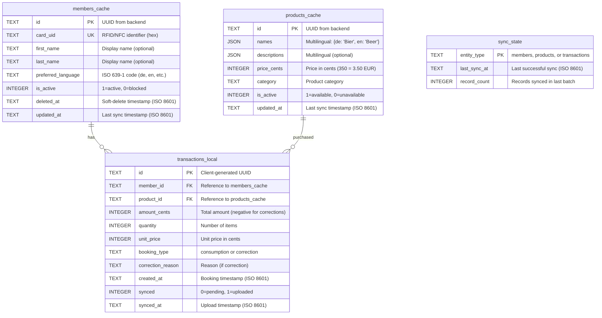
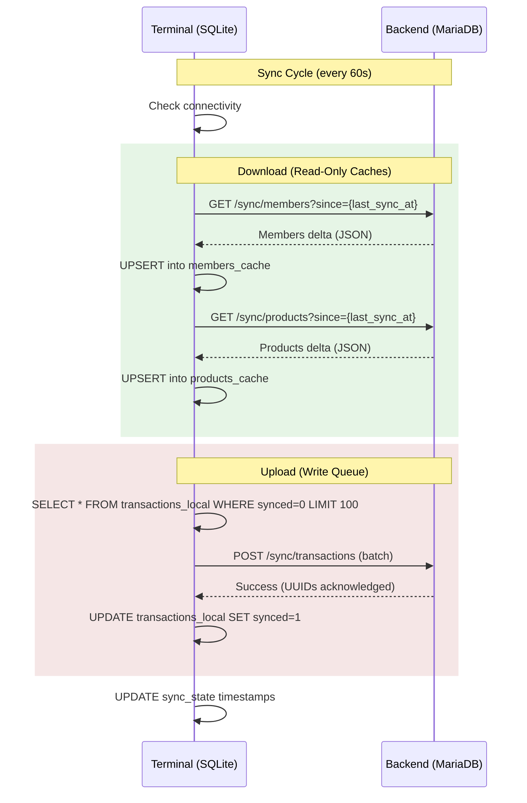
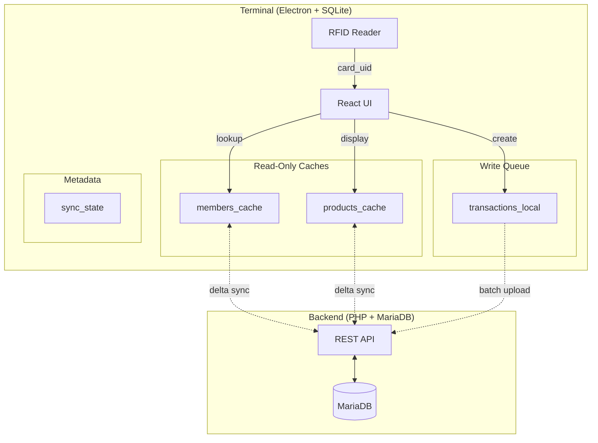

# Frontend (Terminal) SQLite Database - Entity-Relationship Model

This document describes the Entity-Relationship Model for the Terminal application's local SQLite database. The terminal uses an offline-first architecture with eventual consistency.

## Overview

The terminal SQLite database serves three purposes:

1. **Cache backend data** (members, products) for offline operation
2. **Queue transactions** locally before upload to backend
3. **Track sync state** for delta synchronization

**Key Principles:**
- Members and products are **read-only caches** (backend is authoritative)
- Transactions are **append-only** (created locally, synced to backend)
- **Data minimization**: Only operationally necessary fields are cached
- **Offline-first**: Full functionality without network connectivity

---

## Entity-Relationship Diagram



---

## Table Specifications

### members_cache

Read-only cache of member data synced from backend. Used for RFID card lookups.

| Column | Type | Constraints | Description |
|--------|------|-------------|-------------|
| `id` | TEXT | PRIMARY KEY | UUID from backend |
| `card_uid` | TEXT | UNIQUE, NOT NULL | RFID/NFC card identifier (hex string) |
| `first_name` | TEXT | NULL | First name (for display) |
| `last_name` | TEXT | NULL | Last name (for display) |
| `preferred_language` | TEXT | NOT NULL, DEFAULT 'de' | ISO 639-1 language code |
| `is_active` | INTEGER | NOT NULL, DEFAULT 1 | 1=active, 0=blocked |
| `deleted_at` | TEXT | NULL | Soft-delete timestamp (ISO 8601) |
| `updated_at` | TEXT | NOT NULL | Last modification timestamp (ISO 8601) |

**Indexes:**
- `idx_members_cache_card_uid` on `card_uid` (critical for fast card lookups)
- `idx_members_cache_updated_at` on `updated_at` (for sync queries)

**Data NOT cached** (privacy/data minimization):
- IBAN, BIC, mandate_reference
- Contact details (email, phone, address)
- Account information

---

### products_cache

Read-only cache of product catalog synced from backend.

| Column | Type | Constraints | Description |
|--------|------|-------------|-------------|
| `id` | TEXT | PRIMARY KEY | UUID from backend |
| `names` | JSON | NOT NULL | Multilingual names: `{"de": "Bier", "en": "Beer"}` |
| `descriptions` | JSON | NULL | Multilingual descriptions (optional) |
| `price_cents` | INTEGER | NOT NULL | Price in cents (350 = 3.50 EUR) |
| `category` | TEXT | NOT NULL | Category identifier (not translated) |
| `is_active` | INTEGER | NOT NULL, DEFAULT 1 | 1=available, 0=unavailable |
| `updated_at` | TEXT | NOT NULL | Last modification timestamp (ISO 8601) |

**Indexes:**
- `idx_products_cache_active` on `is_active`
- `idx_products_cache_category` on `category`
- `idx_products_cache_updated_at` on `updated_at` (for sync queries)

**Note:** All translations are always synced. Terminal displays product name based on member's `preferred_language`.

---

### transactions_local

Local write queue for transactions. Created on terminal, uploaded to backend during sync.

| Column | Type | Constraints | Description |
|--------|------|-------------|-------------|
| `id` | TEXT | PRIMARY KEY | Client-generated UUID (idempotency key) |
| `member_id` | TEXT | NOT NULL, FK | Reference to `members_cache.id` |
| `product_id` | TEXT | NOT NULL, FK | Reference to `products_cache.id` |
| `amount_cents` | INTEGER | NOT NULL | Total amount in cents (negative for corrections) |
| `quantity` | INTEGER | NOT NULL, DEFAULT 1 | Number of items |
| `unit_price` | INTEGER | NOT NULL | Unit price in cents at time of purchase |
| `booking_type` | TEXT | NOT NULL, DEFAULT 'consumption' | `consumption` or `correction` |
| `correction_reason` | TEXT | NULL | Reason text (required if `booking_type='correction'`) |
| `created_at` | TEXT | NOT NULL | Booking timestamp (ISO 8601) |
| `synced` | INTEGER | NOT NULL, DEFAULT 0 | 0=pending upload, 1=synced to backend |
| `synced_at` | TEXT | NULL | Timestamp when uploaded (ISO 8601) |

**Indexes:**
- `idx_transactions_synced` on `synced` (for batch upload queries)
- `idx_transactions_member_id` on `member_id`
- `idx_transactions_created_at` on `created_at`

**Key Properties:**
- **Append-only**: No UPDATE/DELETE after creation
- **Idempotent**: UUID-based deduplication at backend
- **Batch upload**: Max 100 transactions per sync request

---

### sync_state

Metadata table tracking delta synchronization state.

| Column | Type | Constraints | Description |
|--------|------|-------------|-------------|
| `entity_type` | TEXT | PRIMARY KEY | `members`, `products`, or `transactions` |
| `last_sync_at` | TEXT | NULL | Timestamp of last successful sync (ISO 8601) |
| `record_count` | INTEGER | NULL | Number of records in last sync batch |

**Usage:** The `last_sync_at` value is sent as the `since` parameter in delta sync requests.

---

## Synchronization Flow



---

## Data Flow Architecture



---

## Offline Capabilities

### Fully Functional Offline

| Feature | Data Source |
|---------|-------------|
| RFID card scanning | `members_cache` lookup by `card_uid` |
| Member identification | `members_cache` (name, language) |
| Product catalog | `products_cache` (names, prices) |
| Product selection | `products_cache` |
| Transaction recording | Insert into `transactions_local` |
| Local balance display | `SUM(amount_cents)` from `transactions_local` |

### Requires Network Connectivity

| Feature | Reason |
|---------|--------|
| New member recognition | Member not yet in cache |
| Product price updates | Until next sync cycle |
| Member status changes | Blocked/deleted members |
| Accurate total balance | Backend aggregates all terminals |

---

## Error Handling

| Scenario | Behavior |
|----------|----------|
| Network unreachable | Continue local operation; transactions queued |
| Sync interrupted | Retry in next cycle; partial sync acceptable |
| Duplicate transaction sent | Backend deduplicates via UUID (`INSERT IGNORE`) |
| Response lost after upload | Terminal resends; backend ignores duplicate |
| Terminal restart | Sync state persisted; resumes cleanly |
| Unknown card scanned | Display "Unknown member" message |
| Member deleted after cache | Shows stale data until sync; then removed |

---

## SQL Schema

```sql
-- Enable foreign keys
PRAGMA foreign_keys = ON;

-- Members cache (read-only, synced from backend)
CREATE TABLE IF NOT EXISTS members_cache (
    id TEXT PRIMARY KEY,
    card_uid TEXT UNIQUE NOT NULL,
    first_name TEXT,
    last_name TEXT,
    preferred_language TEXT NOT NULL DEFAULT 'de',
    is_active INTEGER NOT NULL DEFAULT 1,
    deleted_at TEXT,
    updated_at TEXT NOT NULL
);

CREATE INDEX IF NOT EXISTS idx_members_cache_card_uid ON members_cache(card_uid);
CREATE INDEX IF NOT EXISTS idx_members_cache_updated_at ON members_cache(updated_at);

-- Products cache (read-only, synced from backend)
CREATE TABLE IF NOT EXISTS products_cache (
    id TEXT PRIMARY KEY,
    names JSON NOT NULL,
    descriptions JSON,
    price_cents INTEGER NOT NULL,
    category TEXT NOT NULL,
    is_active INTEGER NOT NULL DEFAULT 1,
    updated_at TEXT NOT NULL
);

CREATE INDEX IF NOT EXISTS idx_products_cache_active ON products_cache(is_active);
CREATE INDEX IF NOT EXISTS idx_products_cache_category ON products_cache(category);
CREATE INDEX IF NOT EXISTS idx_products_cache_updated_at ON products_cache(updated_at);

-- Transactions (local write queue)
CREATE TABLE IF NOT EXISTS transactions_local (
    id TEXT PRIMARY KEY,
    member_id TEXT NOT NULL REFERENCES members_cache(id),
    product_id TEXT NOT NULL REFERENCES products_cache(id),
    amount_cents INTEGER NOT NULL,
    quantity INTEGER NOT NULL DEFAULT 1,
    unit_price INTEGER NOT NULL,
    booking_type TEXT NOT NULL DEFAULT 'consumption',
    correction_reason TEXT,
    created_at TEXT NOT NULL,
    synced INTEGER NOT NULL DEFAULT 0,
    synced_at TEXT
);

CREATE INDEX IF NOT EXISTS idx_transactions_synced ON transactions_local(synced);
CREATE INDEX IF NOT EXISTS idx_transactions_member_id ON transactions_local(member_id);
CREATE INDEX IF NOT EXISTS idx_transactions_created_at ON transactions_local(created_at);

-- Sync state (metadata for delta sync)
CREATE TABLE IF NOT EXISTS sync_state (
    entity_type TEXT PRIMARY KEY,
    last_sync_at TEXT,
    record_count INTEGER
);

-- Initialize sync state rows
INSERT OR IGNORE INTO sync_state (entity_type) VALUES ('members');
INSERT OR IGNORE INTO sync_state (entity_type) VALUES ('products');
INSERT OR IGNORE INTO sync_state (entity_type) VALUES ('transactions');
```

---

## Related Documentation

- [ADR-0001](../adr/0001-monetary-values-as-integers.md): Monetary values as integer cents
- [ADR-0002](../adr/0002-product-internationalization.md): Product internationalization (JSON multilingual)
- [ADR-0003](../adr/0003-gzip-compression-http.md): GZIP compression for HTTP
- [ADR-0004](../adr/0004-immutable-transaction-storage.md): Immutable transaction storage
- [ADR-0012](../adr/0012-eventual-consistency-frontend-caching.md): Eventual consistency and frontend caching
- [ADR-0014](../adr/0014-rfid-scanning-integration.md): RFID scanning integration
