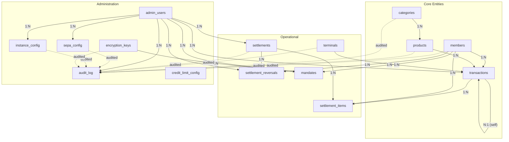

# Master Database Entity-Relationship Model (MariaDB)

This document defines the complete data model for the Club Bar backend database.

---

## Entity-Relationship Diagram

```mermaid
erDiagram
    members {
        binary_16 id PK "UUID, immutable"
        varchar_20 card_uid UK "RFID/NFC card identifier"
        varchar_100 first_name "First name (nullable for GDPR)"
        varchar_100 last_name "Last name (nullable for GDPR)"
        varchar_255 email "Contact email"
        varchar_20 phone "Contact phone number"
        date date_of_birth "Jugendschutz (ADR-0045); NULL = anonymized"
        varchar_70 account_holder_name "If different from member (still on members)"
        varchar_10 preferred_language "ISO 639-1 (e.g., 'de', 'en')"
        int credit_limit_cents "Own ceiling; NULL = club default, 0 = unlimited"
        boolean is_active "Active/blocked (TEMPORARY, e.g. lost card)"
        boolean collection_hold "Blocks the next SEPA sweep after a return"
        varchar_500 collection_hold_reason "Why the hold was placed"
        datetime held_at "When the hold was placed"
        binary_16 held_by_admin_id FK "Admin who placed the hold"
        datetime cleared_at "When the hold was lifted"
        binary_16 cleared_by_admin_id FK "Admin who lifted the hold"
        datetime deleted_at "Offboarded; erasure completed"
        date retention_expires_at "When the retained residual may be deleted"
        datetime created_at "Record creation"
        datetime updated_at "Last modification"
    }

    categories {
        binary_16 id PK "UUID"
        json names "Multilingual names"
        int display_order "Sort position"
        boolean is_active "Available"
        varchar_50 icon_name "Icon name (nullable)"
        datetime created_at "Record creation"
        datetime updated_at "Last modification"
    }

    products {
        binary_16 id PK "UUID, immutable"
        binary_16 category_id FK "Reference to categories"
        json names "Multilingual names"
        json descriptions "Multilingual descriptions"
        int price_cents "Price in cents"
        boolean is_active "Available for sale"
        boolean requires_dispenser "Poured by a dispenser rather than handed over"
        tinyint_unsigned min_age "Minimum legal age (ADR-0045); NULL = unrestricted"
        varchar_50 icon_name "Icon name (nullable)"
        datetime deleted_at "Soft-deleted; hidden from the catalogue"
        binary_16 deleted_by_admin_id FK "Admin who deleted it"
        datetime created_at "Record creation"
        datetime updated_at "Last modification"
    }

    transactions {
        binary_16 id PK "UUID, frontend-generated"
        binary_16 member_id FK "Reference to members"
        binary_16 product_id FK "Reference to products (nullable)"
        int amount_cents "Amount in cents"
        enum transaction_type "purchase, storno or payout"
        varchar_500 notes "Reason/description"
        binary_16 related_transaction_id FK "Reversed transaction (NOT NULL for storno, UNIQUE)"
        binary_16 created_by_terminal_id FK "Recording terminal"
        binary_16 created_by_admin_id FK "Admin (manual entries)"
        datetime occurred_at "Terminal-owned: when the sale happened"
        datetime received_at "Server-owned: when we learned of it"
    }

    mandates {
        binary_16 id PK "UUID, append-only"
        binary_16 member_id FK "Owning member"
        binary_16 active_member_id UK "= member_id while in force, else NULL"
        varchar_35 reference UK "SEPA mandate ID (UMR)"
        varbinary_512 iban_ciphertext "Sealed IBAN (ADR-0036); server cannot open it"
        char_4 iban_last4 "Last four characters, for display"
        char_64 iban_fingerprint "Keyed BLAKE2b, for bank-change detection"
        binary_16 encryption_key_id FK "Key generation this row is sealed under"
        varchar_255 bank_name "Resolved from the BLZ at write time"
        date signed_at "Mandate signature date (nullable in Phase 0)"
        datetime ended_at "Bank change or revocation"
        enum ended_reason "bank_change, revoked or offboarded"
        binary_16 created_by_admin_id FK "Admin who recorded it"
        datetime created_at "Record creation"
        boolean is_active "VIRTUAL: active_member_id IS NOT NULL"
    }

    encryption_keys {
        binary_16 id PK "UUID"
        varchar_100 key_identifier UK "Human-readable label (e.g. 'club-2026')"
        varchar_50 algorithm "Always SODIUM_CRYPTO_BOX_SEAL today"
        varbinary_32 public_key "Raw Curve25519 public key; no private key ever stored"
        char_64 fingerprint_sha256 UK "Identifies the key to humans; validates a supplied private key"
        enum status "pending, active, retiring, retired, revoked or compromised"
        datetime created_at "Registration"
        datetime activated_at "When it became ACTIVE"
        datetime expires_at "activated_at + 365 days; no extend operation"
        datetime retired_at "When rotation finished re-encrypting off it"
        binary_16 created_by_admin_id "Admin who registered it (no FK; see note below)"
    }

    settlements {
        binary_16 id PK "UUID"
        enum method "direct_debit, bank_transfer or write_off"
        date settlement_date "Creation date"
        date execution_date "SEPA execution date"
        date period_start "Accounting period start"
        date period_end "Accounting period end"
        varchar_35 sepa_message_id UK "SEPA XML message ID (direct_debit only)"
        int total_amount_cents "Total settlement amount"
        int member_count "Number of members included"
        boolean is_cancelled "Cancellation flag"
        datetime cancelled_at "Cancellation timestamp"
        binary_16 cancelled_by_admin_id FK "Who cancelled"
        datetime exported_at "Last export timestamp"
        datetime submitted_at "When submission to the bank became irreversible"
        binary_16 submitted_by_admin_id FK "Admin who submitted"
        varchar_1000 notes "Admin notes"
        binary_16 created_by_admin_id FK "Who created"
        datetime created_at "Record creation"
        datetime updated_at "Last modification"
    }

    settlement_items {
        bigint id PK "Auto-increment"
        binary_16 settlement_id FK "Which settlement"
        binary_16 transaction_id FK "Historical record (no longer UNIQUE)"
        binary_16 active_transaction_id UK "Live claim; NULL once released"
        binary_16 member_id FK "Which member"
        int amount_cents "Member total amount"
        varchar_35 end_to_end_id "SEPA End-to-End-ID for this item"
    }

    settlement_reversals {
        binary_16 id PK "UUID"
        binary_16 settlement_id FK "Which settlement"
        binary_16 member_id FK "Which member"
        enum reason "bank_return or club_error"
        int amount_cents "Reversed amount in cents"
        varchar_35 bank_reference "Bank's reversal reference"
        varchar_1000 notes "Admin notes"
        binary_16 created_by_admin_id FK "Admin who recorded it"
        datetime created_at "Record creation (append-only)"
    }

    settlement_announcements {
        bigint id PK "Internal reference"
        char_36 settlement_id FK "Which collection was announced"
        char_36 member_id FK "Who was announced to"
        enum kind "sepa_prenotification, cancellation_notice"
        datetime sent_at "When the transport accepted it (copied from the queue row)"
    }

    mail_outbox {
        char_36 id PK "UUID"
        enum kind "What this message is"
        char_36 subject_id "What it is about; polymorphic, no FK"
        varchar_64 dedup_key "The rest of a message's identity"
        char_36 member_id FK "Member written to, if any"
        char_36 admin_user_id FK "Admin written to, if any"
        varchar_255 recipient "Address snapshot; cleared on erasure"
        char_2 language "Frozen at enqueue"
        enum status "pending, sent, failed, superseded"
        datetime next_attempt_at "When due again"
        datetime sent_at "Delivery time; the prune predicate"
    }

    terminals {
        binary_16 id PK "UUID"
        varchar_100 name "Terminal display name"
        varchar_50 terminal_id UK "Configured terminal identifier"
        varchar_255 token_hash "Hashed API token"
        datetime token_issued_at "When the current token was issued"
        datetime token_expires_at "When the current token stops authenticating"
        varchar_255 pending_token_hash "Replacement token, promoted on first use"
        datetime pending_token_issued_at "When the replacement was minted"
        datetime pending_token_expires_at "Lifetime the replacement carries into promotion"
        boolean is_active "Terminal enabled"
        datetime last_sync_at "Last successful sync"
        varchar_45 last_sync_ip "IP of last sync"
        datetime created_at "Record creation"
        datetime updated_at "Last modification"
    }

    admin_users {
        binary_16 id PK "UUID"
        varchar_255 email UK "Login email"
        varchar_255 password_hash "bcrypt hash"
        varchar_100 display_name "Display name"
        varchar_10 locale "UI language preference"
        boolean is_active "Account enabled"
        datetime last_login_at "Last successful login"
        datetime credentials_changed_at "Ends sessions older than itself"
        datetime created_at "Record creation"
        datetime updated_at "Last modification"
    }

    sepa_config {
        int id PK "Single row (id=1)"
        varchar_35 creditor_id "Gläubiger-ID (immutable)"
        varchar_70 creditor_name "Organization name"
        varchar_34 creditor_iban "Organization bank account"
        varchar_70 creditor_address_street "Street address"
        varchar_70 creditor_address_city "City and postal code"
        varchar_2 creditor_address_country "ISO 3166-1 alpha-2"
        binary_16 updated_by_admin_id FK "Who last modified"
        datetime created_at "Initial setup"
        datetime updated_at "Last modification"
    }

    instance_config {
        tinyint id PK "Single row (id=1)"
        varchar_100 instance_name "Deploying club's display name"
        binary_16 instance_id "Stable random identity (ADR-0035); set once, read via /health"
        binary_16 updated_by_admin_id FK "Who last modified"
        datetime created_at "Initial configuration"
        datetime updated_at "Last modification"
    }

    credit_limit_config {
        tinyint id PK "Single row (id=1)"
        int default_limit_cents "Club-wide ceiling; 0 = no ceiling"
        tinyint warn_threshold_percent "Warn from this share of the ceiling, 1-100"
        char_36 updated_by_admin_id FK "Who last modified"
        timestamp created_at "Initial configuration"
        timestamp updated_at "Last modification"
    }

    audit_log {
        bigint id PK "Auto-increment"
        binary_16 admin_user_id FK "Acting admin (nullable)"
        enum action "create, update, delete, terminal_repair, etc."
        varchar_50 entity_type "Affected table"
        varchar_36 entity_id "Affected record ID"
        json old_values "Values before change"
        json new_values "Values after change"
        varchar_45 ip_address "Client IP (IPv4/IPv6)"
        varchar_500 user_agent "Browser/client"
        datetime created_at "Action timestamp"
    }

    categories ||--o{ products : "contains"
    members ||--o{ transactions : "makes"
    products ||--o{ transactions : "purchased in"
    transactions ||--o| transactions : "stornos"
    terminals ||--o{ transactions : "records"
    admin_users ||--o{ transactions : "creates"
    settlements ||--o{ settlement_items : "includes"
    transactions ||--o{ settlement_items : "settled in"
    members ||--o{ settlement_items : "has"
    settlements ||--o{ settlement_reversals : "clawed back by"
    members ||--o{ settlement_reversals : "affects"
    admin_users ||--o{ settlement_reversals : "records"
    settlements ||--o{ settlement_announcements : "announced to"
    members ||--o{ settlement_announcements : "was told"
    members ||--o{ mail_outbox : "addressed in"
    admin_users ||--o{ mail_outbox : "warned in"
    members ||--o{ mandates : "grants"
    admin_users ||--o{ mandates : "records"
    encryption_keys ||--o{ mandates : "seals"
    admin_users ||--o{ settlements : "creates"
    admin_users ||--o{ settlements : "cancels"
    admin_users ||--o{ settlements : "submits"
    admin_users ||--o{ audit_log : "performs"
    admin_users ||--o{ sepa_config : "modifies"
    admin_users ||--o{ instance_config : "modifies"
    admin_users ||--o{ credit_limit_config : "modifies"

    bank_codes {
        char_8 bank_code PK "Bankleitzahl (BLZ)"
        varchar_128 bank_name "Full bank name"
        varchar_30 short_name "Short designation"
        varchar_11 bic "SWIFT/BIC code"
        varchar_10 postal_code "PLZ of headquarters"
        varchar_40 city "City of headquarters"
        timestamp imported_at "Last import timestamp"
    }
```

---

## Table Definitions

### members

Stores all organization members with payment information.

| Column | Type | Constraints | Description |
|--------|------|-------------|-------------|
| id | BINARY(16) | PK | UUID, immutable permanent identifier |
| card_uid | VARCHAR(20) | UNIQUE, NULL | RFID/NFC card identifier (8-20 hex chars, uppercase) |
| first_name | VARCHAR(100) | NULL | First name (nullable for GDPR anonymization) |
| last_name | VARCHAR(100) | NULL | Last name (nullable for GDPR anonymization) |
| email | VARCHAR(255) | NULL | Contact email address |
| phone | VARCHAR(20) | NULL | Contact phone number |
| date_of_birth | DATE | NULL | Date of birth, for the Jugendschutz check ([ADR-0045](../adr/0045-age-restricted-products.md)). **Required when a member is created** and on any write that names it — the column is nullable only so that erasure can empty it, so NULL means *anonymized*, never *unknown*. Synced to terminals as the **raw date**, never an age in years: an age is wrong from the member's next birthday until the kiosk next reaches the server |
| account_holder_name | VARCHAR(70) | NULL | Still on `members` — only banking fields moved to `mandates` ([ADR-0006](../adr/0006-sepa-mandate-reference-strategy.md), amended) |
| preferred_language | VARCHAR(10) | NOT NULL | ISO 639-1 language code for product display |
| credit_limit_cents | INT | NULL | This member's own Deckel ceiling in cents ([ADR-0047](../adr/0047-configurable-credit-limits.md)). **NULL and 0 are different answers**: NULL means *follow the club default* — so raising the club's ceiling lifts this member too — while 0 means *no ceiling for this member*, the value `limitCents <= 0` already reads as "not enforced" at the terminal. A negative value is refused by the API rather than being allowed to pass that same test by accident. Signed `INT`, not `INT UNSIGNED`, so an out-of-range write is a rejected value rather than a silently clamped one. No index: it is read one member at a time through rows the sync and the dashboard already fetch |
| ~~iban~~ | — | — | **Moved to `mandates.iban`** ([#164](https://github.com/dgloeckner/clubbar/issues/164)) |
| ~~mandate_reference~~ | — | — | **Moved to `mandates.reference`** |
| ~~mandate_signed_at~~ | — | — | **Moved to `mandates.signed_at`** |
| is_active | BOOLEAN | NOT NULL, DEFAULT TRUE | **Temporary** block — e.g. a lost card. **Not** "left the club" |
| collection_hold | BOOLEAN | NOT NULL, DEFAULT FALSE | Stops the **next SEPA sweep** from re-debiting a member whose collection was just returned ([#148](https://github.com/dgloeckner/clubbar/issues/148), [#165](https://github.com/dgloeckner/clubbar/issues/165)) |
| collection_hold_reason | VARCHAR(500) | NULL | Why the hold was placed |
| held_at | DATETIME | NULL | When the hold was placed |
| held_by_admin_id | BINARY(16) | FK → admin_users.id, NULL | Admin who placed the hold |
| cleared_at | DATETIME | NULL | When the hold was lifted |
| cleared_by_admin_id | BINARY(16) | FK → admin_users.id, NULL | Admin who lifted the hold |
| deleted_at | DATETIME | NULL | Offboarding completed; erasure done. This **is** "gone" |
| deleted_by_admin_id | VARCHAR(36) | FK → admin_users.id, NULL | Admin who performed the erasure |
| retention_expires_at | DATE | NULL | Stamped at offboarding: 31.12. of last transaction year + 10 years ([#173](https://github.com/dgloeckner/clubbar/issues/173)). ⚠️ This is the **earliest** deletion may occur, not a due date — § 147 Abs. 3 S. 5 AO suspends expiry while the Festsetzungsfrist runs. Deletion is a **reviewed, deliberate act**, not an automated sweep ([ADR-0029](../adr/0029-two-tier-retention-and-erasure.md)) |
| created_at | DATETIME | NOT NULL | Record creation timestamp |
| updated_at | DATETIME | NOT NULL | Last modification timestamp |

**Indexes:**
- `card_uid` (UNIQUE)
- `is_active`
- `collection_hold`
- `retention_expires_at`
- `updated_at`

**SEPA validity** is no longer a member field test. It is *"does this member have an active mandate"* — one lookup against `mandates` ([ADR-0020](../adr/0020-sepa-mandate-requirement-terminal-access.md), amended). Without one the member cannot use the terminal at all.

**GDPR erasure** ([ADR-0029](../adr/0029-two-tier-retention-and-erasure.md)) — **deletes the person, not the record**:

| Deleted | Retained (restricted) |
|---|---|
| `first_name`, `last_name`, `email`, `phone` | Per-transaction records incl. the member link |
| `date_of_birth`, `account_holder_name`, `collection_hold_reason` | `mandates` rows: reference, IBAN, signature date |
| `card_uid`, credentials, sessions | Settlement, payment, return and reversal records |
| Postal address ⚠️ *(deletable only while the club issues no invoices)* | `preferred_language` — a display setting, not personal data, and `NOT NULL` |

Sets `deleted_at`, and stamps `retention_expires_at`. Restriction is enforced by **access** — restricted rows are not listed, searched, exported or synced — not by a flag each query must remember.

---

### categories

Product categories for organization.

| Column | Type | Constraints | Description |
|--------|------|-------------|-------------|
| id | BINARY(16) | PK | UUID |
| names | JSON | NOT NULL | Multilingual names: `{"de": "Getränke", "en": "Beverages"}` |
| display_order | INT | NOT NULL | Sort position (>= 0) |
| is_active | BOOLEAN | NOT NULL, DEFAULT TRUE | Available (inactive categories hidden on terminal) |
| icon_name | VARCHAR(50) | NULL | Icon component name (e.g., "CategoryIcon"; NULL for default) |
| created_at | DATETIME | NOT NULL | Record creation timestamp |
| updated_at | DATETIME | NOT NULL | Last modification timestamp |

**Indexes:**
- `display_order`
- `is_active`
- `icon_name`
- `updated_at`

**Deactivation**: Inactive categories are hidden on terminal. Products in inactive categories are also hidden (even if product itself is active).

**Icon Display**: Terminal displays category icon based on `icon_name` field. If NULL, displays default CategoryIcon.

---

### products

Product catalog with multilingual support.

| Column | Type | Constraints | Description |
|--------|------|-------------|-------------|
| id | BINARY(16) | PK | UUID, immutable |
| category_id | BINARY(16) | FK → categories.id, NOT NULL | Product category |
| names | JSON | NOT NULL | Multilingual names: `{"de": "Bier 0,5L", "en": "Beer 0.5L"}` |
| descriptions | JSON | NULL | Multilingual descriptions |
| price_cents | INT | NOT NULL | Price in cents (> 0; max 999999 = €9,999.99) |
| is_active | BOOLEAN | NOT NULL, DEFAULT TRUE | Available for purchase |
| requires_dispenser | BOOLEAN | NOT NULL, DEFAULT FALSE | Poured by a dispenser rather than handed over; the terminal holds the sale until the pour is confirmed |
| min_age | TINYINT UNSIGNED | NULL | Minimum legal age to buy this product ([ADR-0045](../adr/0045-age-restricted-products.md)). NULL — the ordinary state of most of a drinks list — means unrestricted. A free integer between 1 and 99 rather than a `{16, 18}` enum: those two thresholds are JuSchG § 9, and a club running this elsewhere sets its own numbers |
| icon_name | VARCHAR(50) | NULL | Icon component name (e.g., "PilsIcon"; NULL for default) |
| deleted_at | DATETIME | NULL | Soft delete. The row survives because `transactions.product_id` references it and a sold drink must stay nameable |
| deleted_by_admin_id | VARCHAR(36) | FK → admin_users.id, NULL | Admin who deleted it |
| created_at | DATETIME | NOT NULL | Record creation timestamp |
| updated_at | DATETIME | NOT NULL | Last modification timestamp |

**Indexes:**
- `category_id`
- `is_active`
- `requires_dispenser`
- `icon_name`
- `deleted_at`
- `deleted_by_admin_id`
- `updated_at`

**Price Changes**: New price applies to new transactions only. Historical transactions retain original amount_cents.

**Age Changes**: The same way. Raising or clearing `min_age` changes what the terminal refuses from the next sync onwards; it does not reach backwards. A Jugendschutz violation already recorded against a past sale keeps the limit as it stood at the time and does not clear when the drink is later un-restricted ([ADR-0045](../adr/0045-age-restricted-products.md) invariant 4).

**Icon Display**: Terminal displays product icon based on `icon_name` field. If NULL, displays default PackageIcon.

### mandates

A mandate is **one record**, or the member has none. Rows are **append-only** — a bank change or revocation ends the current mandate and creates a new one, never mutates in place. Banking data used to live directly on `members` and was freely mutable, so a return arriving after a bank change quoted an MREF+ that no longer existed anywhere and could not be matched; a standalone, append-only record is what keeps it matchable ([ADR-0006](../adr/0006-sepa-mandate-reference-strategy.md) amended, [#164](https://github.com/dgloeckner/clubbar/issues/164), [#165](https://github.com/dgloeckner/clubbar/issues/165)).

| Column | Type | Constraints | Description |
|--------|------|-------------|-------------|
| id | BINARY(16) | PK | UUID |
| member_id | BINARY(16) | FK → members.id, NOT NULL | Owning member (stable across the mandate's history) |
| active_member_id | BINARY(16) | **UNIQUE**, NULL | Holds `member_id` while this mandate is **in force**; NULL once ended. MariaDB has no partial indexes but permits many NULLs in a unique column, so this expresses *"at most one active mandate per member"* the same way `settlement_items` expresses its live claim |
| reference | VARCHAR(35) | UNIQUE, NOT NULL | SEPA mandate ID (UMR); auto-generated at mandate creation |
| iban_ciphertext | VARBINARY(512) | NULL | The IBAN, sealed under the club's public key (`v1:` + base64). The server holds no private key and cannot open it ([ADR-0036](../adr/0036-iban-encryption-sealed-box.md)); only the SEPA export can, with the key supplied for that one request |
| iban_last4 | CHAR(4) | NULL | Last four characters, stored in the clear. Everything routine — `****3000` in a list, the missing-IBAN badge, the settlement CSV — reads this and never needs a key |
| iban_fingerprint | CHAR(64) | NULL | Keyed BLAKE2b of the normalized IBAN, hex. Sealed boxes are randomized, so this is how a bank change is told from a correction without decrypting. The key lives in `config.php`, never in the DB |
| encryption_key_id | CHAR(36) | FK → encryption_keys.id, NULL | Which key generation this row is sealed under; what a rotation walks |
| bank_name | VARCHAR(255) | NULL | Resolved from the BLZ at write time — the last moment the plaintext exists. A sealed row can never answer this question again |
| signed_at | DATE | NULL | Mandate signature date. Deliberately nullable in Phase 0 — the schema migration relocates existing data without changing the eligibility predicate; making a signature date a precondition of SEPA validity is a separate, later change |
| ended_at | DATETIME | NULL | When the mandate stopped being in force |
| ended_reason | ENUM | NULL | `bank_change` · `revoked` · `offboarded` |
| created_by_admin_id | BINARY(16) | FK → admin_users.id, NULL | Admin who recorded it |
| created_at | DATETIME | NOT NULL | Record creation |
| is_active | BOOLEAN | **VIRTUAL, generated** | `active_member_id IS NOT NULL`. Derived rather than stored beside the constraint, so the flag and the constraint cannot drift apart |

**Indexes:** `member_id`, `reference` (UNIQUE), `active_member_id` (UNIQUE)

**Constraint:** `active_member_id` must equal `member_id` when set (`CHECK`) — a mandate can only be "active" for its own owner.

**No plaintext IBAN column.** Migration `018` added one as a nullable remnant for installs that already held IBANs; `020` dropped it, since nothing had shipped and therefore nothing needed migrating. While it existed, the guarantee above was conditional on the column staying empty — now no row shape yields a readable IBAN without the private key.

**No stored mandate document.** `document_id` and the `mandate_documents` table it pointed at existed for OCR prefill; migration `023` dropped both ([ADR-0037](../adr/0037-mandate-documents-not-retained.md)). Extraction from a scan is still available (stateless — nothing written to disk or database), but the signed paper original, archived by the treasurer outside the system, is now the Beleg rather than a stored copy of it.

**Beleg-bearing** — `reference`, `iban_ciphertext` and `signed_at` survive a GDPR erasure request under [ADR-0029](../adr/0029-two-tier-retention-and-erasure.md). Do not null them on anonymisation; the current code does, and that is a bug. The ciphertext is retained rather than the plaintext, which is the point: the record survives without the club being able to read it day to day.

---

### encryption_keys

Key **metadata only** ([ADR-0036](../adr/0036-iban-encryption-sealed-box.md)) — the database never contains a private key. The server holds the public half of a libsodium keypair, which lets it seal an IBAN but never open one; the private half is generated offline and archived by the club, supplied back to the server only transiently (behind fresh TOTP step-up) for SEPA export, an exceptional full-IBAN view, or a rotation batch.

| Column | Type | Constraints | Description |
|--------|------|-------------|-------------|
| id | BINARY(16) | PK | UUID |
| key_identifier | VARCHAR(100) | UNIQUE, NOT NULL | Human-readable label an admin assigns at registration (e.g. `club-2026`) |
| algorithm | VARCHAR(50) | NOT NULL, DEFAULT `SODIUM_CRYPTO_BOX_SEAL` | The only algorithm this system speaks today; a column instead of an assumption, for whenever that changes |
| public_key | VARBINARY(32) | NOT NULL | Raw Curve25519 public key. No corresponding private-key column exists anywhere in this schema |
| fingerprint_sha256 | CHAR(64) | UNIQUE, NOT NULL | SHA-256 of `public_key`, hex. Identifies a key generation to a human, and validates a private key an admin supplies back against the public half already on file |
| status | ENUM | NOT NULL, DEFAULT `pending` | `pending` · `active` · `retiring` · `retired` · `revoked` · `compromised`. Exactly one row is `active` at a time — enforced in `EncryptionKeyService`, not the schema (MariaDB has no partial unique index) |
| created_at | DATETIME | NOT NULL | Registration |
| activated_at | DATETIME | NULL | When this key generation became `active` |
| expires_at | DATETIME | NULL | `activated_at` + 365 days (the shared credential cryptoperiod, ADR-0036). There is no extend operation — expiry is resolved by rotation, not postponed |
| retired_at | DATETIME | NULL | When a rotation finished re-encrypting every row off this key |
| created_by_admin_id | BINARY(16) | NULL, **no FK** | Admin who registered it. Deliberately unconstrained: unlike every other `created_by_admin_id` in this schema, an `admin_users` row being anonymized or removed must never be blocked by, or silently corrupt, a permanent cryptographic audit trail |

**Indexes:** `key_identifier` (UNIQUE), `fingerprint_sha256` (UNIQUE), `status`

**No plaintext, ever.** Every other sensitive column in this schema (e.g. `mandates.iban_ciphertext`) holds something the application can eventually decrypt given the right key. This table is the one place that isn't true by design: `public_key` is precisely the half that grants no decryption capability, and it is the only key material this database is ever allowed to hold.

**Audited**, not FK-linked to `admin_users`: `key_registered`, `key_activated`, `key_rotation_started`, `key_rotation_batch_completed`, `key_rotation_completed`, `key_retired`, `key_revoked`, `key_marked_compromised` (`audit_log.action`) carry the admin who acted and this row's `id`, without a schema constraint tying the two tables together — see `created_by_admin_id` above.

---

### transactions

Immutable, append-only transaction log. No UPDATE or DELETE operations permitted.

| Column | Type | Constraints | Description |
|--------|------|-------------|-------------|
| id | BINARY(16) | PK | UUID, generated by frontend (idempotency key) |
| member_id | BINARY(16) | FK → members.id, NOT NULL | Member who made the transaction |
| product_id | BINARY(16) | FK → products.id, NULL | Product purchased (NULL for stornos and payouts; a purchase always names a product) |
| amount_cents | INT | NOT NULL | Amount in cents (positive = charge; negative = credit/reversal; non-zero; -999999 to +999999) |
| transaction_type | ENUM | NOT NULL | `purchase` (terminal sale) · `storno` (full reversal of one transaction) · `payout` (credit returned at offboarding) |
| notes | VARCHAR(500) | NULL | Reason/description (required for a storno) |
| related_transaction_id | BINARY(16) | FK → transactions.id, **NOT NULL for `storno`**, **UNIQUE** | The transaction being reversed. Mandatory linkage — GoBD Rz. 64 ([ADR-0028](../adr/0028-legal-constraints-on-money-handling.md) §4). UNIQUE enforces *stornoable at most once*; MariaDB permits many NULLs in a unique column, so purchases and payouts (which carry no linkage) are unaffected |
| created_by_terminal_id | BINARY(16) | FK → terminals.id, NULL | Terminal that recorded the transaction |
| created_by_admin_id | BINARY(16) | FK → admin_users.id, NULL | Admin who created manual entry |
| occurred_at | TIMESTAMP | NOT NULL | **Terminal-owned**: when the sale actually happened. Reporting queries use this ([#144](https://github.com/dgloeckner/clubbar/issues/144)) |
| received_at | TIMESTAMP | NOT NULL | **Server-owned**: when the backend learned of it. Audit and sync queries use this. A drink sold offline yesterday and synced today `occurred_at` yesterday but `received_at` today — filtering settlement on the terminal-supplied value is what makes backdating profitable, filtering on server time misdates genuine offline sales |

**Indexes:**
- `(member_id, occurred_at)`
- `product_id`
- `transaction_type`
- `received_at`
- `related_transaction_id` (UNIQUE)

**Note:** A **storno** is a new transaction whose `amount_cents` is the **exact negation** of the transaction it references — derived, never supplied by the caller. The original is never modified. There is no free-amount adjustment and no partial storno ([ADR-0004](../adr/0004-immutable-transaction-storage.md), amended). `related_transaction_id` is a **hard DB constraint** for storno rows (`CHECK (transaction_type <> 'storno' OR related_transaction_id IS NOT NULL)`), not just an application-level rule ([#158](https://github.com/dgloeckner/clubbar/issues/158)).

---

### settlements

Settlement records for SEPA collections and manual settlements.

| Column | Type | Constraints | Description |
|--------|------|-------------|-------------|
| id | BINARY(16) | PK | UUID |
| method | ENUM | NOT NULL | `direct_debit` (many members, produces pain.008) · `bank_transfer` (one member, money already arrived) · `write_off` (one member, money never arrives). **Only `direct_debit` may be exported** ([#163](https://github.com/dgloeckner/clubbar/issues/163)) |
| settlement_date | DATE | NOT NULL | Creation date, set by the server to its own today. Not a request field — the API accepts no `settlement_date` ([#113](https://github.com/dgloeckner/clubbar/issues/113)) |
| execution_date | DATE | NULL | SEPA execution date (>= the server's today + 7 days, and a TARGET2 business day; NULL for manual) |
| period_start | DATE | NULL | Accounting period start (optional) |
| period_end | DATE | NULL | Accounting period end (optional) |
| sepa_message_id | VARCHAR(35) | UNIQUE, NULL | SEPA XML message ID (auto-generated on first export; NULL for manual) |
| ~~manual_reason~~ | — | — | **Removed** — replaced by `method`. `notes` remains free text carrying no meaning to the system |
| total_amount_cents | INT | NOT NULL | Total amount collected in cents (> 0) |
| member_count | INT | NOT NULL | Number of members included (> 0) |
| is_cancelled | BOOLEAN | NOT NULL, DEFAULT FALSE | Cancellation flag |
| cancelled_at | DATETIME | NULL | Cancellation timestamp |
| cancelled_by_admin_id | BINARY(16) | FK → admin_users.id, NULL | Admin who cancelled |
| exported_at | DATETIME | NULL | Last export timestamp |
| submitted_at | DATETIME | NULL | When the settlement was submitted to the bank and became **no longer freely cancellable**. Cancellation is permitted while no money has moved, which needs a recorded moment at which it did ([#142](https://github.com/dgloeckner/clubbar/issues/142), [#163](https://github.com/dgloeckner/clubbar/issues/163)) |
| submitted_by_admin_id | BINARY(16) | FK → admin_users.id, NULL | Admin who submitted |
| notes | VARCHAR(1000) | NULL | Admin notes; carries no meaning to the system |
| created_by_admin_id | BINARY(16) | FK → admin_users.id, NOT NULL | Admin who created |
| created_at | DATETIME | NOT NULL | Settlement creation timestamp |
| updated_at | DATETIME | NOT NULL | Last modification timestamp |

**Indexes:**
- `is_cancelled`
- `settlement_date`
- `execution_date`
- `method`

**`method`** replaces two prior fields: a `settlement_type` that was validated at the controller but never stored, and `manual_reason`, which was an unvalidated free string ([#142](https://github.com/dgloeckner/clubbar/issues/142), [#163](https://github.com/dgloeckner/clubbar/issues/163)):
- `direct_debit`: SEPA collection covering any number of members; the only method that produces a pain.008 export
- `bank_transfer`: one member, money already arrived by other means
- `write_off`: one member, money that will never arrive

**Constraint**: `CHECK (method = 'direct_debit' OR member_count = 1)` — only a direct debit is a batch; a bank transfer or write-off is a decision about exactly one member, so neither may be exported and neither may quietly cover a group.

**Cancellation**: Sets `is_cancelled = true`; linked transactions become unsettled again (available for future settlement) — the `settlement_items` row survives (see below), only its live claim (`active_transaction_id`) is released.

---

### settlement_items

Links transactions to settlements. Cancelling a settlement used to `DELETE` its items, which both returned the transactions to the unsettled pool *and* destroyed the record of what the cancelled settlement had contained. Splitting the claim from the record fixes both: the row survives cancellation while the claim is released ([#142](https://github.com/dgloeckner/clubbar/issues/142), [#148](https://github.com/dgloeckner/clubbar/issues/148)).

| Column | Type | Constraints | Description |
|--------|------|-------------|-------------|
| id | BIGINT | PK, AUTO_INCREMENT | Internal reference |
| settlement_id | BINARY(16) | FK → settlements.id, NOT NULL | Which settlement |
| transaction_id | BINARY(16) | FK → transactions.id, NOT NULL | **Historical record** — which transaction this item was ever created for. No longer UNIQUE: a transaction can appear here once per settlement attempt over its lifetime |
| active_transaction_id | BINARY(16) | FK → transactions.id, **UNIQUE**, NULL | **The live claim**. Equal to `transaction_id` while the settlement holding it is not cancelled; set to NULL when cancelled, freeing the transaction for re-settlement. MariaDB has no partial indexes but permits many NULLs in a unique column, so the DB still prevents two live settlements claiming the same transaction |
| member_id | BINARY(16) | FK → members.id, NOT NULL | Denormalized for queries |
| amount_cents | BIGINT | NOT NULL | Member's amount for this item; **signed**, to allow negative correction amounts |
| end_to_end_id | VARCHAR(35) | NULL | SEPA End-to-End-ID this item was collected under; `E2E-<settlement:12hex>-<member:12hex>`, written on export and shared by every item of the same collection line. NULL until exported, and for members the export left out (#150) |

**Indexes:**
- `settlement_id`
- `transaction_id`
- `active_transaction_id` (UNIQUE)
- `member_id`

**Constraint**: A transaction can be **actively** claimed by at most one settlement at a time (`active_transaction_id` UNIQUE); its full settlement history is preserved via `transaction_id`.

### settlement_reversals

The bank clawing back a collection without asking — distinct from cancellation, which is the club *choosing* to undo a settlement. Append-only events, at most one per member per settlement ([#148](https://github.com/dgloeckner/clubbar/issues/148)).

| Column | Type | Constraints | Description |
|--------|------|-------------|-------------|
| id | BINARY(16) | PK | UUID |
| settlement_id | BINARY(16) | FK → settlements.id, NOT NULL | Which settlement was (partially) clawed back |
| member_id | BINARY(16) | FK → members.id, NOT NULL | Which member's collection was returned |
| reason | ENUM | NOT NULL | `bank_return` (the bank returned the direct debit, e.g. insufficient funds) · `club_error` (the club's own mistake) |
| amount_cents | BIGINT | NOT NULL | Amount reversed, in cents |
| bank_reference | VARCHAR(35) | NULL | Bank's reference for the return |
| notes | VARCHAR(1000) | NULL | Admin notes |
| created_by_admin_id | BINARY(16) | FK → admin_users.id, NOT NULL | Admin who recorded it |
| created_at | DATETIME | NOT NULL | Record creation (append-only; no update/delete) |

**Indexes:**
- `(settlement_id, member_id)` (UNIQUE)
- `member_id`

---

### settlement_announcements

Durable proof that one member was announced to about one settlement, and when ([#408](https://github.com/dgloeckner/clubbar/issues/408)).

The queue row in `mail_outbox` carries the same fact plus the *address*, and the two do not expire together: the address is operational-tier and is erased with the member and pruned 90 days after delivery, while the fact that the § 7 Abs. 3 announcement went out is retention-tier ([ADR-0029](../adr/0029-two-tier-retention-and-erasure.md)). This table is the half that stays. It names no address, which is exactly what lets it be kept.

An event table rather than columns on `settlement_items` for the reason [ADR-0032](../adr/0032-settlement-lifecycle.md) §6 gives for reversals: `settlement_items` is one row per settled *transaction*, so a member with thirty bookings would carry thirty copies of one timestamp and no single row meaning "this member was told".

| Column | Type | Constraints | Description |
|--------|------|-------------|-------------|
| id | BIGINT | PK, AUTO_INCREMENT | Internal reference |
| settlement_id | CHAR(36) | FK → settlements.id (CASCADE), NOT NULL | Which collection was announced |
| member_id | CHAR(36) | FK → members.id (RESTRICT), NOT NULL | Who was announced to. RESTRICT because a member is anonymised, never deleted — and the retention tier must not leave with them |
| kind | ENUM | NOT NULL | `sepa_prenotification` · `cancellation_notice`. Only member-addressed settlement mail; an expiry warning has no settlement to be evidence against |
| sent_at | DATETIME | NOT NULL | When the transport accepted it. **Copied from the queue row**, not stamped from a second clock, so the two cannot disagree while both exist |

**Indexes:**
- `(settlement_id, member_id, kind)` (UNIQUE) — one announcement of one kind per member per settlement; also what makes the drain's write idempotent across a re-marked send
- `settlement_id`

**Retention tier:** retention. Kept for the settlement's retention period; **not** touched by erasure.

---

### mail_outbox

The transactional outbox ([ADR-0038](../adr/0038-transactional-mail-outbox-on-shared-hosting.md)). Finalizing a settlement writes rows here inside the settlement's own transaction and makes no network call; the scheduler drains them and is the only sender.

There is **no body column**. Content is rendered from settlement data at send time, which is safe because ADR-0032 makes a settlement append-only — and storing bodies would multiply copies of member PII for no evidentiary gain.

| Column | Type | Constraints | Description |
|--------|------|-------------|-------------|
| id | CHAR(36) | PK | UUID |
| kind | ENUM | NOT NULL | `sepa_prenotification` · `cancellation_notice` · `key_expiry_warning` · `terminal_token_expiry_warning` · `terminal_anomaly_warning`. A `payment_request` value existed until migration `036` removed it — see CONTEXT.md, **Settlement method** |
| subject_id | CHAR(36) | NOT NULL, no FK | What the message is about; which table it points at is decided by `kind`. Polymorphic, so no foreign key is possible — stated rather than hidden |
| dedup_key | VARCHAR(64) | NOT NULL | The rest of a message's identity: the member for settlement mail, the warning tier for an expiry warning |
| member_id | CHAR(36) | FK → members.id (CASCADE), NULL | The member written to, when there is one. The FK is how erasure finds this table |
| admin_user_id | CHAR(36) | FK → admin_users.id (CASCADE), NULL | The admin written to, for operational warnings |
| recipient | VARCHAR(255) | NOT NULL | **Snapshot** of the address at enqueue — the proof of who was announced to, and the one field not reproducible later. Cleared to `''` on erasure |
| language | CHAR(2) | NOT NULL, default `de` | Frozen at enqueue so a later language change cannot alter what was announced |
| status | ENUM | NOT NULL, default `pending` | `pending` · `sent` · `failed` · `superseded` (withdrawn: a cancelled collection, or an erased member) |
| attempts | TINYINT | NOT NULL, default 0 | Attempts so far; the ladder is in scheduler ticks |
| next_attempt_at | DATETIME | NOT NULL, default epoch | When this row is due again |
| last_error | TEXT | NULL | What the receiving server said — the text the Kassenwart reads |
| claim_token / claimed_at | CHAR(36) / DATETIME | NULL | Claim by `UPDATE`, then select by token; deliberately not `SELECT … FOR UPDATE SKIP LOCKED`, which needs MariaDB 10.6+ |
| queued_at | DATETIME | NOT NULL | Enqueue time |
| sent_at | DATETIME | NULL | Delivery time; the prune predicate reads this |
| message_id | VARCHAR(255) | NULL | The transport's handle, for correlating with an MTA log |

**Indexes:**
- `(kind, subject_id, dedup_key)` (UNIQUE) — the whole of the "a retried finalize does not duplicate emails" guarantee. Every column is NOT NULL because in MySQL a NULL never equals a NULL, and one nullable column would silently stop the index being unique
- `(status, next_attempt_at, claimed_at)` — the drain's claim predicate
- `(subject_id, status)` — the settlement detail and the cancellation path
- `member_id` — erasure
- `sent_at` — pruning

**Retention tier:** operational. `recipient` is cleared on erasure; `sent` rows are pruned after 90 days per kind, and `pending`/`failed`/`superseded` rows are never pruned at any age.

---

### mail_config

Club-editable mail settings — sender name and address, reply-to, header style, footer identity, and the declared scheduler interval and drain batch size. Singleton row.

The **DSN, including the SMTP password, is deliberately not here**: it stays in `config.php`, consistent with the database password and the TOTP key ([ADR-0031](../adr/0031-production-hardening-on-shared-hosting.md) decision 2). Changing the mail server is an installer or file operation.

**Retention tier:** configuration. No personal data; untouched by erasure and by pruning.

---

### cron_heartbeat

One row, written by every drain run. Read for three different questions: has a scheduled run ever been observed (the install gate), is the queue moving (the monitoring), and what does the self-check show.

| Column | Type | Description |
|--------|------|-------------|
| id | TINYINT | PK, always 1 |
| last_run_at / previous_run_at | DATETIME | The last two runs — two timestamps answer "how far apart do runs actually arrive?", which a growing log of cron ticks would answer at the cost of a table nobody prunes |
| source | ENUM | `cli` (preferred) · `url` |
| sent / failed | INT | Counts from the last run |
| php_version | VARCHAR(32) | The **CLI** interpreter, which on shared hosting is frequently not the web one |
| missing_extensions | VARCHAR | `''` means checked and complete; NULL means never checked |

**Retention tier:** operational. No personal data.

---

### terminals

Registered POS terminals with API authentication.

| Column | Type | Constraints | Description |
|--------|------|-------------|-------------|
| id | BINARY(16) | PK | UUID |
| name | VARCHAR(100) | NOT NULL | Human-readable terminal name (e.g., "Bar-Terminal-1") |
| terminal_id | VARCHAR(50) | UNIQUE, NOT NULL | Configured terminal identifier (sent in X-Terminal-Id header) |
| token_hash | VARCHAR(255) | NOT NULL | bcrypt hash of API token (cost >= 12) |
| token_issued_at | DATETIME | NULL | When the current token was issued; NULL once access is revoked |
| token_expires_at | DATETIME | NULL | When the current token stops authenticating; NULL once access is revoked |
| pending_token_hash | VARCHAR(255) | NULL | SHA-256 of a replacement token issued but not yet used; promoted on first successful authentication (#395) |
| pending_token_issued_at | DATETIME | NULL | When the replacement was minted |
| pending_token_expires_at | DATETIME | NULL | Lifetime the replacement carries into its promotion |
| is_active | BOOLEAN | NOT NULL, DEFAULT TRUE | Terminal enabled for API access |
| last_sync_at | DATETIME | NULL | Timestamp of last successful sync |
| last_sync_ip | VARCHAR(45) | NULL | IP address of last sync (IPv4 or IPv6) |
| created_at | DATETIME | NOT NULL | Record creation timestamp |
| updated_at | DATETIME | NOT NULL | Last modification timestamp |

**Indexes:**
- `terminal_id` (UNIQUE)
- `is_active`
- `pending_token_hash` — authentication falls through to this column on every request the active hash did not match, so it needs the same indexed lookup

**Token**: 64-character hex string; stored as bcrypt hash; shown once during creation.

**Token lifetime (#106)**: a token authenticates only while
`token_expires_at > NOW()` — `API_TOKEN_TTL_DAYS` (default 365, the shared
credential cryptoperiod of ADR-0036) after it was issued. The check is
fail-closed: a row carrying a token hash with no `token_expires_at` does not
authenticate.

**Overlap rotation (#395)**: rotating does not touch the active columns. It
writes the `pending_*` triple instead, so both tokens authenticate until the
terminal presents the new one; that first use copies the pending columns over
the active ones and clears them, retiring the replaced token in the same
statement. Revoking clears all six columns along with the hash — a staged
replacement is a credential too.

---

### admin_users

Administrator accounts for the admin panel.

| Column | Type | Constraints | Description |
|--------|------|-------------|-------------|
| id | BINARY(16) | PK | UUID |
| email | VARCHAR(255) | UNIQUE, NOT NULL | Login email address |
| password_hash | VARCHAR(255) | NOT NULL | bcrypt hash (cost >= 12) |
| display_name | VARCHAR(100) | NULL | Display name in UI |
| locale | VARCHAR(10) | NOT NULL, DEFAULT 'de' | UI language preference (ISO 639-1) |
| is_active | BOOLEAN | NOT NULL, DEFAULT TRUE | Account enabled |
| last_login_at | DATETIME | NULL | Last successful login |
| credentials_changed_at | TIMESTAMP | NULL | When this account's password, email or 2FA last changed. A session whose `authenticated_at` is at or before this is refused with `credentials_changed`, which is how a credential change ends the account's other sessions without a session store ([ADR-0026 amendment](../adr/0026-mandatory-totp-two-factor-authentication.md#amendment-2026-08-15--a-reset-now-ends-the-targets-sessions)). NULL until the first such change — every pre-existing row, so deploying the column signs nobody out |
| totp_secret | VARCHAR(255) | NULL | AES-256-CBC encrypted TOTP secret (`base64(iv):base64(ciphertext)`) |
| totp_enabled | BOOLEAN | NOT NULL, DEFAULT FALSE | `0` = not enrolled, `1` = TOTP active |
| totp_last_timestep | BIGINT | NULL | Time-step of the last TOTP code MFA accepted; a code at or below it is refused as a replay ([#338](https://github.com/dgloeckner/clubbar/issues/338)). Cleared alongside `totp_secret` on 2FA reset |
| created_at | DATETIME | NOT NULL | Record creation timestamp |
| updated_at | DATETIME | NOT NULL | Last modification timestamp |

**Indexes:**
- `email` (UNIQUE)
- `is_active`

**Access:**
- All admin users have full access: CRUD on all entities, settlements, GDPR operations, user management, audit log

---

### sepa_config

Organization-level SEPA Direct Debit configuration. Single-row table.

| Column | Type | Constraints | Description |
|--------|------|-------------|-------------|
| id | INT | PK, CHECK (id = 1) | Always 1 (single row) |
| creditor_id | VARCHAR(35) | NOT NULL | Gläubiger-ID (immutable after initial set) |
| creditor_name | VARCHAR(70) | NOT NULL | Organization name for SEPA records |
| creditor_iban | VARCHAR(34) | NOT NULL | Organization bank account (ISO 13616 + mod-97) |
| creditor_address_street | VARCHAR(70) | NOT NULL | Street address |
| creditor_address_city | VARCHAR(70) | NOT NULL | City and postal code |
| creditor_address_country | VARCHAR(2) | NOT NULL, DEFAULT 'DE' | ISO 3166-1 alpha-2 country code |
| updated_by_admin_id | BINARY(16) | FK → admin_users.id, NULL | Admin who last modified |
| created_at | DATETIME | NOT NULL | Initial configuration timestamp |
| updated_at | DATETIME | NOT NULL | Last modification timestamp |

**Constraint:** `CHECK (id = 1)` ensures single-row enforcement.

---

### instance_config

Deployment-wide instance branding ([ADR-0034](../adr/0034-instance-branding-configuration.md)). Single-row table, same pattern as `sepa_config`. Read by the admin frontend (login page and header), the Terminal (via `/health`), and `TotpService` (2FA enrollment issuer).

| Column | Type | Constraints | Description |
|--------|------|-------------|-------------|
| id | TINYINT UNSIGNED | PK | Always 1 (single row) |
| instance_name | VARCHAR(100) | NOT NULL, DEFAULT 'Club Bar' | The deploying club's display name, e.g. "FRGS Ruderbar" |
| instance_id | CHAR(36) | NOT NULL | Random UUID set once when this row is created (install/reseed); read via `/health` so a Terminal can tell this backend apart from one with a discontinuous history ([ADR-0035](../adr/0035-terminal-backend-instance-pairing.md)) |
| updated_by_admin_id | CHAR(36) | FK → admin_users.id, NULL | Admin who last modified |
| created_at | TIMESTAMP | NOT NULL | Initial configuration timestamp |
| updated_at | TIMESTAMP | NOT NULL | Last modification timestamp |

---

### credit_limit_config

What the club sets as the ceiling a member's Deckel may reach, and the share of it at which the terminal starts warning ([ADR-0047](../adr/0047-configurable-credit-limits.md)). Single-row table, same pattern as `sepa_config` and `instance_config`. Read by the terminal via `GET /api/sync/config`, by the dashboard's near-limit list, and by the Deckelauszug.

| Column | Type | Constraints | Description |
|--------|------|-------------|-------------|
| id | TINYINT UNSIGNED | PK | Always 1 (single row) |
| default_limit_cents | INT | NOT NULL, DEFAULT 10000 | Club-wide ceiling in cents, applying to every member whose own `credit_limit_cents` is NULL. `0` = the club enforces no ceiling. Seeded at 10000, exactly the constant it replaced, so the migration changes nothing on the day it runs |
| warn_threshold_percent | TINYINT UNSIGNED | NOT NULL, DEFAULT 80 | Share of the **effective** ceiling from which a member is warned, 1–100. Club-wide only: an override sets one number, the ceiling, and the band is always the same share of whatever ceiling a member ends up with. The boundary is integer division (`intdiv(limit × percent, 100)`) on both sides of the wire |
| updated_by_admin_id | CHAR(36) | FK → admin_users.id, NULL | Admin who last modified. Nullable and `ON DELETE SET NULL` — an account can be removed and the setting still stands |
| created_at | TIMESTAMP | NOT NULL | Initial configuration timestamp |
| updated_at | TIMESTAMP | NOT NULL | Last modification timestamp |

**Why the club default lives here and not on `/health`.** `/health` carries only what a terminal needs *before* it can authenticate; a spending ceiling is not that. And it cannot ride `/sync/members` either, which is a delta on `updated_at` — a club setting touches no member row, so a terminal that had already synced would never see the change. Hence its own authenticated `GET /api/sync/config`.

**Reads and writes:** both verbs are TREASURY (admin + Kassenwart) in `RouteRoleMap`; the terminal reads the resolved policy through `/api/sync/config` with its bearer token.

---

### jugendschutz_violation_acks

Whether a human has dealt with a recorded underage sale ([#622](https://github.com/dgloeckner/clubbar/issues/622), [ADR-0045](../adr/0045-age-restricted-products.md) §3).

**There is no `jugendschutz_violations` table, deliberately.** The violation *is* the `jugendschutz_violation` audit entry — one record, append-only, filed under the transaction. A second table mirroring its payload would be two records of one fact, free to drift apart. This table holds only the acknowledgement, keyed on the audit entry it concerns.

| Column | Type | Constraints | Description |
|--------|------|-------------|-------------|
| audit_log_id | BIGINT UNSIGNED | PK, FK → audit_log.id ON DELETE CASCADE | The violation entry being acknowledged. A real foreign key, unlike `mail_outbox.subject_id` — this one points at exactly one table |
| acknowledged_at | DATETIME | NOT NULL | When somebody dealt with it |
| acknowledged_by_admin_id | CHAR(36) | FK → admin_users.id, NULL | Who. Nullable because an account can be removed and the acknowledgement still happened |
| note | VARCHAR(500) | NULL | Optional free text — what was done. Never required: a mandatory field on a dismissal becomes "." and teaches people to write nothing true |
| created_at | TIMESTAMP | NOT NULL | Row creation |

**Indexes:** `acknowledged_at`

**Does this break invariant 4?** No, and the distinction is the whole design. In `terminal_anomalies`, acknowledging mutates *the record itself* — one object, and closing it changes what the club can say happened. Here there are **two objects**: the audit entry is the record, immutable and untouched by anything in this table, and acknowledgement is state added beside it. A past sale to a minor stays true no matter what; what changes is only whether the dashboard is still asking somebody to look at it.

That matters because the alternative is worse. An alert that can never be dismissed is one people learn to stop seeing — which would leave the *next* violation as invisible as the first.

**Reads:** the dashboard alert counts `jugendschutz_violation` audit rows with no row here, using `idx_audit_created_action (action, created_at)`.

---

### audit_log

Centralized audit trail for all master data changes.

| Column | Type | Constraints | Description |
|--------|------|-------------|-------------|
| id | BIGINT | PK, AUTO_INCREMENT | Unique log entry ID |
| admin_user_id | BINARY(16) | FK → admin_users.id, NULL | Admin who performed action (NULL for system/failed login) |
| action | ENUM | NOT NULL | Action type (see below) |
| entity_type | VARCHAR(50) | NOT NULL | Affected table name |
| entity_id | VARCHAR(36) | NULL | Primary key of affected record |
| old_values | JSON | NULL | Field values before change |
| new_values | JSON | NULL | Field values after change |
| ip_address | VARCHAR(45) | NULL | Client IP address (IPv4 or IPv6) |
| user_agent | VARCHAR(500) | NULL | Browser/client identifier |
| created_at | DATETIME | NOT NULL | Action timestamp |

**Action types:**
- `create` — New record created
- `update` — Record modified
- `delete` — Record deleted
- `anonymize` — GDPR anonymization performed
- `login` — Successful admin login
- `logout` — Admin logout
- `login_failed` — Failed login attempt
- `export` — Data export generated
- `settlement_create` — Settlement created
- `settlement_cancel` — Settlement cancelled
- `settlement_export` — Settlement CSV/XML exported
- `settlement_submit` — Exported file handed to the bank ([#81](https://github.com/dgloeckner/clubbar/issues/81))
- `settlement_reverse` — Money that already moved has come back ([#196](https://github.com/dgloeckner/clubbar/issues/196))
- `transaction_storno` — A booking reversed in full ([#169](https://github.com/dgloeckner/clubbar/issues/169))
- `transaction_price_divergence` — A synced sale claimed an amount other than the product's current price ([#204](https://github.com/dgloeckner/clubbar/issues/204)). Written by the sync path, so `admin_user_id` is NULL. The amount stands: it is what the member saw and accepted, possibly weeks earlier while offline — the entry records the disagreement rather than correcting it
- `jugendschutz_violation` — A synced sale handed an age-restricted drink to a member who was under its `min_age` **at the moment of the sale** ([ADR-0045](../adr/0045-age-restricted-products.md), JuSchG § 9). Written by the sync path, so `admin_user_id` is NULL. Filed under the **transaction**, and the payload carries ids, `min_age` and `age_at_sale` — never the member's name and never their birth date, so a later erasure (which keys on the member's own `entity_id`) leaves nothing behind. Like the divergence entry it never rejects the row: the drink was already poured, and refusing the upload would trade a youth-protection incident for a § 146 Abs. 1 AO bookkeeping one
- `jugendschutz_violation_acknowledged` — An admin decided a recorded violation had been dealt with ([#622](https://github.com/dgloeckner/clubbar/issues/622)). Deliberately **not** an edit to the entry above: that one is the record and never moves ([ADR-0045](../adr/0045-age-restricted-products.md) invariant 4). This is a later, separate fact. Reading the pair tells a club what happened *and* how it was handled
- `collection_hold_placed` — A bank return stopped the next run re-debiting a member
- `collection_hold_cleared` — An admin released that member back into the next run
- `totp_enrolled` / `totp_reset` — Second factor enrolled or reset
- `password_changed` — An admin password changed, whether by its owner or by another admin's reset. Distinct from the plain `update` a display-name edit produces, so "when did this account's password change" is one filter rather than a scan of every admin-user payload
- `email_changed` — An admin's login email moved. Carries the old and new addresses; the email is the login identifier, so this records a change to who can sign in
- `mandate_document_upload` / `mandate_document_delete` — Mandate scan stored or removed; historical only since [ADR-0037](../adr/0037-mandate-documents-not-retained.md) (migration `023`) removed the code path that wrote them — kept in the enum so pre-existing audit rows stay valid
- `activate` / `deactivate` / `reorder` — Status and ordering changes
- `terminal_repair` — A terminal resumed sync after staff confirmed a pairing (instance_id) mismatch was safe to trust ([ADR-0035](../adr/0035-terminal-backend-instance-pairing.md), [#380](https://github.com/dgloeckner/clubbar/issues/380))

**Indexes:**
- `admin_user_id`
- `action`
- `entity_type`
- `entity_id`
- `created_at`

**Sensitive Data**: IBAN masked as `DE89****...****4567`; passwords logged as `[CHANGED]`; tokens never logged.

**Retention**: 10 years per § 147 AO (German tax code).

### bank_codes

Lookup table for resolving German IBANs to bank names. Data sourced from the Deutsche Bundesbank BLZ (Bankleitzahl) file, updated quarterly. Only Hauptstelle (main office, Merkmal=1) entries are stored.

| Column | Type | Constraints | Description |
|--------|------|-------------|-------------|
| bank_code | CHAR(8) | PK | Bankleitzahl (BLZ) |
| bank_name | VARCHAR(128) | NOT NULL | Full bank name from Bundesbank file |
| short_name | VARCHAR(30) | NOT NULL, DEFAULT '' | Short designation (Kurzbezeichnung) |
| bic | VARCHAR(11) | NOT NULL, DEFAULT '' | SWIFT/BIC code |
| postal_code | VARCHAR(10) | NOT NULL, DEFAULT '' | PLZ of bank headquarters |
| city | VARCHAR(40) | NOT NULL, DEFAULT '' | City of bank headquarters |
| imported_at | TIMESTAMP | NOT NULL, DEFAULT CURRENT_TIMESTAMP | When this row was last imported |

**Data Source**: Deutsche Bundesbank BLZ-Datei (https://www.bundesbank.de)

**Import**: Via `install.php?action=import-bank-codes` or CLI `php bin/import-bank-codes.php <file>`.

**Lookup**: Extract BLZ from German IBAN positions 5–12 (e.g., DE89**37040044**0532013000 → BLZ 37040044).

---

## Relationships

| Relationship | Cardinality | Description |
|--------------|-------------|-------------|
| categories → products | 1:N | Category contains many products |
| members → transactions | 1:N | Member makes many transactions |
| products → transactions | 1:N | Product appears in many transactions |
| terminals → transactions | 1:N | Terminal records many transactions |
| admin_users → transactions | 1:N | Admin creates manual transactions |
| transactions → transactions | N:1 | Storno references the transaction it reverses |
| settlements → settlement_items | 1:N | Settlement includes many items |
| transactions → settlement_items | 1:N | Transaction in settlement items (history), at most one active claim |
| members → settlement_items | 1:N | Member's settlement items |
| settlements → settlement_reversals | 1:N | A settlement may be clawed back per member |
| members → settlement_reversals | 1:N | Member's reversed collections |
| admin_users → settlement_reversals | 1:N | Admin who recorded the reversal |
| settlements → settlement_announcements | 1:N | Which members this collection was announced to |
| members → settlement_announcements | 1:N | The member's own announcement history |
| members → mail_outbox | 1:N | Messages queued for a member (cascades, so mail never outlives them) |
| admin_users → mail_outbox | 1:N | Operational warnings queued for an admin |
| members → mandates | 1:N | Member's mandate history (append-only; at most one active) |
| admin_users → mandates | 1:N | Admin who recorded the mandate |
| encryption_keys → mandates | 1:N | The key generation a mandate's IBAN is sealed under; what a rotation batch walks |
| admin_users → settlements | 1:N | Admin creates/cancels/submits settlements |
| admin_users → audit_log | 1:N | Admin performs many audited actions |

---

## Data Integrity Rules

### Referential Integrity

| Child Table | Foreign Key | Parent Table | On Delete |
|-------------|-------------|--------------|-----------|
| products | category_id | categories | RESTRICT |
| transactions | member_id | members | RESTRICT |
| transactions | product_id | products | SET NULL |
| transactions | related_transaction_id | transactions | SET NULL |
| transactions | created_by_terminal_id | terminals | RESTRICT |
| transactions | created_by_admin_id | admin_users | SET NULL |
| settlement_items | settlement_id | settlements | CASCADE |
| settlement_items | transaction_id | transactions | RESTRICT |
| settlement_items | active_transaction_id | transactions | RESTRICT |
| settlement_items | member_id | members | RESTRICT |
| settlements | created_by_admin_id | admin_users | RESTRICT |
| settlements | cancelled_by_admin_id | admin_users | SET NULL |
| settlements | submitted_by_admin_id | admin_users | RESTRICT |
| settlement_reversals | settlement_id | settlements | RESTRICT |
| settlement_reversals | member_id | members | RESTRICT |
| settlement_reversals | created_by_admin_id | admin_users | RESTRICT |
| settlement_announcements | settlement_id | settlements | CASCADE |
| settlement_announcements | member_id | members | RESTRICT |
| mail_outbox | member_id | members | CASCADE |
| mail_outbox | admin_user_id | admin_users | CASCADE |
| mandates | member_id | members | CASCADE |
| mandates | created_by_admin_id | admin_users | SET NULL |
| mandates | encryption_key_id | encryption_keys | RESTRICT |
| members | held_by_admin_id | admin_users | SET NULL |
| members | cleared_by_admin_id | admin_users | SET NULL |
| audit_log | admin_user_id | admin_users | SET NULL |
| sepa_config | updated_by_admin_id | admin_users | SET NULL |
| instance_config | updated_by_admin_id | admin_users | SET NULL |
| credit_limit_config | updated_by_admin_id | admin_users | SET NULL |

### Business Rules

1. **Transactions are immutable**: No UPDATE or DELETE on transactions table
2. **Members cannot be deleted with balance**: Check unsettled transaction sum before anonymization
3. **Products cannot be deleted with transactions**: Use `is_active = false` instead
4. **Categories cannot be deleted with products**: Use `is_active = false` instead
5. **Terminals cannot be deleted with transactions**: Use `is_active = false` instead
6. **SEPA creditor_id is immutable**: Cannot be changed after initial configuration
7. **Settlement transactions are locked**: Transactions with an active `settlement_items` claim cannot be re-settled elsewhere
8. **Settlement cancellation releases the claim, not the record**: When cancelled, `active_transaction_id` is nulled and the transaction becomes available for future settlement; the `settlement_items` row itself is retained as history
9. **A transaction is stornoed at most once**: Enforced by the UNIQUE index on `transactions.related_transaction_id`
10. **A storno must reference the original**: Enforced by `CHECK (transaction_type <> 'storno' OR related_transaction_id IS NOT NULL)`
11. **Non-direct-debit settlements cover exactly one member**: Enforced by `CHECK (method = 'direct_debit' OR member_count = 1)`
12. **At most one active mandate per member**: Enforced by the UNIQUE index on `mandates.active_member_id`, together with `CHECK (active_member_id IS NULL OR active_member_id = member_id)`
13. **Exactly one `active` encryption key at a time**: Not schema-enforced (MariaDB has no partial unique index on `encryption_keys.status`) — `EncryptionKeyService` owns this invariant
14. **An `encryption_keys` row cannot be deleted while a mandate is sealed under it**: `mandates.encryption_key_id` is `RESTRICT`, not `SET NULL` — a mandate whose key vanished would hold ciphertext nothing could ever open again

---

## GDPR Compliance

### Anonymization Mapping

When a member requests deletion (GDPR Art. 17):

| Column | Before | After |
|--------|--------|-------|
| first_name | "Max" | NULL |
| last_name | "Mustermann" | NULL |
| email | "max@example.com" | NULL |
| phone | "+49 170 ..." | NULL |
| date_of_birth | "2009-03-04" | NULL |
| account_holder_name | "Erika Mustermann" | NULL |
| collection_hold_reason | "Rücklastschrift 03/2026" | NULL |
| card_uid | "A1B2C3D4" | "ANON-{15 hex}" |
| is_active | true | false |
| deleted_at | NULL | {timestamp} |
| deleted_by_admin_id | NULL | {admin uuid, or NULL for a self-service erasure} |

`preferred_language` is **not** nulled — it is `NOT NULL` in the schema, so it could not be, and it is a display setting rather than personal data. This table claimed otherwise until [#590](https://github.com/dgloeckner/clubbar/issues/590); `MembersRepository::anonymize()` is the authority.

`date_of_birth` is nulled here, and that is the compensating control for putting it on kiosks at all ([ADR-0045](../adr/0045-age-restricted-products.md) decision 1): the anonymized row travels the ordinary delta sync with the field emptied, so the erasure reaches every terminal cache with no separate mechanism. A member with no birth date is refused any product carrying a `min_age` — absent means *anonymized*, never *unknown*, so there is no fail-open branch.

`iban` and `mandate_reference` no longer live on `members` at all — they moved to `mandates` in [#164](https://github.com/dgloeckner/clubbar/issues/164)/[#165](https://github.com/dgloeckner/clubbar/issues/165) and are **not** touched by member anonymization ([ADR-0029](../adr/0029-two-tier-retention-and-erasure.md)): both are Beleg-bearing, and nulling them would break matching a returned collection that arrives after the erasure request.

The outbox is the **second place a member's address lives**, and erasure covers it in the same transaction ([#408](https://github.com/dgloeckner/clubbar/issues/408)) — otherwise anonymisation clears `members.email` and leaves the same address sitting in a queue row:

| Table.column | Before | After |
|--------------|--------|-------|
| mail_outbox.recipient | "max@example.com" | `''` (every row of that member, keyed on `member_id`) |
| mail_outbox.status | `pending` | `superseded` — a message queued for an erased member is withdrawn, not left addressed to nobody |

**Retained:** `id`, `created_at`, `updated_at`, `retention_expires_at` — plus the whole **retention tier**: `mandates` rows (`reference`, `iban_ciphertext`, `signed_at`), transactions, settlements, payment/return/reversal records. `settlement_announcements` is retention tier and is **not** touched: it records that a member was announced to and names no address.

### Retention Periods

| Data | Retention | Legal Basis |
|------|-----------|-------------|
| transactions | 10 years | § 147 AO (German tax code) |
| settlements | 10 years | § 147 AO |
| audit_log | 10 years | Accountability requirement |
| Anonymized members | 10 years | Transaction linkage |
| Active member PII | Until deletion request | GDPR Art. 17 |
| settlement_announcements | 10 years (with the settlement) | § 147 AO; proof the Nutzungsordnung § 7 Abs. 3 announcement was made |
| mail_outbox (`sent` rows) | 90 days from delivery, per kind | Operational tier — a delivered message has no reason to keep an address ([ADR-0029](../adr/0029-two-tier-retention-and-erasure.md)) |
| mail_outbox (`pending`/`failed`/`superseded`) | Not pruned | A failed row is the record that somebody was **not** reached |

---

## Related ADRs

- [ADR-0001: Monetary Values as Integer Cents](../adr/0001-monetary-values-as-integer-cents.md)
- [ADR-0002: Product Internationalization](../adr/0002-product-internationalization.md)
- [ADR-0004: Immutable Transaction Storage](../adr/0004-immutable-transaction-storage.md)
- [ADR-0005: IBAN Storage and Validation](../adr/0005-iban-storage-and-validation.md)
- [ADR-0006: SEPA Mandate Reference Strategy](../adr/0006-sepa-mandate-reference-strategy.md)
- [ADR-0007: Organization SEPA Configuration Storage](../adr/0007-organization-sepa-configuration-storage.md)
- [ADR-0013: Audit Logging](../adr/0013-audit-logging.md)
- [ADR-0015: Authentication and Authorization](../adr/0015-authentication-and-authorization-strategy.md)
- [ADR-0020: SEPA Mandate Requirement for Terminal Access](../adr/0020-sepa-mandate-requirement-terminal-access.md)
- [ADR-0029: Two-Tier Retention and Erasure](../adr/0029-two-tier-retention-and-erasure.md)
- [ADR-0036: IBAN Encryption at Rest with libsodium Sealed Boxes](../adr/0036-iban-encryption-sealed-box.md)
- [ADR-0037: Mandate Documents Are Not Retained in the System](../adr/0037-mandate-documents-not-retained.md)
- [ADR-0038: Transactional Mail Outbox on Shared Hosting](../adr/0038-transactional-mail-outbox-on-shared-hosting.md)
- [ADR-0047: Configurable Credit Limits](../adr/0047-configurable-credit-limits.md)
