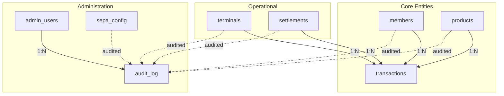

# Master Database Entity-Relationship Model (MariaDB)

This document defines the complete data model for the Member Bar System backend database.

---

## Entity-Relationship Diagram

```mermaid
erDiagram
    members {
        char_36 id PK "UUID, immutable"
        varchar_20 card_uid UK "RFID/NFC card identifier"
        varchar_100 first_name "First name (nullable for GDPR)"
        varchar_100 last_name "Last name (nullable for GDPR)"
        varchar_5 preferred_language "ISO 639-1 (e.g., 'de', 'en')"
        varchar_34 iban "SEPA bank account"
        varchar_35 mandate_reference UK "SEPA mandate ID"
        boolean is_active "Active/blocked"
        datetime deleted_at "Soft-delete timestamp (GDPR)"
        datetime created_at "Record creation"
        datetime updated_at "Last modification"
    }

    products {
        char_36 id PK "UUID, immutable"
        json names "Multilingual names"
        json descriptions "Multilingual descriptions"
        int price_cents "Price in cents"
        varchar_50 category "Product category"
        boolean is_active "Available for sale"
        datetime created_at "Record creation"
        datetime updated_at "Last modification"
    }

    transactions {
        char_36 id PK "UUID, frontend-generated"
        char_36 member_id FK "Reference to members"
        char_36 product_id FK "Reference to products"
        int amount_cents "Amount in cents (negative for refunds)"
        char_36 terminal_id FK "Recording terminal"
        char_36 settlement_id FK "Settlement (null if unsettled)"
        datetime created_at "Transaction timestamp"
    }

    settlements {
        char_36 id PK "UUID"
        datetime period_start "Settlement period start"
        datetime period_end "Settlement period end"
        int total_amount_cents "Total settlement amount"
        int member_count "Number of members included"
        date sepa_execution_date "SEPA collection date"
        varchar_35 sepa_message_id UK "SEPA XML message ID"
        datetime created_at "Record creation"
    }

    terminals {
        char_36 id PK "UUID"
        varchar_100 name "Terminal display name"
        varchar_255 api_token_hash "Hashed API token"
        datetime last_seen_at "Last API request"
        boolean is_active "Terminal enabled"
        datetime created_at "Record creation"
        datetime updated_at "Last modification"
    }

    admin_users {
        char_36 id PK "UUID"
        varchar_255 email UK "Login email"
        varchar_255 password_hash "bcrypt hash"
        varchar_100 display_name "Display name"
        enum_role role "admin, viewer, auditor"
        varchar_5 locale "UI language preference"
        boolean is_active "Account enabled"
        datetime last_login_at "Last successful login"
        datetime created_at "Record creation"
        datetime updated_at "Last modification"
    }

    sepa_config {
        int id PK "Single row (id=1)"
        varchar_18 creditor_id "Gläubiger-ID (immutable)"
        varchar_70 organization_name "Organization name"
        varchar_34 organization_iban "Organization bank account"
        varchar_255 street_address "Street address"
        varchar_255 city "City and postal code"
        char_2 country_code "ISO 3166-1 alpha-2"
        datetime created_at "Initial setup"
        datetime updated_at "Last modification"
    }

    audit_log {
        bigint id PK "Auto-increment"
        char_36 admin_user_id FK "Acting admin (nullable)"
        enum_action action "create, update, delete, etc."
        varchar_50 entity_type "Affected table"
        char_36 entity_id "Affected record ID"
        json old_values "Values before change"
        json new_values "Values after change"
        varchar_45 ip_address "Client IP (IPv4/IPv6)"
        varchar_500 user_agent "Browser/client"
        datetime created_at "Action timestamp"
    }

    members ||--o{ transactions : "makes"
    products ||--o{ transactions : "purchased in"
    terminals ||--o{ transactions : "records"
    settlements ||--o{ transactions : "includes"
    admin_users ||--o{ audit_log : "performs"
```

---

## Table Definitions

### members

Stores all organization members with payment information.

| Column | Type | Constraints | Description |
|--------|------|-------------|-------------|
| id | CHAR(36) | PK | UUID, immutable permanent identifier |
| card_uid | VARCHAR(20) | UNIQUE, NOT NULL | RFID/NFC card identifier (hex string) |
| first_name | VARCHAR(100) | NULL | First name (nullable for GDPR anonymization) |
| last_name | VARCHAR(100) | NULL | Last name (nullable for GDPR anonymization) |
| preferred_language | VARCHAR(5) | NOT NULL, DEFAULT 'de' | ISO 639-1 language code for product display |
| iban | VARCHAR(34) | NULL | SEPA bank account (nullable, masked in logs) |
| mandate_reference | VARCHAR(35) | UNIQUE, NULL | SEPA mandate ID; default = UUID without hyphens |
| is_active | BOOLEAN | NOT NULL, DEFAULT TRUE | Active (true) or blocked (false) |
| deleted_at | DATETIME | NULL | Soft-delete timestamp for GDPR anonymization |
| created_at | DATETIME | NOT NULL | Record creation timestamp |
| updated_at | DATETIME | NOT NULL | Last modification timestamp |

**Indexes:**
- `idx_members_card_uid` on `card_uid`
- `idx_members_updated_at` on `updated_at`
- `idx_members_active` on `is_active, deleted_at`

---

### products

Product catalog with multilingual support.

| Column | Type | Constraints | Description |
|--------|------|-------------|-------------|
| id | CHAR(36) | PK | UUID, immutable |
| names | JSON | NOT NULL | Multilingual names: `{"de": "Bier", "en": "Beer"}` |
| descriptions | JSON | NULL | Multilingual descriptions |
| price_cents | INT | NOT NULL | Price in cents (e.g., 350 = €3.50) |
| category | VARCHAR(50) | NOT NULL | Category identifier (not translated) |
| is_active | BOOLEAN | NOT NULL, DEFAULT TRUE | Available for purchase |
| created_at | DATETIME | NOT NULL | Record creation timestamp |
| updated_at | DATETIME | NOT NULL | Last modification timestamp |

**Indexes:**
- `idx_products_updated_at` on `updated_at`
- `idx_products_active` on `is_active`
- `idx_products_category` on `category`

---

### transactions

Immutable, append-only transaction log. No UPDATE or DELETE operations permitted.

| Column | Type | Constraints | Description |
|--------|------|-------------|-------------|
| id | CHAR(36) | PK | UUID, generated by frontend (idempotency key) |
| member_id | CHAR(36) | FK → members.id, NOT NULL | Member who made the transaction |
| product_id | CHAR(36) | FK → products.id, NULL | Product purchased (NULL for manual corrections) |
| amount_cents | INT | NOT NULL | Amount in cents (negative for refunds/corrections) |
| terminal_id | CHAR(36) | FK → terminals.id, NOT NULL | Terminal that recorded the transaction |
| settlement_id | CHAR(36) | FK → settlements.id, NULL | Settlement that includes this transaction (NULL if unsettled) |
| created_at | DATETIME | NOT NULL | Transaction timestamp |

**Indexes:**
- `idx_transactions_member_id` on `member_id`
- `idx_transactions_terminal_id` on `terminal_id`
- `idx_transactions_settlement_id` on `settlement_id`
- `idx_transactions_created_at` on `created_at`
- `idx_transactions_unsettled` on `settlement_id` WHERE `settlement_id IS NULL`

**Note:** Corrections are stored as new transactions with negative `amount_cents`. The original transaction remains unchanged.

---

### settlements

Periodic settlement records for SEPA Direct Debit collections.

| Column | Type | Constraints | Description |
|--------|------|-------------|-------------|
| id | CHAR(36) | PK | UUID |
| period_start | DATETIME | NOT NULL | Start of settlement period |
| period_end | DATETIME | NOT NULL | End of settlement period |
| total_amount_cents | INT | NOT NULL | Total amount collected in cents |
| member_count | INT | NOT NULL | Number of members included |
| sepa_execution_date | DATE | NOT NULL | SEPA collection execution date |
| sepa_message_id | VARCHAR(35) | UNIQUE, NOT NULL | SEPA XML message ID for bank reference |
| created_at | DATETIME | NOT NULL | Settlement creation timestamp |

**Indexes:**
- `idx_settlements_period` on `period_start, period_end`
- `idx_settlements_execution_date` on `sepa_execution_date`

---

### terminals

Registered POS terminals with API authentication.

| Column | Type | Constraints | Description |
|--------|------|-------------|-------------|
| id | CHAR(36) | PK | UUID |
| name | VARCHAR(100) | NOT NULL | Human-readable terminal name |
| api_token_hash | VARCHAR(255) | NOT NULL | bcrypt hash of API token |
| last_seen_at | DATETIME | NULL | Timestamp of last API request |
| is_active | BOOLEAN | NOT NULL, DEFAULT TRUE | Terminal enabled for API access |
| created_at | DATETIME | NOT NULL | Record creation timestamp |
| updated_at | DATETIME | NOT NULL | Last modification timestamp |

**Indexes:**
- `idx_terminals_active` on `is_active`

---

### admin_users

Administrator accounts for the admin panel.

| Column | Type | Constraints | Description |
|--------|------|-------------|-------------|
| id | CHAR(36) | PK | UUID |
| email | VARCHAR(255) | UNIQUE, NOT NULL | Login email address |
| password_hash | VARCHAR(255) | NOT NULL | bcrypt hash (cost ≥ 12) |
| display_name | VARCHAR(100) | NOT NULL | Display name in UI |
| role | ENUM('admin', 'viewer', 'auditor') | NOT NULL | Access level |
| locale | VARCHAR(5) | NOT NULL, DEFAULT 'de' | UI language preference |
| is_active | BOOLEAN | NOT NULL, DEFAULT TRUE | Account enabled |
| last_login_at | DATETIME | NULL | Last successful login |
| created_at | DATETIME | NOT NULL | Record creation timestamp |
| updated_at | DATETIME | NOT NULL | Last modification timestamp |

**Indexes:**
- `idx_admin_users_email` on `email`
- `idx_admin_users_active` on `is_active`

**Roles:**
- `admin`: Full CRUD access, settlements, GDPR operations, user management
- `viewer`: Read-only access to dashboard, reports, transaction history
- `auditor`: Read-only access including audit log (for compliance reviews)

---

### sepa_config

Organization-level SEPA Direct Debit configuration. Single-row table.

| Column | Type | Constraints | Description |
|--------|------|-------------|-------------|
| id | INT | PK, DEFAULT 1 | Always 1 (single row) |
| creditor_id | VARCHAR(18) | NOT NULL | Gläubiger-ID (immutable after initial set) |
| organization_name | VARCHAR(70) | NOT NULL | Organization name for SEPA records |
| organization_iban | VARCHAR(34) | NOT NULL | Organization bank account |
| street_address | VARCHAR(255) | NOT NULL | Street address |
| city | VARCHAR(255) | NOT NULL | City and postal code |
| country_code | CHAR(2) | NOT NULL, DEFAULT 'DE' | ISO 3166-1 alpha-2 country code |
| created_at | DATETIME | NOT NULL | Initial configuration timestamp |
| updated_at | DATETIME | NOT NULL | Last modification timestamp |

**Constraint:** `CHECK (id = 1)` ensures single-row enforcement.

---

### audit_log

Centralized audit trail for all master data changes.

| Column | Type | Constraints | Description |
|--------|------|-------------|-------------|
| id | BIGINT | PK, AUTO_INCREMENT | Unique log entry ID |
| admin_user_id | CHAR(36) | FK → admin_users.id, NULL | Admin who performed action (NULL for system/failed login) |
| action | ENUM | NOT NULL | Action type (see below) |
| entity_type | VARCHAR(50) | NOT NULL | Affected table name |
| entity_id | CHAR(36) | NULL | Primary key of affected record |
| old_values | JSON | NULL | Field values before change |
| new_values | JSON | NULL | Field values after change |
| ip_address | VARCHAR(45) | NULL | Client IP address (IPv4 or IPv6) |
| user_agent | VARCHAR(500) | NULL | Browser/client identifier |
| created_at | DATETIME | NOT NULL | Action timestamp |

**Action types:**
- `create` — New record created
- `update` — Record modified
- `delete` — Record deleted
- `anonymize` — GDPR anonymization performed
- `login` — Successful admin login
- `logout` — Admin logout
- `login_failed` — Failed login attempt
- `export` — Data export generated
- `settlement_create` — Settlement created
- `settlement_revoke` — Settlement revoked

**Indexes:**
- `idx_audit_log_admin_user_id` on `admin_user_id`
- `idx_audit_log_entity` on `entity_type, entity_id`
- `idx_audit_log_action` on `action`
- `idx_audit_log_created_at` on `created_at`

---

## Relationships

| Relationship | Cardinality | Description |
|--------------|-------------|-------------|
| members → transactions | 1:N | Member makes many transactions |
| products → transactions | 1:N | Product appears in many transactions |
| terminals → transactions | 1:N | Terminal records many transactions |
| settlements → transactions | 1:N | Settlement includes many transactions |
| admin_users → audit_log | 1:N | Admin performs many audited actions |

---

## Data Integrity Rules

### Referential Integrity

| Child Table | Foreign Key | Parent Table | On Delete |
|-------------|-------------|--------------|-----------|
| transactions | member_id | members | RESTRICT |
| transactions | product_id | products | RESTRICT |
| transactions | terminal_id | terminals | RESTRICT |
| transactions | settlement_id | settlements | SET NULL |
| audit_log | admin_user_id | admin_users | SET NULL |

### Business Rules

1. **Transactions are immutable**: No UPDATE or DELETE on transactions table
2. **Members cannot be deleted with balance**: Check unsettled transaction sum before anonymization
3. **Products cannot be deleted with transactions**: Use `is_active = false` instead
4. **Terminals cannot be deleted with transactions**: Use `is_active = false` instead
5. **SEPA creditor_id is immutable**: Cannot be changed after initial configuration
6. **Settlement transactions are locked**: Transactions with `settlement_id` cannot be modified

---

## GDPR Compliance

### Anonymization Mapping

When a member requests deletion (GDPR Art. 17):

| Column | Before | After |
|--------|--------|-------|
| first_name | "Max" | NULL |
| last_name | "Mustermann" | NULL |
| iban | "DE89..." | NULL |
| mandate_reference | "ABC123..." | NULL |
| card_uid | "A1B2C3D4" | "ANON-{uuid}" |
| is_active | true | false |
| deleted_at | NULL | {timestamp} |

**Retained:** `id`, `preferred_language`, `created_at`, `updated_at` — required for transaction history linkage.

### Retention Periods

| Data | Retention | Legal Basis |
|------|-----------|-------------|
| transactions | 10 years | § 147 AO (German tax code) |
| settlements | 10 years | § 147 AO |
| audit_log | 10 years | Accountability requirement |
| Anonymized members | 10 years | Transaction linkage |
| Active member PII | Until deletion request | GDPR Art. 17 |

---

## Related ADRs

- [ADR-0001: Monetary Values as Integer Cents](../adr/0001-monetary-values-as-integer-cents.md)
- [ADR-0002: Product Internationalization](../adr/0002-product-internationalization.md)
- [ADR-0004: Immutable Transaction Storage](../adr/0004-immutable-transaction-storage.md)
- [ADR-0005: IBAN Storage and Validation](../adr/0005-iban-storage-and-validation.md)
- [ADR-0006: SEPA Mandate Reference Strategy](../adr/0006-sepa-mandate-reference-strategy.md)
- [ADR-0007: Organization SEPA Configuration Storage](../adr/0007-organization-sepa-configuration-storage.md)
- [ADR-0013: Audit Logging](../adr/0013-audit-logging.md)
