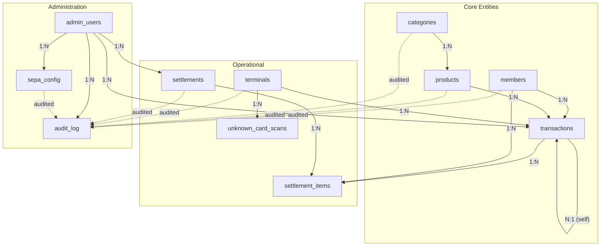

# Master Database Entity-Relationship Model (MariaDB)

This document defines the complete data model for the Club Bar backend database.

---

## Entity-Relationship Diagram

```mermaid
erDiagram
    members {
        binary_16 id PK "UUID, immutable"
        varchar_20 card_uid UK "RFID/NFC card identifier"
        varchar_100 first_name "First name (nullable for GDPR)"
        varchar_100 last_name "Last name (nullable for GDPR)"
        varchar_255 email "Contact email"
        varchar_10 preferred_language "ISO 639-1 (e.g., 'de', 'en')"
        varchar_34 iban "SEPA bank account"
        varchar_35 mandate_reference UK "SEPA mandate ID"
        date mandate_signed_at "Mandate signature date"
        boolean is_active "Active/blocked"
        datetime deleted_at "Soft-delete timestamp (GDPR)"
        datetime created_at "Record creation"
        datetime updated_at "Last modification"
    }

    categories {
        binary_16 id PK "UUID"
        json names "Multilingual names"
        int display_order "Sort position"
        boolean is_active "Available"
        varchar_50 icon_name "Icon name (nullable)"
        datetime created_at "Record creation"
        datetime updated_at "Last modification"
    }

    products {
        binary_16 id PK "UUID, immutable"
        binary_16 category_id FK "Reference to categories"
        json names "Multilingual names"
        json descriptions "Multilingual descriptions"
        int price_cents "Price in cents"
        boolean is_active "Available for sale"
        varchar_50 icon_name "Icon name (nullable)"
        datetime created_at "Record creation"
        datetime updated_at "Last modification"
    }

    transactions {
        binary_16 id PK "UUID, frontend-generated"
        binary_16 member_id FK "Reference to members"
        binary_16 product_id FK "Reference to products (nullable)"
        int amount_cents "Amount in cents"
        enum transaction_type "purchase or correction"
        varchar_500 notes "Reason/description"
        binary_16 related_transaction_id FK "Original transaction (correction)"
        binary_16 created_by_terminal_id FK "Recording terminal"
        binary_16 created_by_admin_id FK "Admin (manual entries)"
        datetime created_at "Transaction timestamp"
    }

    settlements {
        binary_16 id PK "UUID"
        enum settlement_type "sepa or manual"
        date settlement_date "Creation date"
        date execution_date "SEPA execution date"
        date period_start "Accounting period start"
        date period_end "Accounting period end"
        varchar_35 sepa_message_id UK "SEPA XML message ID"
        enum manual_reason "Reason for manual settlement"
        int total_amount_cents "Total settlement amount"
        int member_count "Number of members included"
        boolean is_cancelled "Cancellation flag"
        datetime cancelled_at "Cancellation timestamp"
        binary_16 cancelled_by_admin_id FK "Who cancelled"
        datetime exported_at "Last export timestamp"
        varchar_500 notes "Admin notes"
        binary_16 created_by_admin_id FK "Who created"
        datetime created_at "Record creation"
        datetime updated_at "Last modification"
    }

    settlement_items {
        int id PK "Auto-increment"
        binary_16 settlement_id FK "Which settlement"
        binary_16 transaction_id FK "Which transaction"
        binary_16 member_id FK "Which member"
        int amount_cents "Member total amount"
    }

    terminals {
        binary_16 id PK "UUID"
        varchar_100 name "Terminal display name"
        varchar_50 terminal_id UK "Configured terminal identifier"
        varchar_255 token_hash "Hashed API token"
        boolean is_active "Terminal enabled"
        datetime last_sync_at "Last successful sync"
        varchar_45 last_sync_ip "IP of last sync"
        datetime created_at "Record creation"
        datetime updated_at "Last modification"
    }

    unknown_card_scans {
        int id PK "Auto-increment"
        varchar_20 card_uid UK "Scanned card identifier"
        binary_16 terminal_id FK "Which terminal"
        datetime first_seen_at "First scan timestamp"
        datetime last_seen_at "Last scan timestamp"
        int scan_count "Number of scan attempts"
    }

    admin_users {
        binary_16 id PK "UUID"
        varchar_255 email UK "Login email"
        varchar_255 password_hash "bcrypt hash"
        varchar_100 display_name "Display name"
        varchar_10 locale "UI language preference"
        boolean is_active "Account enabled"
        datetime last_login_at "Last successful login"
        datetime created_at "Record creation"
        datetime updated_at "Last modification"
    }

    sepa_config {
        int id PK "Single row (id=1)"
        varchar_35 creditor_id "Gläubiger-ID (immutable)"
        varchar_70 creditor_name "Organization name"
        varchar_34 creditor_iban "Organization bank account"
        varchar_70 creditor_address_street "Street address"
        varchar_70 creditor_address_city "City and postal code"
        varchar_2 creditor_address_country "ISO 3166-1 alpha-2"
        binary_16 updated_by_admin_id FK "Who last modified"
        datetime created_at "Initial setup"
        datetime updated_at "Last modification"
    }

    audit_log {
        bigint id PK "Auto-increment"
        binary_16 admin_user_id FK "Acting admin (nullable)"
        enum action "create, update, delete, etc."
        varchar_50 entity_type "Affected table"
        varchar_36 entity_id "Affected record ID"
        json old_values "Values before change"
        json new_values "Values after change"
        varchar_45 ip_address "Client IP (IPv4/IPv6)"
        varchar_500 user_agent "Browser/client"
        datetime created_at "Action timestamp"
    }

    categories ||--o{ products : "contains"
    members ||--o{ transactions : "makes"
    products ||--o{ transactions : "purchased in"
    transactions ||--o| transactions : "corrects"
    terminals ||--o{ transactions : "records"
    admin_users ||--o{ transactions : "creates"
    settlements ||--o{ settlement_items : "includes"
    transactions ||--o{ settlement_items : "settled in"
    members ||--o{ settlement_items : "has"
    admin_users ||--o{ settlements : "creates"
    admin_users ||--o{ settlements : "cancels"
    admin_users ||--o{ audit_log : "performs"
    terminals ||--o{ unknown_card_scans : "detects"
    admin_users ||--o{ sepa_config : "modifies"
```

---

## Table Definitions

### members

Stores all organization members with payment information.

| Column | Type | Constraints | Description |
|--------|------|-------------|-------------|
| id | BINARY(16) | PK | UUID, immutable permanent identifier |
| card_uid | VARCHAR(20) | UNIQUE, NULL | RFID/NFC card identifier (8-20 hex chars, uppercase) |
| first_name | VARCHAR(100) | NULL | First name (nullable for GDPR anonymization) |
| last_name | VARCHAR(100) | NULL | Last name (nullable for GDPR anonymization) |
| email | VARCHAR(255) | NULL | Contact email address |
| preferred_language | VARCHAR(10) | NOT NULL | ISO 639-1 language code for product display |
| iban | VARCHAR(34) | NULL | SEPA bank account (ISO 13616 format + mod-97 checksum) |
| account_holder_name | VARCHAR(70) | NULL | Account holder name if different from member (SEPA max 70) |
| mandate_reference | VARCHAR(35) | UNIQUE, NULL | SEPA mandate ID; default = UUID without hyphens |
| mandate_signed_at | DATE | NULL | Mandate signature date |
| is_active | BOOLEAN | NOT NULL, DEFAULT TRUE | Active (true) or blocked (false) |
| deleted_at | DATETIME | NULL | Soft-delete timestamp for GDPR anonymization |
| created_at | DATETIME | NOT NULL | Record creation timestamp |
| updated_at | DATETIME | NOT NULL | Last modification timestamp |

**Indexes:**
- `card_uid` (UNIQUE)
- `iban`
- `is_active`
- `updated_at`

**SEPA Fields**: Nullable at database level (for GDPR anonymization and legacy data), but required at application level for member creation. Members without valid IBAN + mandate_reference cannot use the terminal.

**GDPR Anonymization**: Sets first_name, last_name, email, iban, mandate_reference to NULL; card_uid to "ANONYMOUS-{uuid}"; is_active to false; deleted_at to timestamp.

---

### categories

Product categories for organization.

| Column | Type | Constraints | Description |
|--------|------|-------------|-------------|
| id | BINARY(16) | PK | UUID |
| names | JSON | NOT NULL | Multilingual names: `{"de": "Getränke", "en": "Beverages"}` |
| display_order | INT | NOT NULL | Sort position (>= 0) |
| is_active | BOOLEAN | NOT NULL, DEFAULT TRUE | Available (inactive categories hidden on terminal) |
| icon_name | VARCHAR(50) | NULL | Icon component name (e.g., "CategoryIcon"; NULL for default) |
| created_at | DATETIME | NOT NULL | Record creation timestamp |
| updated_at | DATETIME | NOT NULL | Last modification timestamp |

**Indexes:**
- `display_order`
- `is_active`
- `icon_name`
- `updated_at`

**Deactivation**: Inactive categories are hidden on terminal. Products in inactive categories are also hidden (even if product itself is active).

**Icon Display**: Terminal displays category icon based on `icon_name` field. If NULL, displays default CategoryIcon.

---

### products

Product catalog with multilingual support.

| Column | Type | Constraints | Description |
|--------|------|-------------|-------------|
| id | BINARY(16) | PK | UUID, immutable |
| category_id | BINARY(16) | FK → categories.id, NOT NULL | Product category |
| names | JSON | NOT NULL | Multilingual names: `{"de": "Bier 0,5L", "en": "Beer 0.5L"}` |
| descriptions | JSON | NULL | Multilingual descriptions |
| price_cents | INT | NOT NULL | Price in cents (> 0; max 999999 = €9,999.99) |
| is_active | BOOLEAN | NOT NULL, DEFAULT TRUE | Available for purchase |
| icon_name | VARCHAR(50) | NULL | Icon component name (e.g., "PilsIcon"; NULL for default) |
| created_at | DATETIME | NOT NULL | Record creation timestamp |
| updated_at | DATETIME | NOT NULL | Last modification timestamp |

**Indexes:**
- `category_id`
- `is_active`
- `icon_name`
- `updated_at`

**Price Changes**: New price applies to new transactions only. Historical transactions retain original amount_cents.

**Icon Display**: Terminal displays product icon based on `icon_name` field. If NULL, displays default PackageIcon.

---

### transactions

Immutable, append-only transaction log. No UPDATE or DELETE operations permitted.

| Column | Type | Constraints | Description |
|--------|------|-------------|-------------|
| id | BINARY(16) | PK | UUID, generated by frontend (idempotency key) |
| member_id | BINARY(16) | FK → members.id, NOT NULL | Member who made the transaction |
| product_id | BINARY(16) | FK → products.id, NULL | Product purchased (NULL for manual adjustments) |
| amount_cents | INT | NOT NULL | Amount in cents (positive = charge; negative = credit/reversal; non-zero; -999999 to +999999) |
| transaction_type | ENUM | NOT NULL | Type: 'purchase', 'correction' |
| notes | VARCHAR(500) | NULL | Reason/description (required for manual entries) |
| related_transaction_id | BINARY(16) | FK → transactions.id, NULL | Link to original transaction being corrected |
| created_by_terminal_id | BINARY(16) | FK → terminals.id, NULL | Terminal that recorded the transaction |
| created_by_admin_id | BINARY(16) | FK → admin_users.id, NULL | Admin who created manual entry |
| created_at | DATETIME | NOT NULL | Transaction timestamp |

**Indexes:**
- `member_id`
- `product_id`
- `transaction_type`
- `created_at`
- `related_transaction_id`

**Note:** Corrections are stored as new transactions with negative `amount_cents`. The original transaction remains unchanged.

---

### settlements

Settlement records for SEPA collections and manual settlements.

| Column | Type | Constraints | Description |
|--------|------|-------------|-------------|
| id | BINARY(16) | PK | UUID |
| settlement_type | ENUM | NOT NULL | Type: 'sepa', 'manual' |
| settlement_date | DATE | NOT NULL | Creation date (auto-set to today) |
| execution_date | DATE | NULL | SEPA execution date (>= settlement_date + 7 days; NULL for manual) |
| period_start | DATE | NULL | Accounting period start (optional) |
| period_end | DATE | NULL | Accounting period end (optional) |
| sepa_message_id | VARCHAR(35) | UNIQUE, NULL | SEPA XML message ID (auto-generated on first export; NULL for manual) |
| manual_reason | ENUM | NULL | Reason for manual settlement (required if settlement_type = 'manual') |
| total_amount_cents | INT | NOT NULL | Total amount collected in cents (> 0) |
| member_count | INT | NOT NULL | Number of members included (> 0) |
| is_cancelled | BOOLEAN | NOT NULL, DEFAULT FALSE | Cancellation flag |
| cancelled_at | DATETIME | NULL | Cancellation timestamp |
| cancelled_by_admin_id | BINARY(16) | FK → admin_users.id, NULL | Admin who cancelled |
| exported_at | DATETIME | NULL | Last export timestamp |
| notes | VARCHAR(500) | NULL | Admin notes (required for manual: min 10 chars) |
| created_by_admin_id | BINARY(16) | FK → admin_users.id, NOT NULL | Admin who created |
| created_at | DATETIME | NOT NULL | Settlement creation timestamp |
| updated_at | DATETIME | NOT NULL | Last modification timestamp |

**Indexes:**
- `is_cancelled`
- `settlement_date`
- `execution_date`
- `settlement_type`

**Settlement Types:**
- `sepa`: Standard SEPA Direct Debit settlement with XML export
- `manual`: Non-SEPA settlement (cash, bank transfer, write-off, etc.)

**Manual Settlement Reasons:**
- `cash_payment`: Member paid in cash
- `bank_transfer`: Member paid via manual bank transfer
- `other_payment`: Member paid via other method
- `write_off`: Debt written off as uncollectable
- `goodwill`: Balance cleared as goodwill gesture
- `correction`: Administrative correction
- `other`: Other reason (explain in notes)

**Cancellation**: Sets `is_cancelled = true`; linked transactions become unsettled again (available for future settlement).

---

### settlement_items

Links transactions to settlements (many-to-many).

| Column | Type | Constraints | Description |
|--------|------|-------------|-------------|
| id | INT | PK, AUTO_INCREMENT | Internal reference |
| settlement_id | BINARY(16) | FK → settlements.id, NOT NULL | Which settlement |
| transaction_id | BINARY(16) | FK → transactions.id, NOT NULL | Which transaction |
| member_id | BINARY(16) | FK → members.id, NOT NULL | Denormalized for queries |
| amount_cents | INT | NOT NULL | Member's total amount in this settlement |

**Indexes:**
- `settlement_id`
- `transaction_id` (UNIQUE pair with settlement_id)
- `member_id`

**Constraint**: Each transaction can only belong to one settlement.

---

### terminals

Registered POS terminals with API authentication.

| Column | Type | Constraints | Description |
|--------|------|-------------|-------------|
| id | BINARY(16) | PK | UUID |
| name | VARCHAR(100) | NOT NULL | Human-readable terminal name (e.g., "Bar-Terminal-1") |
| terminal_id | VARCHAR(50) | UNIQUE, NOT NULL | Configured terminal identifier (sent in X-Terminal-Id header) |
| token_hash | VARCHAR(255) | NOT NULL | bcrypt hash of API token (cost >= 12) |
| is_active | BOOLEAN | NOT NULL, DEFAULT TRUE | Terminal enabled for API access |
| last_sync_at | DATETIME | NULL | Timestamp of last successful sync |
| last_sync_ip | VARCHAR(45) | NULL | IP address of last sync (IPv4 or IPv6) |
| created_at | DATETIME | NOT NULL | Record creation timestamp |
| updated_at | DATETIME | NOT NULL | Last modification timestamp |

**Indexes:**
- `terminal_id` (UNIQUE)
- `is_active`

**Token**: 64-character hex string; stored as bcrypt hash; shown once during creation.

---

### unknown_card_scans

Cards scanned at terminal but not assigned to any member.

| Column | Type | Constraints | Description |
|--------|------|-------------|-------------|
| id | INT | PK, AUTO_INCREMENT | Internal reference |
| card_uid | VARCHAR(20) | UNIQUE, NOT NULL | Scanned card identifier (8-20 hex chars, uppercase) |
| terminal_id | BINARY(16) | FK → terminals.id, NULL | Which terminal first scanned |
| first_seen_at | DATETIME | NOT NULL | First scan timestamp |
| last_seen_at | DATETIME | NOT NULL | Last scan timestamp |
| scan_count | INT | NOT NULL, DEFAULT 1 | Number of scan attempts |

**Indexes:**
- `card_uid` (UNIQUE)
- `last_seen_at`

**Cleanup**: Entries removed when card is assigned to a member.

---

### admin_users

Administrator accounts for the admin panel.

| Column | Type | Constraints | Description |
|--------|------|-------------|-------------|
| id | BINARY(16) | PK | UUID |
| email | VARCHAR(255) | UNIQUE, NOT NULL | Login email address |
| password_hash | VARCHAR(255) | NOT NULL | bcrypt hash (cost >= 12) |
| display_name | VARCHAR(100) | NULL | Display name in UI |
| locale | VARCHAR(10) | NOT NULL, DEFAULT 'de' | UI language preference (ISO 639-1) |
| is_active | BOOLEAN | NOT NULL, DEFAULT TRUE | Account enabled |
| last_login_at | DATETIME | NULL | Last successful login |
| created_at | DATETIME | NOT NULL | Record creation timestamp |
| updated_at | DATETIME | NOT NULL | Last modification timestamp |

**Indexes:**
- `email` (UNIQUE)
- `is_active`

**Access:**
- All admin users have full access: CRUD on all entities, settlements, GDPR operations, user management, audit log

---

### sepa_config

Organization-level SEPA Direct Debit configuration. Single-row table.

| Column | Type | Constraints | Description |
|--------|------|-------------|-------------|
| id | INT | PK, CHECK (id = 1) | Always 1 (single row) |
| creditor_id | VARCHAR(35) | NOT NULL | Gläubiger-ID (immutable after initial set) |
| creditor_name | VARCHAR(70) | NOT NULL | Organization name for SEPA records |
| creditor_iban | VARCHAR(34) | NOT NULL | Organization bank account (ISO 13616 + mod-97) |
| creditor_address_street | VARCHAR(70) | NOT NULL | Street address |
| creditor_address_city | VARCHAR(70) | NOT NULL | City and postal code |
| creditor_address_country | VARCHAR(2) | NOT NULL, DEFAULT 'DE' | ISO 3166-1 alpha-2 country code |
| updated_by_admin_id | BINARY(16) | FK → admin_users.id, NULL | Admin who last modified |
| created_at | DATETIME | NOT NULL | Initial configuration timestamp |
| updated_at | DATETIME | NOT NULL | Last modification timestamp |

**Constraint:** `CHECK (id = 1)` ensures single-row enforcement.

---

### audit_log

Centralized audit trail for all master data changes.

| Column | Type | Constraints | Description |
|--------|------|-------------|-------------|
| id | BIGINT | PK, AUTO_INCREMENT | Unique log entry ID |
| admin_user_id | BINARY(16) | FK → admin_users.id, NULL | Admin who performed action (NULL for system/failed login) |
| action | ENUM | NOT NULL | Action type (see below) |
| entity_type | VARCHAR(50) | NOT NULL | Affected table name |
| entity_id | VARCHAR(36) | NULL | Primary key of affected record |
| old_values | JSON | NULL | Field values before change |
| new_values | JSON | NULL | Field values after change |
| ip_address | VARCHAR(45) | NULL | Client IP address (IPv4 or IPv6) |
| user_agent | VARCHAR(500) | NULL | Browser/client identifier |
| created_at | DATETIME | NOT NULL | Action timestamp |

**Action types:**
- `create` — New record created
- `update` — Record modified
- `delete` — Record deleted
- `anonymize` — GDPR anonymization performed
- `login` — Successful admin login
- `logout` — Admin logout
- `login_failed` — Failed login attempt
- `export` — Data export generated
- `settlement_create` — Settlement created
- `settlement_cancel` — Settlement cancelled
- `settlement_export` — Settlement CSV/XML exported

**Indexes:**
- `admin_user_id`
- `action`
- `entity_type`
- `entity_id`
- `created_at`

**Sensitive Data**: IBAN masked as `DE89****...****4567`; passwords logged as `[CHANGED]`; tokens never logged.

**Retention**: 10 years per § 147 AO (German tax code).

---

## Relationships

| Relationship | Cardinality | Description |
|--------------|-------------|-------------|
| categories → products | 1:N | Category contains many products |
| members → transactions | 1:N | Member makes many transactions |
| products → transactions | 1:N | Product appears in many transactions |
| terminals → transactions | 1:N | Terminal records many transactions |
| admin_users → transactions | 1:N | Admin creates manual transactions |
| transactions → transactions | N:1 | Correction references original |
| settlements → settlement_items | 1:N | Settlement includes many items |
| transactions → settlement_items | 1:N | Transaction in settlement items |
| members → settlement_items | 1:N | Member's settlement items |
| admin_users → settlements | 1:N | Admin creates/cancels settlements |
| admin_users → audit_log | 1:N | Admin performs many audited actions |
| terminals → unknown_card_scans | 1:N | Terminal detects unknown cards |

---

## Data Integrity Rules

### Referential Integrity

| Child Table | Foreign Key | Parent Table | On Delete |
|-------------|-------------|--------------|-----------|
| products | category_id | categories | RESTRICT |
| transactions | member_id | members | RESTRICT |
| transactions | product_id | products | SET NULL |
| transactions | related_transaction_id | transactions | SET NULL |
| transactions | created_by_terminal_id | terminals | RESTRICT |
| transactions | created_by_admin_id | admin_users | SET NULL |
| settlement_items | settlement_id | settlements | CASCADE |
| settlement_items | transaction_id | transactions | RESTRICT |
| settlement_items | member_id | members | RESTRICT |
| settlements | created_by_admin_id | admin_users | RESTRICT |
| settlements | cancelled_by_admin_id | admin_users | SET NULL |
| unknown_card_scans | terminal_id | terminals | SET NULL |
| audit_log | admin_user_id | admin_users | SET NULL |
| sepa_config | updated_by_admin_id | admin_users | SET NULL |

### Business Rules

1. **Transactions are immutable**: No UPDATE or DELETE on transactions table
2. **Members cannot be deleted with balance**: Check unsettled transaction sum before anonymization
3. **Products cannot be deleted with transactions**: Use `is_active = false` instead
4. **Categories cannot be deleted with products**: Use `is_active = false` instead
5. **Terminals cannot be deleted with transactions**: Use `is_active = false` instead
6. **SEPA creditor_id is immutable**: Cannot be changed after initial configuration
7. **Settlement transactions are locked**: Transactions with settlement_items cannot be modified
8. **Settlement cancellation unlinks transactions**: When cancelled, transactions become available for future settlements

---

## GDPR Compliance

### Anonymization Mapping

When a member requests deletion (GDPR Art. 17):

| Column | Before | After |
|--------|--------|-------|
| first_name | "Max" | NULL |
| last_name | "Mustermann" | NULL |
| email | "max@example.com" | NULL |
| iban | "DE89..." | NULL |
| mandate_reference | "ABC123..." | NULL |
| card_uid | "A1B2C3D4" | "ANONYMOUS-{uuid}" |
| is_active | true | false |
| deleted_at | NULL | {timestamp} |

**Retained:** `id`, `preferred_language`, `mandate_signed_at`, `created_at`, `updated_at` — required for transaction history linkage.

### Retention Periods

| Data | Retention | Legal Basis |
|------|-----------|-------------|
| transactions | 10 years | § 147 AO (German tax code) |
| settlements | 10 years | § 147 AO |
| audit_log | 10 years | Accountability requirement |
| Anonymized members | 10 years | Transaction linkage |
| Active member PII | Until deletion request | GDPR Art. 17 |

---

## Related ADRs

- [ADR-0001: Monetary Values as Integer Cents](../adr/0001-monetary-values-as-integer-cents.md)
- [ADR-0002: Product Internationalization](../adr/0002-product-internationalization.md)
- [ADR-0004: Immutable Transaction Storage](../adr/0004-immutable-transaction-storage.md)
- [ADR-0005: IBAN Storage and Validation](../adr/0005-iban-storage-and-validation.md)
- [ADR-0006: SEPA Mandate Reference Strategy](../adr/0006-sepa-mandate-reference-strategy.md)
- [ADR-0007: Organization SEPA Configuration Storage](../adr/0007-organization-sepa-configuration-storage.md)
- [ADR-0013: Audit Logging](../adr/0013-audit-logging.md)
- [ADR-0015: Authentication and Authorization](../adr/0015-authentication-and-authorization-strategy.md)
- [ADR-0020: SEPA Mandate Requirement for Terminal Access](../adr/0020-sepa-mandate-requirement-terminal-access.md)
