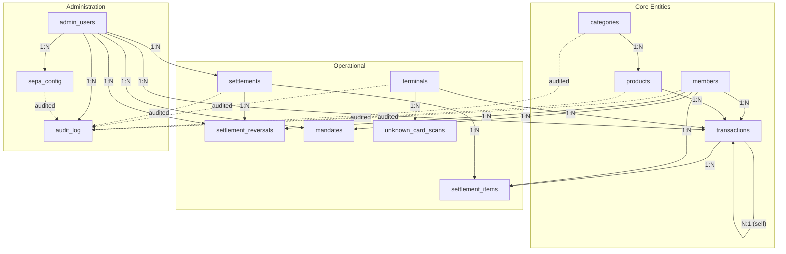

# Master Database Entity-Relationship Model (MariaDB)

This document defines the complete data model for the Club Bar backend database.

---

## Entity-Relationship Diagram

```mermaid
erDiagram
    members {
        binary_16 id PK "UUID, immutable"
        varchar_20 card_uid UK "RFID/NFC card identifier"
        varchar_100 first_name "First name (nullable for GDPR)"
        varchar_100 last_name "Last name (nullable for GDPR)"
        varchar_255 email "Contact email"
        varchar_70 account_holder_name "If different from member (still on members)"
        varchar_10 preferred_language "ISO 639-1 (e.g., 'de', 'en')"
        boolean is_active "Active/blocked (TEMPORARY, e.g. lost card)"
        boolean collection_hold "Blocks the next SEPA sweep after a return"
        varchar_500 collection_hold_reason "Why the hold was placed"
        datetime held_at "When the hold was placed"
        binary_16 held_by_admin_id FK "Admin who placed the hold"
        datetime cleared_at "When the hold was lifted"
        binary_16 cleared_by_admin_id FK "Admin who lifted the hold"
        datetime deleted_at "Offboarded; erasure completed"
        date retention_expires_at "When the retained residual may be deleted"
        datetime created_at "Record creation"
        datetime updated_at "Last modification"
    }

    categories {
        binary_16 id PK "UUID"
        json names "Multilingual names"
        int display_order "Sort position"
        boolean is_active "Available"
        varchar_50 icon_name "Icon name (nullable)"
        datetime created_at "Record creation"
        datetime updated_at "Last modification"
    }

    products {
        binary_16 id PK "UUID, immutable"
        binary_16 category_id FK "Reference to categories"
        json names "Multilingual names"
        json descriptions "Multilingual descriptions"
        int price_cents "Price in cents"
        boolean is_active "Available for sale"
        varchar_50 icon_name "Icon name (nullable)"
        datetime created_at "Record creation"
        datetime updated_at "Last modification"
    }

    transactions {
        binary_16 id PK "UUID, frontend-generated"
        binary_16 member_id FK "Reference to members"
        binary_16 product_id FK "Reference to products (nullable)"
        int amount_cents "Amount in cents"
        enum transaction_type "purchase, storno or payout"
        varchar_500 notes "Reason/description"
        binary_16 related_transaction_id FK "Reversed transaction (NOT NULL for storno, UNIQUE)"
        binary_16 created_by_terminal_id FK "Recording terminal"
        binary_16 created_by_admin_id FK "Admin (manual entries)"
        datetime occurred_at "Terminal-owned: when the sale happened"
        datetime received_at "Server-owned: when we learned of it"
    }

    mandates {
        binary_16 id PK "UUID, append-only"
        binary_16 member_id FK "Owning member"
        binary_16 active_member_id UK "= member_id while in force, else NULL"
        varchar_35 reference UK "SEPA mandate ID (UMR)"
        varchar_34 iban "SEPA bank account"
        date signed_at "Mandate signature date (nullable in Phase 0)"
        binary_16 document_id FK "Optional scanned mandate"
        datetime ended_at "Bank change or revocation"
        enum ended_reason "bank_change, revoked or offboarded"
        binary_16 created_by_admin_id FK "Admin who recorded it"
        datetime created_at "Record creation"
        boolean is_active "VIRTUAL: active_member_id IS NOT NULL"
    }

    settlements {
        binary_16 id PK "UUID"
        enum method "direct_debit, bank_transfer or write_off"
        date settlement_date "Creation date"
        date execution_date "SEPA execution date"
        date period_start "Accounting period start"
        date period_end "Accounting period end"
        varchar_35 sepa_message_id UK "SEPA XML message ID (direct_debit only)"
        int total_amount_cents "Total settlement amount"
        int member_count "Number of members included"
        boolean is_cancelled "Cancellation flag"
        datetime cancelled_at "Cancellation timestamp"
        binary_16 cancelled_by_admin_id FK "Who cancelled"
        datetime exported_at "Last export timestamp"
        datetime submitted_at "When submission to the bank became irreversible"
        binary_16 submitted_by_admin_id FK "Admin who submitted"
        varchar_1000 notes "Admin notes"
        binary_16 created_by_admin_id FK "Who created"
        datetime created_at "Record creation"
        datetime updated_at "Last modification"
    }

    settlement_items {
        bigint id PK "Auto-increment"
        binary_16 settlement_id FK "Which settlement"
        binary_16 transaction_id FK "Historical record (no longer UNIQUE)"
        binary_16 active_transaction_id UK "Live claim; NULL once released"
        binary_16 member_id FK "Which member"
        int amount_cents "Member total amount"
        varchar_35 end_to_end_id "SEPA End-to-End-ID for this item"
    }

    settlement_reversals {
        binary_16 id PK "UUID"
        binary_16 settlement_id FK "Which settlement"
        binary_16 member_id FK "Which member"
        enum reason "bank_return or club_error"
        int amount_cents "Reversed amount in cents"
        varchar_35 bank_reference "Bank's reversal reference"
        varchar_1000 notes "Admin notes"
        binary_16 created_by_admin_id FK "Admin who recorded it"
        datetime created_at "Record creation (append-only)"
    }

    terminals {
        binary_16 id PK "UUID"
        varchar_100 name "Terminal display name"
        varchar_50 terminal_id UK "Configured terminal identifier"
        varchar_255 token_hash "Hashed API token"
        datetime token_issued_at "When the current token was issued"
        datetime token_expires_at "When the current token stops authenticating"
        boolean is_active "Terminal enabled"
        datetime last_sync_at "Last successful sync"
        varchar_45 last_sync_ip "IP of last sync"
        datetime created_at "Record creation"
        datetime updated_at "Last modification"
    }

    unknown_card_scans {
        int id PK "Auto-increment"
        varchar_20 card_uid UK "Scanned card identifier"
        binary_16 terminal_id FK "Which terminal"
        datetime first_seen_at "First scan timestamp"
        datetime last_seen_at "Last scan timestamp"
        int scan_count "Number of scan attempts"
    }

    admin_users {
        binary_16 id PK "UUID"
        varchar_255 email UK "Login email"
        varchar_255 password_hash "bcrypt hash"
        varchar_100 display_name "Display name"
        varchar_10 locale "UI language preference"
        boolean is_active "Account enabled"
        datetime last_login_at "Last successful login"
        datetime created_at "Record creation"
        datetime updated_at "Last modification"
    }

    sepa_config {
        int id PK "Single row (id=1)"
        varchar_35 creditor_id "Gläubiger-ID (immutable)"
        varchar_70 creditor_name "Organization name"
        varchar_34 creditor_iban "Organization bank account"
        varchar_70 creditor_address_street "Street address"
        varchar_70 creditor_address_city "City and postal code"
        varchar_2 creditor_address_country "ISO 3166-1 alpha-2"
        binary_16 updated_by_admin_id FK "Who last modified"
        datetime created_at "Initial setup"
        datetime updated_at "Last modification"
    }

    audit_log {
        bigint id PK "Auto-increment"
        binary_16 admin_user_id FK "Acting admin (nullable)"
        enum action "create, update, delete, etc."
        varchar_50 entity_type "Affected table"
        varchar_36 entity_id "Affected record ID"
        json old_values "Values before change"
        json new_values "Values after change"
        varchar_45 ip_address "Client IP (IPv4/IPv6)"
        varchar_500 user_agent "Browser/client"
        datetime created_at "Action timestamp"
    }

    categories ||--o{ products : "contains"
    members ||--o{ transactions : "makes"
    products ||--o{ transactions : "purchased in"
    transactions ||--o| transactions : "stornos"
    terminals ||--o{ transactions : "records"
    admin_users ||--o{ transactions : "creates"
    settlements ||--o{ settlement_items : "includes"
    transactions ||--o{ settlement_items : "settled in"
    members ||--o{ settlement_items : "has"
    settlements ||--o{ settlement_reversals : "clawed back by"
    members ||--o{ settlement_reversals : "affects"
    admin_users ||--o{ settlement_reversals : "records"
    members ||--o{ mandates : "grants"
    admin_users ||--o{ mandates : "records"
    admin_users ||--o{ settlements : "creates"
    admin_users ||--o{ settlements : "cancels"
    admin_users ||--o{ settlements : "submits"
    admin_users ||--o{ audit_log : "performs"
    terminals ||--o{ unknown_card_scans : "detects"
    admin_users ||--o{ sepa_config : "modifies"

    bank_codes {
        char_8 bank_code PK "Bankleitzahl (BLZ)"
        varchar_128 bank_name "Full bank name"
        varchar_30 short_name "Short designation"
        varchar_11 bic "SWIFT/BIC code"
        varchar_10 postal_code "PLZ of headquarters"
        varchar_40 city "City of headquarters"
        timestamp imported_at "Last import timestamp"
    }
```

---

## Table Definitions

### members

Stores all organization members with payment information.

| Column | Type | Constraints | Description |
|--------|------|-------------|-------------|
| id | BINARY(16) | PK | UUID, immutable permanent identifier |
| card_uid | VARCHAR(20) | UNIQUE, NULL | RFID/NFC card identifier (8-20 hex chars, uppercase) |
| first_name | VARCHAR(100) | NULL | First name (nullable for GDPR anonymization) |
| last_name | VARCHAR(100) | NULL | Last name (nullable for GDPR anonymization) |
| email | VARCHAR(255) | NULL | Contact email address |
| phone | VARCHAR(20) | NULL | Contact phone number |
| account_holder_name | VARCHAR(70) | NULL | Still on `members` — only banking fields moved to `mandates` ([ADR-0006](../adr/0006-sepa-mandate-reference-strategy.md), amended) |
| preferred_language | VARCHAR(10) | NOT NULL | ISO 639-1 language code for product display |
| ~~iban~~ | — | — | **Moved to `mandates.iban`** ([#164](https://github.com/dgloeckner/ruderbar/issues/164)) |
| ~~mandate_reference~~ | — | — | **Moved to `mandates.reference`** |
| ~~mandate_signed_at~~ | — | — | **Moved to `mandates.signed_at`** |
| is_active | BOOLEAN | NOT NULL, DEFAULT TRUE | **Temporary** block — e.g. a lost card. **Not** "left the club" |
| collection_hold | BOOLEAN | NOT NULL, DEFAULT FALSE | Stops the **next SEPA sweep** from re-debiting a member whose collection was just returned ([#148](https://github.com/dgloeckner/ruderbar/issues/148), [#165](https://github.com/dgloeckner/ruderbar/issues/165)) |
| collection_hold_reason | VARCHAR(500) | NULL | Why the hold was placed |
| held_at | DATETIME | NULL | When the hold was placed |
| held_by_admin_id | BINARY(16) | FK → admin_users.id, NULL | Admin who placed the hold |
| cleared_at | DATETIME | NULL | When the hold was lifted |
| cleared_by_admin_id | BINARY(16) | FK → admin_users.id, NULL | Admin who lifted the hold |
| deleted_at | DATETIME | NULL | Offboarding completed; erasure done. This **is** "gone" |
| retention_expires_at | DATE | NULL | Stamped at offboarding: 31.12. of last transaction year + 10 years ([#173](https://github.com/dgloeckner/ruderbar/issues/173)). ⚠️ This is the **earliest** deletion may occur, not a due date — § 147 Abs. 3 S. 5 AO suspends expiry while the Festsetzungsfrist runs. Deletion is a **reviewed, deliberate act**, not an automated sweep ([ADR-0029](../adr/0029-two-tier-retention-and-erasure.md)) |
| created_at | DATETIME | NOT NULL | Record creation timestamp |
| updated_at | DATETIME | NOT NULL | Last modification timestamp |

**Indexes:**
- `card_uid` (UNIQUE)
- `is_active`
- `collection_hold`
- `retention_expires_at`
- `updated_at`

**SEPA validity** is no longer a member field test. It is *"does this member have an active mandate"* — one lookup against `mandates` ([ADR-0020](../adr/0020-sepa-mandate-requirement-terminal-access.md), amended). Without one the member cannot use the terminal at all.

**GDPR erasure** ([ADR-0029](../adr/0029-two-tier-retention-and-erasure.md)) — **deletes the person, not the record**:

| Deleted | Retained (restricted) |
|---|---|
| `first_name`, `last_name`, `email`, `phone`, `preferred_language` | Per-transaction records incl. the member link |
| `card_uid`, credentials, sessions | `mandates` rows: reference, IBAN, signature date, document |
| Postal address, date of birth ⚠️ *(deletable only while the club issues no invoices)* | Settlement, payment, return and reversal records |

Sets `deleted_at`, and stamps `retention_expires_at`. Restriction is enforced by **access** — restricted rows are not listed, searched, exported or synced — not by a flag each query must remember.

---

### categories

Product categories for organization.

| Column | Type | Constraints | Description |
|--------|------|-------------|-------------|
| id | BINARY(16) | PK | UUID |
| names | JSON | NOT NULL | Multilingual names: `{"de": "Getränke", "en": "Beverages"}` |
| display_order | INT | NOT NULL | Sort position (>= 0) |
| is_active | BOOLEAN | NOT NULL, DEFAULT TRUE | Available (inactive categories hidden on terminal) |
| icon_name | VARCHAR(50) | NULL | Icon component name (e.g., "CategoryIcon"; NULL for default) |
| created_at | DATETIME | NOT NULL | Record creation timestamp |
| updated_at | DATETIME | NOT NULL | Last modification timestamp |

**Indexes:**
- `display_order`
- `is_active`
- `icon_name`
- `updated_at`

**Deactivation**: Inactive categories are hidden on terminal. Products in inactive categories are also hidden (even if product itself is active).

**Icon Display**: Terminal displays category icon based on `icon_name` field. If NULL, displays default CategoryIcon.

---

### products

Product catalog with multilingual support.

| Column | Type | Constraints | Description |
|--------|------|-------------|-------------|
| id | BINARY(16) | PK | UUID, immutable |
| category_id | BINARY(16) | FK → categories.id, NOT NULL | Product category |
| names | JSON | NOT NULL | Multilingual names: `{"de": "Bier 0,5L", "en": "Beer 0.5L"}` |
| descriptions | JSON | NULL | Multilingual descriptions |
| price_cents | INT | NOT NULL | Price in cents (> 0; max 999999 = €9,999.99) |
| is_active | BOOLEAN | NOT NULL, DEFAULT TRUE | Available for purchase |
| icon_name | VARCHAR(50) | NULL | Icon component name (e.g., "PilsIcon"; NULL for default) |
| created_at | DATETIME | NOT NULL | Record creation timestamp |
| updated_at | DATETIME | NOT NULL | Last modification timestamp |

**Indexes:**
- `category_id`
- `is_active`
- `icon_name`
- `updated_at`

**Price Changes**: New price applies to new transactions only. Historical transactions retain original amount_cents.

**Icon Display**: Terminal displays product icon based on `icon_name` field. If NULL, displays default PackageIcon.

### mandates

A mandate is **one record**, or the member has none. Rows are **append-only** — a bank change or revocation ends the current mandate and creates a new one, never mutates in place. Banking data used to live directly on `members` and was freely mutable, so a return arriving after a bank change quoted an MREF+ that no longer existed anywhere and could not be matched; a standalone, append-only record is what keeps it matchable ([ADR-0006](../adr/0006-sepa-mandate-reference-strategy.md) amended, [#164](https://github.com/dgloeckner/ruderbar/issues/164), [#165](https://github.com/dgloeckner/ruderbar/issues/165)).

| Column | Type | Constraints | Description |
|--------|------|-------------|-------------|
| id | BINARY(16) | PK | UUID |
| member_id | BINARY(16) | FK → members.id, NOT NULL | Owning member (stable across the mandate's history) |
| active_member_id | BINARY(16) | **UNIQUE**, NULL | Holds `member_id` while this mandate is **in force**; NULL once ended. MariaDB has no partial indexes but permits many NULLs in a unique column, so this expresses *"at most one active mandate per member"* the same way `settlement_items` expresses its live claim |
| reference | VARCHAR(35) | UNIQUE, NOT NULL | SEPA mandate ID (UMR); auto-generated at mandate creation |
| iban | VARCHAR(34) | NOT NULL | ISO 13616 + mod-97 checksum |
| signed_at | DATE | NULL | Mandate signature date. Deliberately nullable in Phase 0 — the schema migration relocates existing data without changing the eligibility predicate; making a signature date a precondition of SEPA validity is a separate, later change |
| document_id | BINARY(16) | FK → mandate_documents.id, NULL | Optional scanned mandate; OCR prefill only, not a precondition |
| ended_at | DATETIME | NULL | When the mandate stopped being in force |
| ended_reason | ENUM | NULL | `bank_change` · `revoked` · `offboarded` |
| created_by_admin_id | BINARY(16) | FK → admin_users.id, NULL | Admin who recorded it |
| created_at | DATETIME | NOT NULL | Record creation |
| is_active | BOOLEAN | **VIRTUAL, generated** | `active_member_id IS NOT NULL`. Derived rather than stored beside the constraint, so the flag and the constraint cannot drift apart |

**Indexes:** `member_id`, `reference` (UNIQUE), `active_member_id` (UNIQUE)

**Constraint:** `active_member_id` must equal `member_id` when set (`CHECK`) — a mandate can only be "active" for its own owner.

**Beleg-bearing** — `reference`, `iban` and `signed_at` survive a GDPR erasure request under [ADR-0029](../adr/0029-two-tier-retention-and-erasure.md). Do not null them on anonymisation; the current code does, and that is a bug.

---

---

### transactions

Immutable, append-only transaction log. No UPDATE or DELETE operations permitted.

| Column | Type | Constraints | Description |
|--------|------|-------------|-------------|
| id | BINARY(16) | PK | UUID, generated by frontend (idempotency key) |
| member_id | BINARY(16) | FK → members.id, NOT NULL | Member who made the transaction |
| product_id | BINARY(16) | FK → products.id, NULL | Product purchased (NULL for stornos and payouts; a purchase always names a product) |
| amount_cents | INT | NOT NULL | Amount in cents (positive = charge; negative = credit/reversal; non-zero; -999999 to +999999) |
| transaction_type | ENUM | NOT NULL | `purchase` (terminal sale) · `storno` (full reversal of one transaction) · `payout` (credit returned at offboarding) |
| notes | VARCHAR(500) | NULL | Reason/description (required for a storno) |
| related_transaction_id | BINARY(16) | FK → transactions.id, **NOT NULL for `storno`**, **UNIQUE** | The transaction being reversed. Mandatory linkage — GoBD Rz. 64 ([ADR-0028](../adr/0028-legal-constraints-on-money-handling.md) §4). UNIQUE enforces *stornoable at most once*; MariaDB permits many NULLs in a unique column, so purchases and payouts (which carry no linkage) are unaffected |
| created_by_terminal_id | BINARY(16) | FK → terminals.id, NULL | Terminal that recorded the transaction |
| created_by_admin_id | BINARY(16) | FK → admin_users.id, NULL | Admin who created manual entry |
| occurred_at | TIMESTAMP | NOT NULL | **Terminal-owned**: when the sale actually happened. Reporting queries use this ([#144](https://github.com/dgloeckner/ruderbar/issues/144)) |
| received_at | TIMESTAMP | NOT NULL | **Server-owned**: when the backend learned of it. Audit and sync queries use this. A drink sold offline yesterday and synced today `occurred_at` yesterday but `received_at` today — filtering settlement on the terminal-supplied value is what makes backdating profitable, filtering on server time misdates genuine offline sales |

**Indexes:**
- `(member_id, occurred_at)`
- `product_id`
- `transaction_type`
- `received_at`
- `related_transaction_id` (UNIQUE)

**Note:** A **storno** is a new transaction whose `amount_cents` is the **exact negation** of the transaction it references — derived, never supplied by the caller. The original is never modified. There is no free-amount adjustment and no partial storno ([ADR-0004](../adr/0004-immutable-transaction-storage.md), amended). `related_transaction_id` is a **hard DB constraint** for storno rows (`CHECK (transaction_type <> 'storno' OR related_transaction_id IS NOT NULL)`), not just an application-level rule ([#158](https://github.com/dgloeckner/ruderbar/issues/158)).

---

### settlements

Settlement records for SEPA collections and manual settlements.

| Column | Type | Constraints | Description |
|--------|------|-------------|-------------|
| id | BINARY(16) | PK | UUID |
| method | ENUM | NOT NULL | `direct_debit` (many members, produces pain.008) · `bank_transfer` (one member, money already arrived) · `write_off` (one member, money never arrives). **Only `direct_debit` may be exported** ([#163](https://github.com/dgloeckner/ruderbar/issues/163)) |
| settlement_date | DATE | NOT NULL | Creation date (auto-set to today) |
| execution_date | DATE | NULL | SEPA execution date (>= settlement_date + 7 days; NULL for manual) |
| period_start | DATE | NULL | Accounting period start (optional) |
| period_end | DATE | NULL | Accounting period end (optional) |
| sepa_message_id | VARCHAR(35) | UNIQUE, NULL | SEPA XML message ID (auto-generated on first export; NULL for manual) |
| ~~manual_reason~~ | — | — | **Removed** — replaced by `method`. `notes` remains free text carrying no meaning to the system |
| total_amount_cents | INT | NOT NULL | Total amount collected in cents (> 0) |
| member_count | INT | NOT NULL | Number of members included (> 0) |
| is_cancelled | BOOLEAN | NOT NULL, DEFAULT FALSE | Cancellation flag |
| cancelled_at | DATETIME | NULL | Cancellation timestamp |
| cancelled_by_admin_id | BINARY(16) | FK → admin_users.id, NULL | Admin who cancelled |
| exported_at | DATETIME | NULL | Last export timestamp |
| submitted_at | DATETIME | NULL | When the settlement was submitted to the bank and became **no longer freely cancellable**. Cancellation is permitted while no money has moved, which needs a recorded moment at which it did ([#142](https://github.com/dgloeckner/ruderbar/issues/142), [#163](https://github.com/dgloeckner/ruderbar/issues/163)) |
| submitted_by_admin_id | BINARY(16) | FK → admin_users.id, NULL | Admin who submitted |
| notes | VARCHAR(1000) | NULL | Admin notes; carries no meaning to the system |
| created_by_admin_id | BINARY(16) | FK → admin_users.id, NOT NULL | Admin who created |
| created_at | DATETIME | NOT NULL | Settlement creation timestamp |
| updated_at | DATETIME | NOT NULL | Last modification timestamp |

**Indexes:**
- `is_cancelled`
- `settlement_date`
- `execution_date`
- `method`

**`method`** replaces two prior fields: a `settlement_type` that was validated at the controller but never stored, and `manual_reason`, which was an unvalidated free string ([#142](https://github.com/dgloeckner/ruderbar/issues/142), [#163](https://github.com/dgloeckner/ruderbar/issues/163)):
- `direct_debit`: SEPA collection covering any number of members; the only method that produces a pain.008 export
- `bank_transfer`: one member, money already arrived by other means
- `write_off`: one member, money that will never arrive

**Constraint**: `CHECK (method = 'direct_debit' OR member_count = 1)` — only a direct debit is a batch; a bank transfer or write-off is a decision about exactly one member, so neither may be exported and neither may quietly cover a group.

**Cancellation**: Sets `is_cancelled = true`; linked transactions become unsettled again (available for future settlement) — the `settlement_items` row survives (see below), only its live claim (`active_transaction_id`) is released.

---

### settlement_items

Links transactions to settlements. Cancelling a settlement used to `DELETE` its items, which both returned the transactions to the unsettled pool *and* destroyed the record of what the cancelled settlement had contained. Splitting the claim from the record fixes both: the row survives cancellation while the claim is released ([#142](https://github.com/dgloeckner/ruderbar/issues/142), [#148](https://github.com/dgloeckner/ruderbar/issues/148)).

| Column | Type | Constraints | Description |
|--------|------|-------------|-------------|
| id | BIGINT | PK, AUTO_INCREMENT | Internal reference |
| settlement_id | BINARY(16) | FK → settlements.id, NOT NULL | Which settlement |
| transaction_id | BINARY(16) | FK → transactions.id, NOT NULL | **Historical record** — which transaction this item was ever created for. No longer UNIQUE: a transaction can appear here once per settlement attempt over its lifetime |
| active_transaction_id | BINARY(16) | FK → transactions.id, **UNIQUE**, NULL | **The live claim**. Equal to `transaction_id` while the settlement holding it is not cancelled; set to NULL when cancelled, freeing the transaction for re-settlement. MariaDB has no partial indexes but permits many NULLs in a unique column, so the DB still prevents two live settlements claiming the same transaction |
| member_id | BINARY(16) | FK → members.id, NOT NULL | Denormalized for queries |
| amount_cents | BIGINT | NOT NULL | Member's amount for this item; **signed**, to allow negative correction amounts |
| end_to_end_id | VARCHAR(35) | NULL | SEPA End-to-End-ID this item was collected under; `E2E-<settlement:12hex>-<member:12hex>`, written on export and shared by every item of the same collection line. NULL until exported, and for members the export left out (#150) |

**Indexes:**
- `settlement_id`
- `transaction_id`
- `active_transaction_id` (UNIQUE)
- `member_id`

**Constraint**: A transaction can be **actively** claimed by at most one settlement at a time (`active_transaction_id` UNIQUE); its full settlement history is preserved via `transaction_id`.

### settlement_reversals

The bank clawing back a collection without asking — distinct from cancellation, which is the club *choosing* to undo a settlement. Append-only events, at most one per member per settlement ([#148](https://github.com/dgloeckner/ruderbar/issues/148)).

| Column | Type | Constraints | Description |
|--------|------|-------------|-------------|
| id | BINARY(16) | PK | UUID |
| settlement_id | BINARY(16) | FK → settlements.id, NOT NULL | Which settlement was (partially) clawed back |
| member_id | BINARY(16) | FK → members.id, NOT NULL | Which member's collection was returned |
| reason | ENUM | NOT NULL | `bank_return` (the bank returned the direct debit, e.g. insufficient funds) · `club_error` (the club's own mistake) |
| amount_cents | BIGINT | NOT NULL | Amount reversed, in cents |
| bank_reference | VARCHAR(35) | NULL | Bank's reference for the return |
| notes | VARCHAR(1000) | NULL | Admin notes |
| created_by_admin_id | BINARY(16) | FK → admin_users.id, NOT NULL | Admin who recorded it |
| created_at | DATETIME | NOT NULL | Record creation (append-only; no update/delete) |

**Indexes:**
- `(settlement_id, member_id)` (UNIQUE)
- `member_id`

---

### terminals

Registered POS terminals with API authentication.

| Column | Type | Constraints | Description |
|--------|------|-------------|-------------|
| id | BINARY(16) | PK | UUID |
| name | VARCHAR(100) | NOT NULL | Human-readable terminal name (e.g., "Bar-Terminal-1") |
| terminal_id | VARCHAR(50) | UNIQUE, NOT NULL | Configured terminal identifier (sent in X-Terminal-Id header) |
| token_hash | VARCHAR(255) | NOT NULL | bcrypt hash of API token (cost >= 12) |
| token_issued_at | DATETIME | NULL | When the current token was issued; NULL once access is revoked |
| token_expires_at | DATETIME | NULL | When the current token stops authenticating; NULL once access is revoked |
| is_active | BOOLEAN | NOT NULL, DEFAULT TRUE | Terminal enabled for API access |
| last_sync_at | DATETIME | NULL | Timestamp of last successful sync |
| last_sync_ip | VARCHAR(45) | NULL | IP address of last sync (IPv4 or IPv6) |
| created_at | DATETIME | NOT NULL | Record creation timestamp |
| updated_at | DATETIME | NOT NULL | Last modification timestamp |

**Indexes:**
- `terminal_id` (UNIQUE)
- `is_active`

**Token**: 64-character hex string; stored as bcrypt hash; shown once during creation.

**Token lifetime (#106)**: a token authenticates only while
`token_expires_at > NOW()` — `API_TOKEN_TTL_DAYS` (default 90) after it was
issued. The check is fail-closed: a row carrying a token hash with no
`token_expires_at` does not authenticate. Rotating the token restarts both
columns; revoking clears them along with the hash.

---

### unknown_card_scans

Cards scanned at terminal but not assigned to any member.

| Column | Type | Constraints | Description |
|--------|------|-------------|-------------|
| id | INT | PK, AUTO_INCREMENT | Internal reference |
| card_uid | VARCHAR(20) | UNIQUE, NOT NULL | Scanned card identifier (8-20 hex chars, uppercase) |
| terminal_id | BINARY(16) | FK → terminals.id, NULL | Which terminal first scanned |
| first_seen_at | DATETIME | NOT NULL | First scan timestamp |
| last_seen_at | DATETIME | NOT NULL | Last scan timestamp |
| scan_count | INT | NOT NULL, DEFAULT 1 | Number of scan attempts |

**Indexes:**
- `card_uid` (UNIQUE)
- `last_seen_at`

**Cleanup**: Entries removed when card is assigned to a member.

---

### admin_users

Administrator accounts for the admin panel.

| Column | Type | Constraints | Description |
|--------|------|-------------|-------------|
| id | BINARY(16) | PK | UUID |
| email | VARCHAR(255) | UNIQUE, NOT NULL | Login email address |
| password_hash | VARCHAR(255) | NOT NULL | bcrypt hash (cost >= 12) |
| display_name | VARCHAR(100) | NULL | Display name in UI |
| locale | VARCHAR(10) | NOT NULL, DEFAULT 'de' | UI language preference (ISO 639-1) |
| is_active | BOOLEAN | NOT NULL, DEFAULT TRUE | Account enabled |
| last_login_at | DATETIME | NULL | Last successful login |
| created_at | DATETIME | NOT NULL | Record creation timestamp |
| updated_at | DATETIME | NOT NULL | Last modification timestamp |

**Indexes:**
- `email` (UNIQUE)
- `is_active`

**Access:**
- All admin users have full access: CRUD on all entities, settlements, GDPR operations, user management, audit log

---

### sepa_config

Organization-level SEPA Direct Debit configuration. Single-row table.

| Column | Type | Constraints | Description |
|--------|------|-------------|-------------|
| id | INT | PK, CHECK (id = 1) | Always 1 (single row) |
| creditor_id | VARCHAR(35) | NOT NULL | Gläubiger-ID (immutable after initial set) |
| creditor_name | VARCHAR(70) | NOT NULL | Organization name for SEPA records |
| creditor_iban | VARCHAR(34) | NOT NULL | Organization bank account (ISO 13616 + mod-97) |
| creditor_address_street | VARCHAR(70) | NOT NULL | Street address |
| creditor_address_city | VARCHAR(70) | NOT NULL | City and postal code |
| creditor_address_country | VARCHAR(2) | NOT NULL, DEFAULT 'DE' | ISO 3166-1 alpha-2 country code |
| updated_by_admin_id | BINARY(16) | FK → admin_users.id, NULL | Admin who last modified |
| created_at | DATETIME | NOT NULL | Initial configuration timestamp |
| updated_at | DATETIME | NOT NULL | Last modification timestamp |

**Constraint:** `CHECK (id = 1)` ensures single-row enforcement.

---

### audit_log

Centralized audit trail for all master data changes.

| Column | Type | Constraints | Description |
|--------|------|-------------|-------------|
| id | BIGINT | PK, AUTO_INCREMENT | Unique log entry ID |
| admin_user_id | BINARY(16) | FK → admin_users.id, NULL | Admin who performed action (NULL for system/failed login) |
| action | ENUM | NOT NULL | Action type (see below) |
| entity_type | VARCHAR(50) | NOT NULL | Affected table name |
| entity_id | VARCHAR(36) | NULL | Primary key of affected record |
| old_values | JSON | NULL | Field values before change |
| new_values | JSON | NULL | Field values after change |
| ip_address | VARCHAR(45) | NULL | Client IP address (IPv4 or IPv6) |
| user_agent | VARCHAR(500) | NULL | Browser/client identifier |
| created_at | DATETIME | NOT NULL | Action timestamp |

**Action types:**
- `create` — New record created
- `update` — Record modified
- `delete` — Record deleted
- `anonymize` — GDPR anonymization performed
- `login` — Successful admin login
- `logout` — Admin logout
- `login_failed` — Failed login attempt
- `export` — Data export generated
- `settlement_create` — Settlement created
- `settlement_cancel` — Settlement cancelled
- `settlement_export` — Settlement CSV/XML exported
- `settlement_submit` — Exported file handed to the bank ([#81](https://github.com/dgloeckner/ruderbar/issues/81))
- `settlement_reverse` — Money that already moved has come back ([#196](https://github.com/dgloeckner/clubbar/issues/196))
- `transaction_storno` — A booking reversed in full ([#169](https://github.com/dgloeckner/ruderbar/issues/169))
- `collection_hold_placed` — A bank return stopped the next run re-debiting a member
- `collection_hold_cleared` — An admin released that member back into the next run
- `totp_enrolled` / `totp_reset` — Second factor enrolled or reset
- `mandate_document_upload` / `mandate_document_delete` — Mandate scan stored or removed
- `activate` / `deactivate` / `reorder` — Status and ordering changes

**Indexes:**
- `admin_user_id`
- `action`
- `entity_type`
- `entity_id`
- `created_at`

**Sensitive Data**: IBAN masked as `DE89****...****4567`; passwords logged as `[CHANGED]`; tokens never logged.

**Retention**: 10 years per § 147 AO (German tax code).

### bank_codes

Lookup table for resolving German IBANs to bank names. Data sourced from the Deutsche Bundesbank BLZ (Bankleitzahl) file, updated quarterly. Only Hauptstelle (main office, Merkmal=1) entries are stored.

| Column | Type | Constraints | Description |
|--------|------|-------------|-------------|
| bank_code | CHAR(8) | PK | Bankleitzahl (BLZ) |
| bank_name | VARCHAR(128) | NOT NULL | Full bank name from Bundesbank file |
| short_name | VARCHAR(30) | NOT NULL, DEFAULT '' | Short designation (Kurzbezeichnung) |
| bic | VARCHAR(11) | NOT NULL, DEFAULT '' | SWIFT/BIC code |
| postal_code | VARCHAR(10) | NOT NULL, DEFAULT '' | PLZ of bank headquarters |
| city | VARCHAR(40) | NOT NULL, DEFAULT '' | City of bank headquarters |
| imported_at | TIMESTAMP | NOT NULL, DEFAULT CURRENT_TIMESTAMP | When this row was last imported |

**Data Source**: Deutsche Bundesbank BLZ-Datei (https://www.bundesbank.de)

**Import**: Via `install.php?action=import-bank-codes` or CLI `php bin/import-bank-codes.php <file>`.

**Lookup**: Extract BLZ from German IBAN positions 5–12 (e.g., DE89**37040044**0532013000 → BLZ 37040044).

---

## Relationships

| Relationship | Cardinality | Description |
|--------------|-------------|-------------|
| categories → products | 1:N | Category contains many products |
| members → transactions | 1:N | Member makes many transactions |
| products → transactions | 1:N | Product appears in many transactions |
| terminals → transactions | 1:N | Terminal records many transactions |
| admin_users → transactions | 1:N | Admin creates manual transactions |
| transactions → transactions | N:1 | Storno references the transaction it reverses |
| settlements → settlement_items | 1:N | Settlement includes many items |
| transactions → settlement_items | 1:N | Transaction in settlement items (history), at most one active claim |
| members → settlement_items | 1:N | Member's settlement items |
| settlements → settlement_reversals | 1:N | A settlement may be clawed back per member |
| members → settlement_reversals | 1:N | Member's reversed collections |
| admin_users → settlement_reversals | 1:N | Admin who recorded the reversal |
| members → mandates | 1:N | Member's mandate history (append-only; at most one active) |
| admin_users → mandates | 1:N | Admin who recorded the mandate |
| admin_users → settlements | 1:N | Admin creates/cancels/submits settlements |
| admin_users → audit_log | 1:N | Admin performs many audited actions |
| terminals → unknown_card_scans | 1:N | Terminal detects unknown cards |

---

## Data Integrity Rules

### Referential Integrity

| Child Table | Foreign Key | Parent Table | On Delete |
|-------------|-------------|--------------|-----------|
| products | category_id | categories | RESTRICT |
| transactions | member_id | members | RESTRICT |
| transactions | product_id | products | SET NULL |
| transactions | related_transaction_id | transactions | SET NULL |
| transactions | created_by_terminal_id | terminals | RESTRICT |
| transactions | created_by_admin_id | admin_users | SET NULL |
| settlement_items | settlement_id | settlements | CASCADE |
| settlement_items | transaction_id | transactions | RESTRICT |
| settlement_items | active_transaction_id | transactions | RESTRICT |
| settlement_items | member_id | members | RESTRICT |
| settlements | created_by_admin_id | admin_users | RESTRICT |
| settlements | cancelled_by_admin_id | admin_users | SET NULL |
| settlements | submitted_by_admin_id | admin_users | RESTRICT |
| settlement_reversals | settlement_id | settlements | RESTRICT |
| settlement_reversals | member_id | members | RESTRICT |
| settlement_reversals | created_by_admin_id | admin_users | RESTRICT |
| mandates | member_id | members | CASCADE |
| mandates | document_id | mandate_documents | SET NULL |
| mandates | created_by_admin_id | admin_users | SET NULL |
| members | held_by_admin_id | admin_users | SET NULL |
| members | cleared_by_admin_id | admin_users | SET NULL |
| unknown_card_scans | terminal_id | terminals | SET NULL |
| audit_log | admin_user_id | admin_users | SET NULL |
| sepa_config | updated_by_admin_id | admin_users | SET NULL |

### Business Rules

1. **Transactions are immutable**: No UPDATE or DELETE on transactions table
2. **Members cannot be deleted with balance**: Check unsettled transaction sum before anonymization
3. **Products cannot be deleted with transactions**: Use `is_active = false` instead
4. **Categories cannot be deleted with products**: Use `is_active = false` instead
5. **Terminals cannot be deleted with transactions**: Use `is_active = false` instead
6. **SEPA creditor_id is immutable**: Cannot be changed after initial configuration
7. **Settlement transactions are locked**: Transactions with an active `settlement_items` claim cannot be re-settled elsewhere
8. **Settlement cancellation releases the claim, not the record**: When cancelled, `active_transaction_id` is nulled and the transaction becomes available for future settlement; the `settlement_items` row itself is retained as history
9. **A transaction is stornoed at most once**: Enforced by the UNIQUE index on `transactions.related_transaction_id`
10. **A storno must reference the original**: Enforced by `CHECK (transaction_type <> 'storno' OR related_transaction_id IS NOT NULL)`
11. **Non-direct-debit settlements cover exactly one member**: Enforced by `CHECK (method = 'direct_debit' OR member_count = 1)`
12. **At most one active mandate per member**: Enforced by the UNIQUE index on `mandates.active_member_id`, together with `CHECK (active_member_id IS NULL OR active_member_id = member_id)`

---

## GDPR Compliance

### Anonymization Mapping

When a member requests deletion (GDPR Art. 17):

| Column | Before | After |
|--------|--------|-------|
| first_name | "Max" | NULL |
| last_name | "Mustermann" | NULL |
| email | "max@example.com" | NULL |
| phone | "+49 170 ..." | NULL |
| preferred_language | "de" | NULL |
| card_uid | "A1B2C3D4" | "ANONYMOUS-{uuid}" |
| is_active | true | false |
| deleted_at | NULL | {timestamp} |

`iban` and `mandate_reference` no longer live on `members` at all — they moved to `mandates` in [#164](https://github.com/dgloeckner/ruderbar/issues/164)/[#165](https://github.com/dgloeckner/ruderbar/issues/165) and are **not** touched by member anonymization ([ADR-0029](../adr/0029-two-tier-retention-and-erasure.md)): both are Beleg-bearing, and nulling them would break matching a returned collection that arrives after the erasure request.

**Retained:** `id`, `created_at`, `updated_at`, `retention_expires_at` — plus the whole **retention tier**: `mandates` rows (`reference`, `iban`, `signed_at`, document), transactions, settlements, payment/return/reversal records.

### Retention Periods

| Data | Retention | Legal Basis |
|------|-----------|-------------|
| transactions | 10 years | § 147 AO (German tax code) |
| settlements | 10 years | § 147 AO |
| audit_log | 10 years | Accountability requirement |
| Anonymized members | 10 years | Transaction linkage |
| Active member PII | Until deletion request | GDPR Art. 17 |

---

## Related ADRs

- [ADR-0001: Monetary Values as Integer Cents](../adr/0001-monetary-values-as-integer-cents.md)
- [ADR-0002: Product Internationalization](../adr/0002-product-internationalization.md)
- [ADR-0004: Immutable Transaction Storage](../adr/0004-immutable-transaction-storage.md)
- [ADR-0005: IBAN Storage and Validation](../adr/0005-iban-storage-and-validation.md)
- [ADR-0006: SEPA Mandate Reference Strategy](../adr/0006-sepa-mandate-reference-strategy.md)
- [ADR-0007: Organization SEPA Configuration Storage](../adr/0007-organization-sepa-configuration-storage.md)
- [ADR-0013: Audit Logging](../adr/0013-audit-logging.md)
- [ADR-0015: Authentication and Authorization](../adr/0015-authentication-and-authorization-strategy.md)
- [ADR-0020: SEPA Mandate Requirement for Terminal Access](../adr/0020-sepa-mandate-requirement-terminal-access.md)
