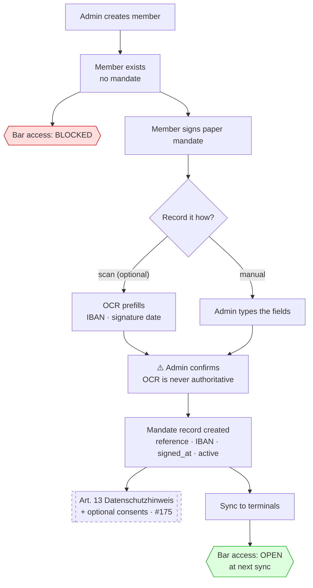
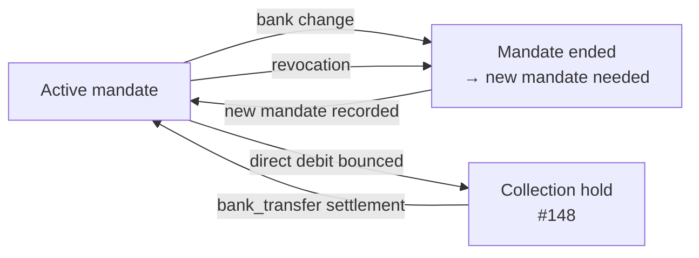
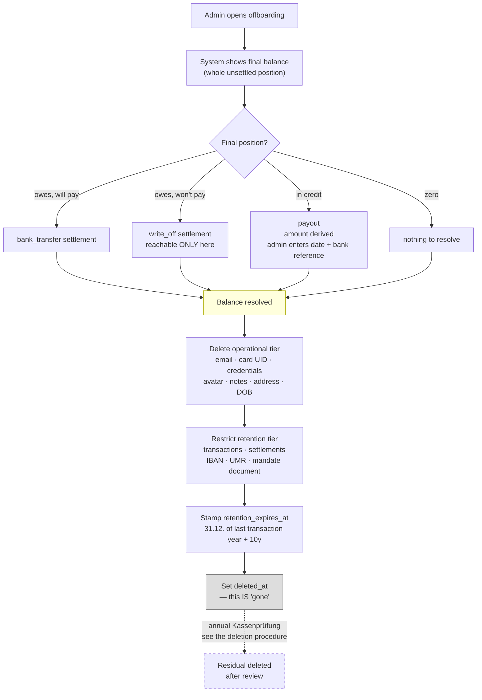

# Flows: Member Lifecycle

Onboarding and offboarding, as decided on [map #139](https://github.com/dgloeckner/clubbar/issues/139).

---

## Onboarding

A member is created **without** a mandate and **cannot use the bar** until one exists — SEPA is the only rail ([ADR-0020](../adr/0020-sepa-mandate-requirement-terminal-access.md)).

**Key points**

- The **signature date is required** — pain.008 demands it, and it must never be fabricated. It is also what makes "valid mandate" mean a real-world event rather than "somebody typed an IBAN".
- **Storing the scan is optional**; OCR is a convenience, not a precondition. Requiring paperwork before a member can drink would strand people at the bar on a Friday.
- Bar access opens **at the next terminal sync**, not instantly — the terminal decides from its last synced state.
- The dashed box is [#175](https://github.com/dgloeckner/clubbar/issues/175), still open.

### Losing access

A bounced direct debit locks a member out of the bar. That is deliberate — a member whose payments are failing should stop accumulating debt — and the route back is a `bank_transfer` settlement recorded by the Kassenwart.

---

## Offboarding

**One atomic action**, not a workflow. It cannot complete with a live balance ([#173](https://github.com/dgloeckner/clubbar/issues/173)).

**Key points**

- **Everything between "Balance resolved" and `deleted_at` is one transaction.** No half-offboarded state can leak into settlement runs, reports or sync.
- Need to revoke access *today* without resolving the money? That is `is_active = false` — reversible, operational, and under SEPA-only the debt stops growing anyway. **Offboarding is the end of the relationship, not the start of a process.**
- The dashed step is **not automatic**: `retention_expires_at` is the *earliest* deletion may occur (§ 147 Abs. 3 S. 5 AO suspends expiry while the Festsetzungsfrist runs), so it happens under the [annual review procedure](./retention-deletion-procedure.md).
- ⚠️ **A departing member cannot be fully erased for up to ten years.** Say so on the screen and in the privacy notice.

### Deactivation is not offboarding

| | `is_active = false` | `deleted_at` set |
|---|---|---|
| Means | **Temporary** — lost card, technical issue | **Gone** — offboarding completed |
| Bar access | blocked | blocked |
| Still collectable? | **Yes** — debt must still be collected | Resolved before this state exists |
| Reversible | yes | no |

⚠️ `previewSettlement()` currently excludes `is_active = false` members from collection. That is a bug — a lost card must not strand a real receivable ([#161](https://github.com/dgloeckner/clubbar/issues/161)).
