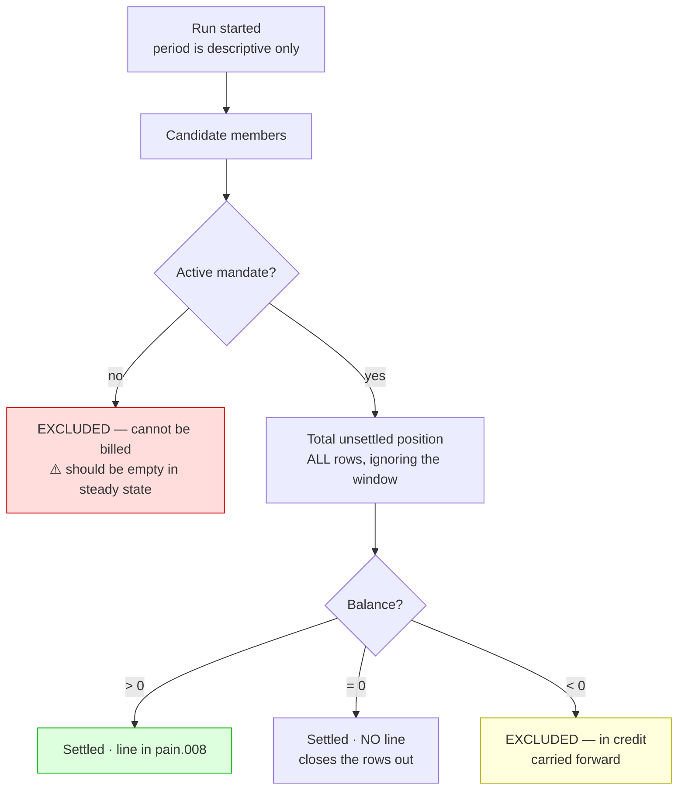
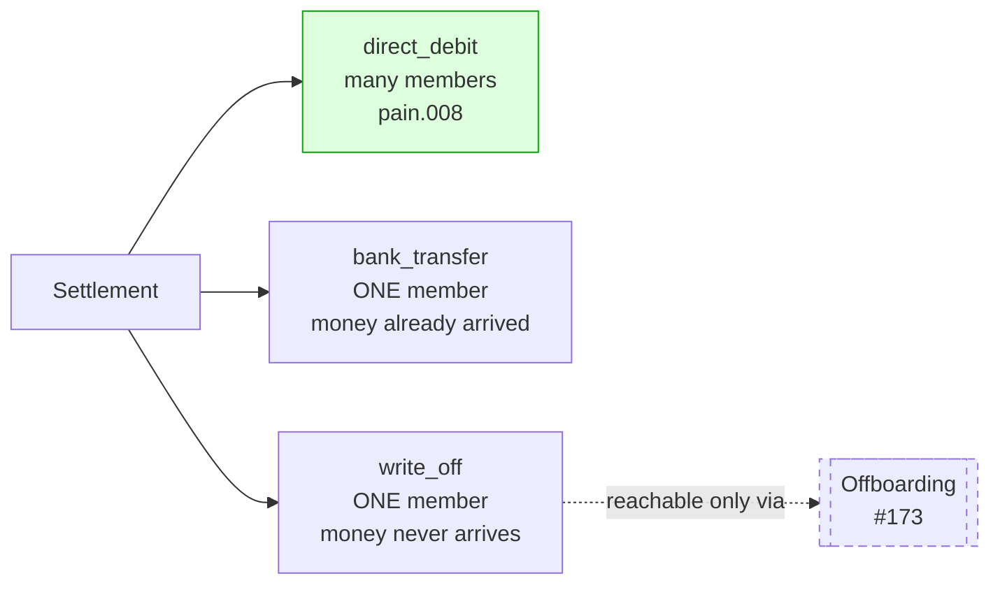
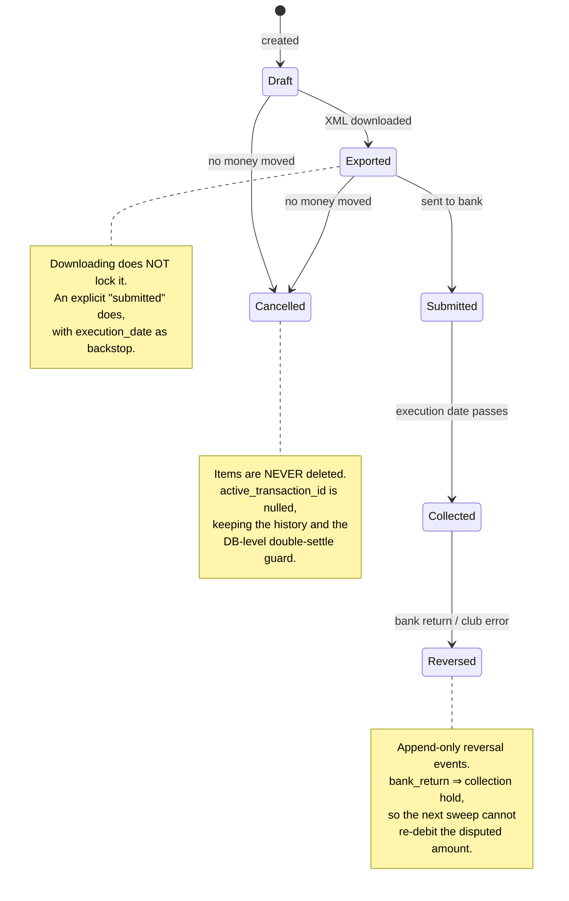
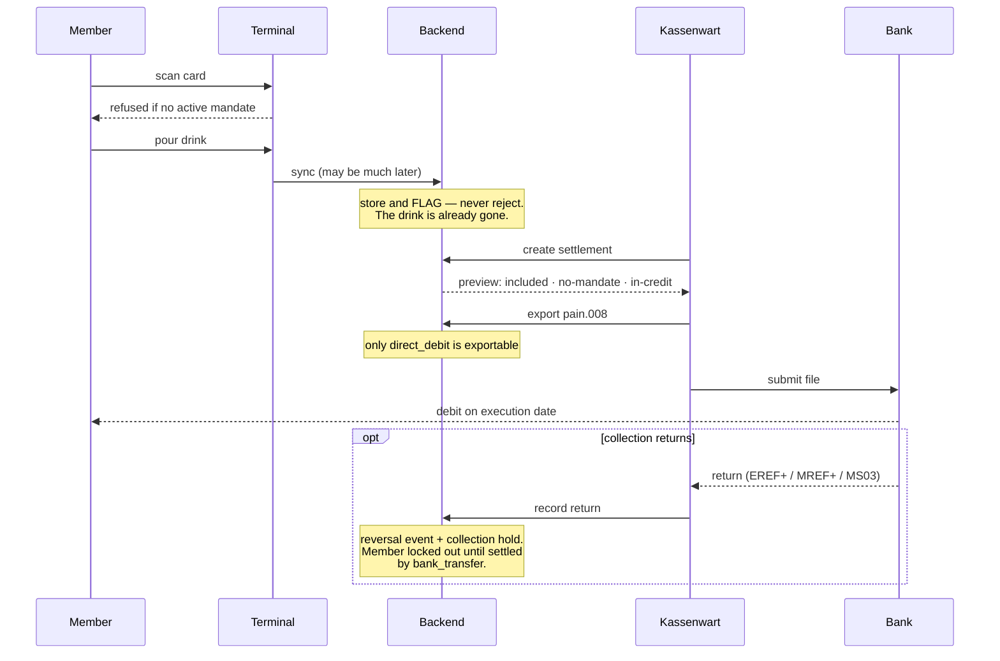

# Flows: Settlement

How a member's Deckel becomes money, and what happens when it doesn't.

---

## 1. What a settlement contains

Not "the transactions in a date window" — **every unsettled transaction of each included member** ([#141](https://github.com/dgloeckner/clubbar/issues/141) §1–§2).

**Why the window cannot decide the amount:** overcharged €20 in January, drinks €5 in February. Settling February alone computes `+5`, debits €5 the member does not owe, and strands the €20 credit outside the run. Testing the total gives `-15` → excluded, both rows carry forward together.

**Two exclusion buckets, opposite remedies** — never merge them into one warning list:

| Bucket | Remedy |
|---|---|
| No active mandate | Chase the bank details ⚠️ *alarm — SEPA-only means this should be empty* |
| In credit | Pay them back, or let it ride |

---

## 2. Settlement methods

One field. Only `direct_debit` produces a file, and **only `direct_debit` may be exported** — which is what stops a settlement recorded as already-paid being sent to the bank ([#163](https://github.com/dgloeckner/clubbar/issues/163)).

`bank_transfer` and `write_off` cover **exactly one member and their whole position**, so a partial payment is *inexpressible* — no picker, no typed amount. Underpaid? Record nothing; the tab stands.

---

## 3. Direct debit lifecycle

**One cancellation rule across all methods** — *cancellable while no money has moved*:

| Method | Cancellable |
|---|---|
| `direct_debit` | until **submitted**, execution date as backstop |
| `bank_transfer` | **never** — the money already arrived |
| `write_off` | yes |

---

## 4. From drink to money

⚠️ The **store-and-flag** step is not a detail. By sync time the beer is gone; rejecting the row destroys the record of a real sale — silent, unrecoverable revenue loss. The terminal is the only place refusal costs nothing ([ADR-0020](../adr/0020-sepa-mandate-requirement-terminal-access.md), amended).

---

## Related

- [ADR-0028](../adr/0028-legal-constraints-on-money-handling.md) · [ADR-0029](../adr/0029-two-tier-retention-and-erasure.md) · [ADR-0004](../adr/0004-immutable-transaction-storage.md) · [ADR-0009](../adr/0009-settlement-lead-times-bank-working-days.md)
- [Member lifecycle flows](./flows-member-lifecycle.md) · [Legal requirements](./legal-requirements-and-how-we-meet-them.md)
- `use-cases/admin/UC-A30`, `UC-A35` · `use-cases/sepa/`
