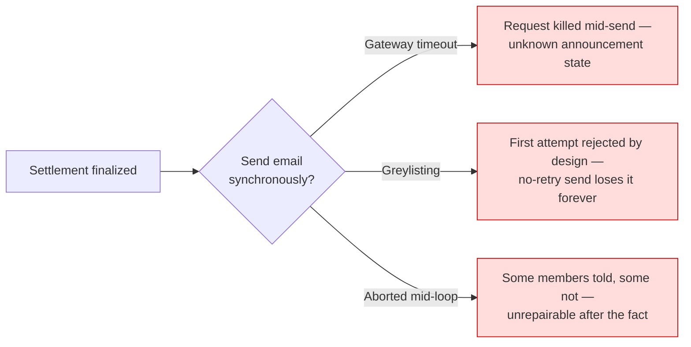
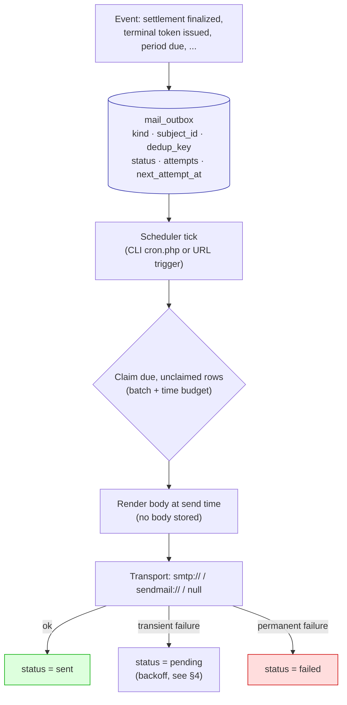
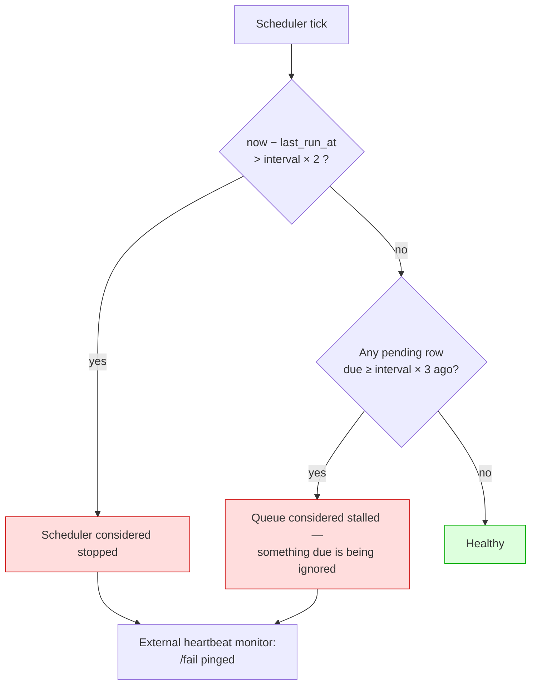
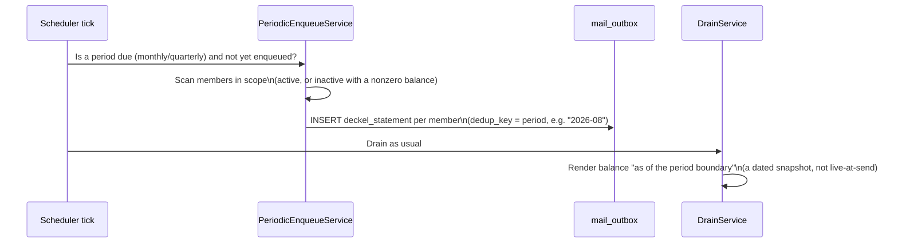

# Notifications & the Mail Outbox

How Club Bar gets email out of a system running on ordinary shared hosting
— reliably, without losing messages to a timeout, and without ever sending
one twice — and what that queue is used for: SEPA pre-notifications,
settlement cancellations, the periodic *Deckelauszug*, and a set of security
alerts (terminal token issuance, credential anomalies, key expiry, admin
lifecycle events).

Full rationale: [ADR-0038](../adr/0038-transactional-mail-outbox-on-shared-hosting.md)
(the outbox itself) and [ADR-0039](../adr/0039-periodic-deckel-statement.md)
(the periodic statement). This page shows how the pieces fit together.

---

## 1. Why mail can't just be sent inline

Three shared-hosting failure modes, each individually enough to lose a
message if sending happens inside the same HTTP request that finalizes a
settlement:



The fix is to make "announce this" a durable fact recorded in the same
database transaction as the event itself, and let a completely separate
process worry about actually getting it out the door.

---

## 2. One queue, exactly one sending path



- **`mail_outbox`** stores no message body — only what's needed to render
  one later: `kind`, a polymorphic `subject_id`, a `dedup_key`, the
  recipient's *address at enqueue time* (a snapshot, not a live join), and
  retry bookkeeping (`attempts`, `next_attempt_at`, `claim_token`,
  `claimed_at`). Rendering at send time is safe because the data it reads —
  a finalized settlement, a dated balance — is itself immutable or pinned to
  a period; nothing about the email can drift between the attempt that fails
  and the one that succeeds.
- **`UNIQUE (kind, subject_id, dedup_key)`** makes idempotency a property of
  the message, not the caller: a settlement finalize retried after a crash
  can enqueue the same row twice and the second insert is simply absorbed.
- **There is exactly one sending path** — the scheduler's `DrainService`.
  No inline send, no "send now, queue only on failure" fallback, and the
  admin panel's retry button only ever resets a row to `pending`; it never
  opens a socket itself. Three alternatives (send-then-queue-on-failure, a
  self-disabling browser-driven drain, a UI polling loop) were each
  considered and rejected in ADR-0038 for the same reason: a second sending
  path is a second place duplicate-prevention has to hold, and it quietly
  removes the pressure to fix the scheduler if it stalls.

---

## 3. What gets queued — the `MailKind` catalogue

| Kind | Audience | Triggered by |
|---|---|---|
| `sepa_prenotification` | Member | Settlement finalized (direct debit only) |
| `cancellation_notice` | Member | Settlement cancelled after a pre-notification already sent |
| `deckel_statement` | Member | Periodic balance statement, due period (§5) |
| `terminal_token_issued` | Active `admin` accounts | A terminal token is minted or rotated ([ADR-0043](../adr/0043-terminal-credential-issuance-is-announced.md)) — never contains the token itself |
| `terminal_anomaly_warning` | Active `admin` accounts | Terminal credential anomaly detection ([ADR-0041](../adr/0041-terminal-credential-anomaly-detection.md)) |
| `key_expiry_warning`, `terminal_token_expiry_warning` | Active `admin` accounts | Encryption key / terminal token entering its expiry window |
| `encryption_key_registered` / `_activated` / `_revoked` | Active `admin` accounts | Key lifecycle events ([ADR-0036](../adr/0036-iban-encryption-sealed-box.md)) |
| `admin_account_created`, `admin_role_changed` | Active `admin` accounts **+ configured club address** | Admin lifecycle events ([ADR-0044](../adr/0044-tiered-admin-roles.md)) — the club-address copy is what still fires when there's only one admin and they're the one being promoted |
| `jugendschutz_violation` | Active `admin` **and `kassenwart`** accounts **+ configured club address** | A sale served to a minor ([ADR-0045](../adr/0045-age-restricted-products.md) §3) — names the drink, the age it required and the transaction, never the member |
| `admin_email_changed` | The *old* address | Own-profile email change — the channel a hijacker holding the new address can't suppress |

`bank_transfer` and `write_off` settlements never enqueue anything — the
money either already arrived or was never expected, so there's nothing to
announce.

### Who an admin-addressed kind actually reaches

The audience column above is not prose: it is
`MailKind::recipientRoles()`, and `AdminNotifier::warnAdmins()` fans out over
exactly the accounts holding one of those offices
([#633](https://github.com/dgloeckner/clubbar/issues/633)). Until that existed
the fan-out was every active account whatever it was for, which made mail the
one surface [ADR-0044](../adr/0044-tiered-admin-roles.md)'s role model did not
cover — a Getränkewart was told the club's encryption-key fingerprint and which
accounts had just been promoted.

The rule is **mirror the grant on the surface the mail points at**, so there is
one source of truth rather than a second table drifting alongside
`RouteRoleMap`. Keys, terminals and admin accounts are `admin`-only routes, so
their mail is `admin`-only — for the Kassenwart as much as for the
Getränkewart. `jugendschutz_violation` is the one kind whose surface is not:
its dashboard alert is `TREASURY`, and the mail carries the same set.

**When no active account holds the office**, the notice is escalated to the
configured club address rather than widened back to everybody — that widening
is the leak, and it would arrive exactly when the installation is least able to
notice. With no club address configured either, nothing is queued and a
`WARNING` is logged naming the kind, the subject and the offices it was for; the
enqueue result reports the same as `nobody_eligible`. Reaching that state takes
a hand-edited database: `AdminUsersService` refuses to demote or deactivate the
last `admin`.

---

## 4. Retry, backoff, and knowing the queue is actually alive

Backoff is measured in **ticks of the declared scheduler interval**, not
wall-clock seconds — a flat "retry in 15 minutes" is a dead letter on a host
that only ticks daily.

| Attempt | Multiplier | On a 15-min scheduler | On hourly | On daily |
|---|---|---|---|---|
| 1 → 2 | 1× | 15 min | 1 h | 1 day |
| 2 → 3 | 2× | 30 min | 2 h | 2 days |
| 3 → 4 | 4× | 60 min | 4 h | 4 days |
| 4th fails | — | `failed` | `failed` | `failed` |

A permanent failure (bad address) never retries regardless of attempt count.
A single hard bounce does not raise an alarm on its own — only a *pattern*
does:



A row legitimately waiting out its own backoff has a *future*
`next_attempt_at` and can never trip the stall check — it's "due and
ignored" that matters, not "old". The scheduler's own liveness is reported
to an external push-monitor (`HeartbeatPinger`, healthchecks.io-shaped):
`/start` before work begins (catches a hung run), a success ping with
counts afterward, `/fail` with a closed set of reasons
(`transport_unavailable`, `queue_stalled`, `run_aborted`). No message
content or recipient address is ever sent to that monitor — counts only.

**The install-time gate never re-closes.** Direct-debit settlements are
blocked until the scheduler has been observed running *at least once* — but
once that's true, a scheduler that later dies does not re-block
settlements. Refusing collection is judged worse than announcing late; the
heartbeat alarm is what's supposed to catch the death instead.

---

## 5. The periodic *Deckelauszug*

A time-triggered balance statement, not tied to any transaction:



- Cadence is `off` (default for upgraded installs — nobody gets auto-mailed
  by an upgrade), `monthly`, or `quarterly`. **Weekly was rejected outright**
  — 52 statements a year reads as relentless rather than useful.
- The balance is computed **as of the period boundary**, not live at send
  time — otherwise a message stuck in a retry loop could shrink between
  attempts as new purchases arrive, contradicting what the member already
  read in a failed earlier attempt.
- Content is itemised, chronological, and netted — a purchase and its
  Storno cancel out and both disappear from the list; capped at 100 lines
  with a "…and N more" note, but the printed total always reflects the
  *full* set, not just the printed lines. It never includes the mandate
  reference, Gläubiger-ID, or IBAN.
- Nothing extra to schedule operationally — the same `bin/cron.php` tick
  that drains the queue also runs the periodic scan first.

---

## 6. Configuring mail (for operators)

| Setting | Where | Notes |
|---|---|---|
| Sender name/address, reply-to, footer/branding | Settings → Mail (admin panel) | Reply-to is typically the Kassenwart's address — bounces land there unparsed |
| `cron_interval` | Settings → Mail | Declare what actually runs (15 min / hourly / daily) — the stall alarm's timing depends on this being honest |
| `drain_batch_size`, `drain_budget_seconds` | Settings → Mail | Budget defaults to 25s; lower it to fit a tighter external scheduler timeout |
| Cron secret (for the URL trigger) | Settings → Mail | Rotatable from the panel without file access; a rotated secret supersedes any value in `config.php` |
| SMTP transport (`mail.dsn`) | `backend/config.php` | **Not** admin-editable from the panel — same tier as the DB password, changing it is a file operation |
| `CLUB_TIMEZONE` | `backend/.env` | The clock a mail's dates and times are written in. Defaults to `Europe/Berlin`; an unknown name falls back to it rather than failing a send |

**Which clock a mail states.** Everything is stored and served in UTC (#365),
and in the admin panel the *browser* converts that to the reader's own zone. A
mail has no browser, so the server does it instead, in the one zone a club
actually has — hence `CLUB_TIMEZONE` rather than anything per-recipient. Only
instants are shifted: a due date, a statement boundary and a period range are
calendar days and stay where they are, in every zone (#637).

**Running the drain:**

```bash
# Preferred: real CLI cron
php /path/to/htdocs/backend/bin/cron.php

# Fallback (e.g. IONOS webcron, which only offers URL/GET triggers):
curl -sS -H 'X-Cron-Secret: <secret>' https://your-domain.example/api/cron/drain
```

A host whose cron UI only offers coarse intervals (e.g. IONOS: monthly /
weekly / daily) should declare **daily**, never weekly — declaring weekly
would erode the legally required SEPA pre-notification lead time to almost
nothing. An external HTTP scheduler (cron-job.org, Uptime Kuma, etc.) with
per-minute granularity and a custom header is the recommended way around a
host panel that only offers coarse choices. See the
[Deployment Guide](./deployment.md) for the full walkthrough, including
IONOS-specific caveats (execution time limits, no custom-header field →
degraded query-string secret).

**Testing the transport** without touching the queue: Settings → Mail → Send
Test Mail. It always goes to the requesting admin's own address (never a
value from the request body — this is the one path that opens a socket
outside the drain, and it is deliberately incapable of sending anything but
a fixed, non-interpolated message to the person who asked for it).

---

## 7. The admin Notifications page

Settings → Notifications shows every queued message — sent, pending,
failed, or superseded — filterable by kind and status, searchable, sortable
by queue/send time. Each row shows the snapshotted recipient address (useful
for "it went to their old address" diagnosis) and, for a failed row, the
transport's raw error text verbatim.

**The only mutation available is Retry**, shown only on rows the backend
considers retryable. It resets the row to `pending` and reports nothing
about *when* it will actually go out — "at the next tick" is the only
honest answer, since there is exactly one sending path and this page isn't
it.

The page deliberately has **no auto-refresh or polling loop** — a browser
tab is not allowed to become a second place mail gets sent from.

---

## 8. Retention & privacy

- Sent rows are pruned after **90 days** — long enough to outlast the
  club's own complaint window, short enough not to accumulate member
  contact history indefinitely. Pending, failed, and superseded rows are
  **never** pruned by age; a failed row is the record that someone wasn't
  reached and has to stay visible until a human resolves it.
- GDPR erasure clears every recipient address the outbox holds for a member
  (including already-superseded rows) as part of the same offboarding
  transaction that anonymizes the member record — see
  [ADR-0029](../adr/0029-two-tier-retention-and-erasure.md) and
  [Security Concept §8](./security-concept.md#8-privacy--retention-gdpr).
  Pending announcements for a member being erased are superseded first, so
  nothing gets sent to an address that's about to be wiped.

---

## See also

- [ADR-0038](../adr/0038-transactional-mail-outbox-on-shared-hosting.md) — Transactional Mail Outbox on Shared Hosting
- [ADR-0039](../adr/0039-periodic-deckel-statement.md) — The Periodic Deckelauszug
- [ADR-0041](../adr/0041-terminal-credential-anomaly-detection.md) — Terminal Credential Anomaly Detection (a mail consumer)
- [ADR-0043](../adr/0043-terminal-credential-issuance-is-announced.md) — Terminal Credential Issuance Is Announced (a mail consumer)
- [Security Concept](./security-concept.md) — where these alerts fit into the overall model
- [Deployment Guide](./deployment.md) — scheduler setup, including host-specific caveats
