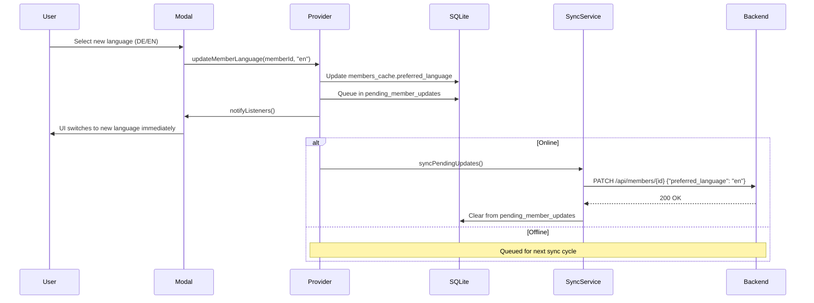
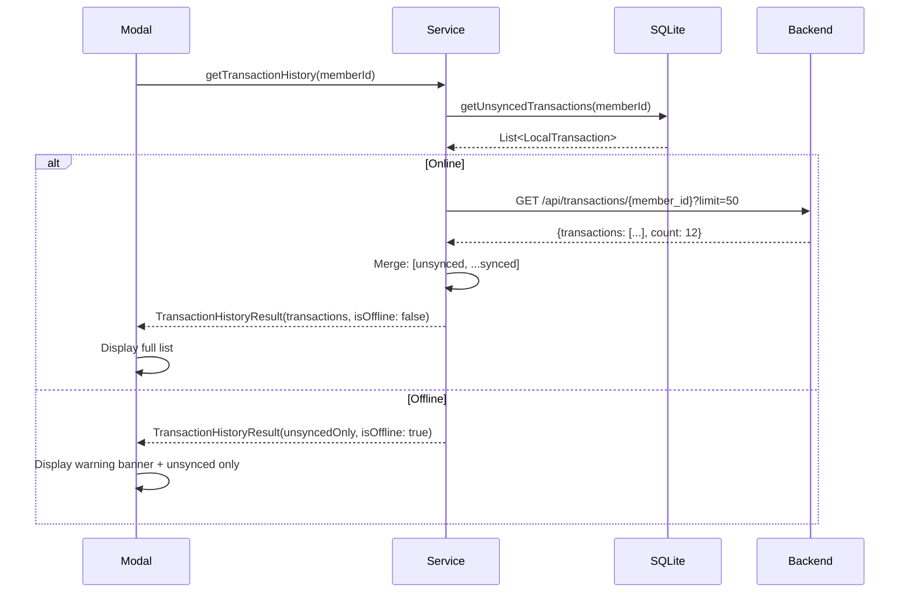

# Member Details Modal - Design Document

**Date**: 2026-02-06

**Status**: Approved

---

## Overview

Design for a member details modal in the terminal frontend that allows members to:
1. View and change their preferred language (DE/EN)
2. View recent transaction history (up to 50 transactions)
3. See sync status of transactions (pending/open/settled)

The modal provides quick access to member settings and transaction visibility during the shopping session.

---

## User Requirements

**From user request:**
- "Cannot open user details in terminal to change preferred language"
- "Need to start design on a user details modal which also show recent 50 transactions"
- "Loaded on demand for the user from backend (loading indicator needed)"
- "Transactions should be marked as settled/open in the table"
- "Unsynced transactions (from local sqlite) should be shown at the top of the list"
- "When offline we want to show local unsynched transactions only and a warning message"

**Use Case:** Member at terminal wants to change their language preference or review recent purchases without admin intervention.

---

## Component Architecture

### Modal Structure

The modal is a bottom sheet overlay (slide-up from bottom) covering ~70% of viewport height. This keeps the MemberBar and header visible as context.

```
┌─────────────────────────────────────────┐
│ Member Details                      [X] │ ← Header (fixed, 80px)
├─────────────────────────────────────────┤
│ 🟠 Max Mustermann                      │ ← Avatar + name
│ Balance: €12.50                         │ ← Balance (color-coded)
├─────────────────────────────────────────┤
│ Preferred Language                      │ ← Language section (fixed, 100px)
│ [🇩🇪 Deutsch]  [🇬🇧 English]           │ ← Toggle buttons
├─────────────────────────────────────────┤
│ Recent Transactions                     │ ← Transaction header
├─────────────────────────────────────────┤
│ ┌─────────────────────────────────────┐ │
│ │ Jan 25, 14:32  Pils      €3.50  ⏳ │ │ ← Scrollable list
│ │ Jan 25, 10:15  Cola      €2.00  ○  │ │
│ │ Jan 24, 18:45  Correction -€3.50 ✓ │ │
│ │ ... (scrollable)                    │ │
│ └─────────────────────────────────────┘ │
└─────────────────────────────────────────┘
```

### Component Hierarchy

```
MemberDetailsModal (StatefulWidget)
├── Header Section (fixed)
│   ├── Title: "Member Details"
│   ├── Close button (X icon, top-right)
├── Member Info Section (fixed)
│   ├── Avatar (48px circle, gradient, initials)
│   ├── Member name
│   └── Balance (color-coded: green/orange/gray)
├── Language Section (fixed)
│   ├── Label: "Preferred Language"
│   └── Toggle buttons: DE / EN
└── Transactions Section (scrollable)
    ├── Section header: "Recent Transactions"
    ├── Loading state: Spinner + "Loading transactions..."
    ├── Error state: Error message + "Retry" button
    ├── Offline state: Warning banner + unsynced transactions
    └── Success state: Transaction list (ScrollView)
```

### Invocation

- **Trigger:** Info button (ⓘ) added to MemberBar (next to cart button)
- **Action:** Opens modal via `showModalBottomSheet(isScrollControlled: true)`
- **Context:** Available only when member is selected (MemberBar is visible)

---

## Data Flow

### Language Change Flow



**Key Points:**
- **Optimistic update:** UI switches immediately to new language
- **Queue for sync:** Update stored in `pending_member_updates` table
- **Background sync:** Next sync cycle sends `PATCH /api/members/{id}`
- **Conflict handling:** Backend update wins on next full member sync

### Transaction Fetching Flow



**Transaction List Order:**
1. **Unsynced transactions** (from SQLite) - TOP
   - Badge: "⏳ Pending sync" (orange)
   - Source: `transactions` table WHERE `synced_at IS NULL`
   - Sorted by `created_at DESC`

2. **Synced transactions** (from backend API) - BELOW
   - Badge: "✓ Settled" (green) if `settlement_id != null`
   - Badge: "○ Open" (blue) if `settlement_id == null`
   - Source: `GET /api/transactions/{member_id}`
   - Sorted by `created_at DESC`

---

## Data Models

### TransactionListItem

```dart
class TransactionListItem {
  final String id;              // UUID
  final DateTime timestamp;     // For display
  final String productName;     // Product or "Correction"
  final int amountCents;        // Negative for corrections
  final TransactionSyncStatus syncStatus;
  final String? settlementId;   // Backend only
  final DateTime? settlementDate; // Backend only

  const TransactionListItem({
    required this.id,
    required this.timestamp,
    required this.productName,
    required this.amountCents,
    required this.syncStatus,
    this.settlementId,
    this.settlementDate,
  });

  factory TransactionListItem.fromLocalTransaction(Transaction tx) {
    return TransactionListItem(
      id: tx.id,
      timestamp: tx.createdAt,
      productName: tx.productName,
      amountCents: tx.amountCents,
      syncStatus: TransactionSyncStatus.pendingSync,
    );
  }

  factory TransactionListItem.fromBackendTransaction(Map<String, dynamic> json) {
    return TransactionListItem(
      id: json['id'],
      timestamp: DateTime.parse(json['created_at']),
      productName: json['product_name'],
      amountCents: json['amount_cents'],
      syncStatus: json['settlement_id'] != null
          ? TransactionSyncStatus.settled
          : TransactionSyncStatus.open,
      settlementId: json['settlement_id'],
      settlementDate: json['settlement_date'] != null
          ? DateTime.parse(json['settlement_date'])
          : null,
    );
  }
}

enum TransactionSyncStatus {
  pendingSync,    // Local transaction not uploaded yet
  open,           // Synced to backend, not settled
  settled,        // Synced and included in settlement
}
```

### TransactionHistoryResult

```dart
class TransactionHistoryResult {
  final List<TransactionListItem> transactions;
  final bool isOffline;

  const TransactionHistoryResult({
    required this.transactions,
    required this.isOffline,
  });
}
```

---

## UI States & Error Handling

### Transaction Section States

| Scenario | Banner | Transaction List | Retry Button |
|----------|--------|------------------|--------------|
| **Online + Loading** | None | Spinner: "Loading transactions..." | No |
| **Online + Success** | None | Unsynced + Synced (full list) | No |
| **Online + Error** | "⚠️ Unable to load transactions" (red) | Unsynced only | Yes |
| **Offline** | "ℹ️ Showing local transactions only - full history unavailable offline" (blue) | Unsynced only | No |
| **No unsynced txs + Offline** | "ℹ️ Transaction history unavailable offline" (blue) | Empty state | No |

### Visual Indicators

**Sync Status Badges:**
- ⏳ **"Pending sync"** - Orange badge, unsynced local transaction
- ○ **"Open"** - Blue badge, synced but not settled
- ✓ **"Settled"** - Green checkmark, synced and settled

**Balance Color Coding:**
- **Green** (#22c55e) - Positive balance
- **Orange** (#f97316) - Negative balance
- **Gray** (#94a3b8) - Zero balance

**Error States:**
- **Red** (#ef4444) - Error icon and banner (network error)
- **Blue** (#3b82f6) - Info icon and banner (offline mode)

---

## API Integration

### Backend Endpoints

#### 1. GET /api/transactions/{member_id}

**Status:** ✅ Exists (terminal.yaml:504-603)

**Authentication:** BearerAuth (terminal token)

**Query Parameters:**
- `limit` (int, default=50, max=100)
- `offset` (int, default=0)
- `since` (ISO 8601 datetime, optional)

**Current Response Schema:**
```json
{
  "member_id": "550e8400-...",
  "count": 12,
  "transactions": [
    {
      "id": "550e8400-...",
      "amount_cents": 350,
      "type": "purchase",
      "product_id": "987f6543-...",
      "product_name": "Pils",
      "created_at": "2025-01-25T14:32:00Z",
      "created_by_terminal_id": "terminal-001"
    }
  ]
}
```

**❌ REQUIRED UPDATE:** Add settlement information to response:
```json
{
  "transactions": [
    {
      "id": "550e8400-...",
      "amount_cents": 350,
      "product_name": "Pils",
      "created_at": "2025-01-25T14:32:00Z",
      "settlement_id": "660e8400-...",        // NEW: null if not settled
      "settlement_date": "2025-01-20"         // NEW: null if not settled
    }
  ]
}
```

**Backend Implementation Note:**
- LEFT JOIN `settlement_items` on `transaction_id`
- LEFT JOIN `settlements` on `settlement_id` (filter `is_cancelled = 0`)
- Include `settlement_id` and `settlement_date` in SELECT

#### 2. PATCH /api/members/{member_id}

**Status:** ❓ Needs verification - does this endpoint exist in terminal API?

**Authentication:** BearerAuth (terminal token)

**Request Body:**
```json
{
  "preferred_language": "de" | "en"
}
```

**Response (200 OK):**
```json
{
  "id": "550e8400-...",
  "preferred_language": "en",
  "updated_at": "2025-02-06T10:30:00Z"
}
```

**Alternative:** If PATCH endpoint doesn't exist, queue updates and sync via existing sync protocol.

---

## Database Schema Changes

### Terminal SQLite: pending_member_updates (NEW)

Queue for pending member updates (language changes, etc.) to sync to backend.

```sql
CREATE TABLE pending_member_updates (
  id TEXT PRIMARY KEY,                  -- UUID
  member_id TEXT NOT NULL,              -- FK to members_cache
  field_name TEXT NOT NULL,             -- 'preferred_language', etc.
  new_value TEXT NOT NULL,              -- New value to sync
  created_at INTEGER NOT NULL,          -- Unix timestamp (ms)
  FOREIGN KEY (member_id) REFERENCES members_cache(id) ON DELETE CASCADE
);

CREATE INDEX idx_pending_member_updates_member_id
  ON pending_member_updates(member_id);
```

**Usage:**
- When member changes language → insert row with `field_name = 'preferred_language'`
- During sync cycle → read pending updates, send to backend, delete on success
- On sync conflict → backend wins (delete pending update)

---

## Implementation Files

### New Files

```
terminal-frontend/lib/
├── widgets/
│   └── modals/
│       └── member_details_modal.dart          // Main modal widget
├── models/
│   └── transaction_list_item.dart              // Transaction model
├── services/
│   └── transaction_history_service.dart        // API integration
└── repository/
    └── member_updates_repository.dart          // Sync queue management
```

### Modified Files

```
terminal-frontend/lib/
├── widgets/
│   └── member_bar.dart                         // Add info button
├── providers/
│   └── members_provider.dart                   // Add updateMemberLanguage()
└── database/
    └── database.dart                           // Add pending_member_updates table
```

### Service Implementation (TransactionHistoryService)

```dart
class TransactionHistoryService {
  final String baseUrl;
  final String bearerToken;
  final http.Client httpClient;

  TransactionHistoryService({
    required this.baseUrl,
    required this.bearerToken,
    http.Client? httpClient,
  }) : httpClient = httpClient ?? http.Client();

  Future<List<TransactionListItem>> fetchTransactionHistory({
    required String memberId,
    int limit = 50,
  }) async {
    final uri = Uri.parse('$baseUrl/api/transactions/$memberId')
        .replace(queryParameters: {'limit': limit.toString()});

    final response = await httpClient.get(
      uri,
      headers: {'Authorization': 'Bearer $bearerToken'},
    ).timeout(const Duration(seconds: 3));

    if (response.statusCode == 200) {
      final json = jsonDecode(response.body);
      return (json['transactions'] as List)
          .map((t) => TransactionListItem.fromBackendTransaction(t))
          .toList();
    } else if (response.statusCode == 404) {
      throw MemberNotFoundException(memberId);
    } else {
      throw TransactionFetchException(
        'Failed to load transactions: ${response.statusCode}',
      );
    }
  }
}
```

### Provider Update (MembersProvider)

```dart
class MembersProvider with ChangeNotifier {
  // ... existing code ...

  Future<void> updateMemberLanguage(String memberId, String newLanguage) async {
    // 1. Optimistic update in SQLite
    await _membersRepository.updateLanguage(memberId, newLanguage);

    // 2. Queue for sync
    await _memberUpdatesRepository.queueLanguageUpdate(memberId, newLanguage);

    // 3. Notify listeners (UI updates immediately)
    notifyListeners();

    // 4. Trigger sync cycle (if online)
    if (await _networkService.isOnline()) {
      try {
        await _syncService.syncPendingUpdates();
      } catch (e) {
        // Sync will retry on next cycle
        _logger.warning('Failed to sync language update: $e');
      }
    }
  }
}
```

---

## Testing Strategy

### Unit Tests

```dart
// test/services/transaction_history_service_test.dart
group('TransactionHistoryService', () {
  test('fetchTransactionHistory returns parsed list', () async {
    // Mock HTTP response
    // Assert: Returns List<TransactionListItem>
  });

  test('fetchTransactionHistory throws on 404', () async {
    // Mock 404 response
    // Assert: Throws MemberNotFoundException
  });

  test('fetchTransactionHistory includes settlement status', () async {
    // Mock response with settlement_id
    // Assert: syncStatus = settled
  });

  test('fetchTransactionHistory times out after 3 seconds', () async {
    // Mock slow network
    // Assert: Throws TimeoutException
  });
});

// test/providers/members_provider_test.dart
group('MembersProvider.updateMemberLanguage', () {
  test('updates SQLite optimistically', () async {
    await provider.updateMemberLanguage(memberId, 'en');
    final member = await repository.getMember(memberId);
    expect(member.preferredLanguage, 'en');
  });

  test('queues update for sync', () async {
    await provider.updateMemberLanguage(memberId, 'en');
    final pending = await updatesRepo.getPendingUpdates();
    expect(pending.length, 1);
    expect(pending[0].fieldName, 'preferred_language');
  });

  test('triggers sync if online', () async {
    when(networkService.isOnline()).thenAnswer((_) async => true);
    await provider.updateMemberLanguage(memberId, 'en');
    verify(syncService.syncPendingUpdates()).called(1);
  });
});

// test/widgets/modals/member_details_modal_test.dart
group('MemberDetailsModal Widget', () {
  testWidgets('displays loading state on open', (tester) async {
    await tester.pumpWidget(buildModal());
    expect(find.text('Loading transactions...'), findsOneWidget);
  });

  testWidgets('shows unsynced transactions first', (tester) async {
    // Setup: 1 unsynced, 2 synced transactions
    await tester.pumpWidget(buildModal());
    await tester.pumpAndSettle();

    final firstRow = find.byType(TransactionRow).first;
    expect(
      tester.widget<TransactionRow>(firstRow).item.syncStatus,
      TransactionSyncStatus.pendingSync,
    );
  });

  testWidgets('renders correct badge per sync status', (tester) async {
    // Test: pendingSync shows "⏳", open shows "○", settled shows "✓"
  });

  testWidgets('language dropdown changes language immediately', (tester) async {
    // Tap EN button → UI switches to English
    // Verify: notifyListeners() called
  });

  testWidgets('offline state shows warning banner', (tester) async {
    // Setup: isOffline = true
    // Assert: Banner text contains "unavailable offline"
    // Assert: No retry button shown
  });

  testWidgets('error state shows retry button', (tester) async {
    // Setup: Error thrown
    // Assert: Retry button visible
    // Tap retry → re-fetches transactions
  });
});
```

### E2E Tests (Playwright)

```typescript
// e2etests/tests/terminal/member-details-modal.spec.ts
import { test, expect } from '@playwright/test';

test.describe('Member Details Modal', () => {
  test('opens from MemberBar info button', async ({ page }) => {
    // Setup: Member logged in (MemberBar visible)
    // Click info button
    // Assert: Modal appears with member name and balance
  });

  test('displays unsynced transactions first', async ({ page }) => {
    // Setup: Create local transaction (not synced)
    // Open modal
    // Assert: First row shows "⏳ Pending sync"
  });

  test('shows settled and open transactions with correct badges', async ({ page }) => {
    // Setup: Backend has settled and open transactions
    // Open modal
    // Assert: Settled shows "✓", open shows "○"
  });

  test('changes language immediately and queues for sync', async ({ page }) => {
    // Open modal
    // Click EN button
    // Assert: UI switches to English immediately
    // Assert: Language queued in pending_member_updates
  });

  test('shows offline warning when disconnected', async ({ page }) => {
    // Setup: Disconnect network
    // Open modal
    // Assert: Warning banner shown
    // Assert: Only unsynced transactions visible
    // Assert: No retry button
  });

  test('shows error with retry on network failure', async ({ page }) => {
    // Setup: Mock 500 error from backend
    // Open modal
    // Assert: Error banner shown
    // Assert: Retry button visible
    // Click retry → re-fetches
  });

  test('syncs language change on next sync cycle', async ({ page }) => {
    // Change language to EN (offline)
    // Reconnect network
    // Trigger sync
    // Assert: Backend received PATCH with preferred_language: "en"
    // Assert: pending_member_updates cleared
  });
});
```

---

## Backend Implementation Requirements

### 1. Update Transaction History Endpoint Response

**File:** `backend/src/Modules/Transactions/Controllers/TransactionController.php` (or similar)

**Required Changes:**
```php
// Query must LEFT JOIN settlement_items and settlements
$query = "
  SELECT
    t.id,
    t.amount_cents,
    t.type,
    t.product_id,
    p.names as product_name,
    t.created_at,
    t.created_by_terminal_id,
    si.settlement_id,
    s.settlement_date
  FROM transactions t
  LEFT JOIN products p ON t.product_id = p.id
  LEFT JOIN settlement_items si ON t.id = si.transaction_id
  LEFT JOIN settlements s ON si.settlement_id = s.id AND s.is_cancelled = 0
  WHERE t.member_id = :member_id
  ORDER BY t.created_at DESC
  LIMIT :limit OFFSET :offset
";
```

**Response DTO Update:**
```php
class TransactionHistoryItemDto {
    public string $id;
    public int $amount_cents;
    public string $type;
    public ?string $product_id;
    public string $product_name;
    public string $created_at;
    public ?string $created_by_terminal_id;
    public ?string $settlement_id;        // NEW
    public ?string $settlement_date;      // NEW
}
```

### 2. Verify/Implement Member Language Update Endpoint

**Endpoint:** `PATCH /api/members/{member_id}`

**If endpoint doesn't exist:** Extend existing sync protocol to handle pending member updates during transaction sync cycle.

**Alternative Implementation:**
- Terminal sends pending updates in `POST /api/sync/transactions` request body
- Backend processes updates atomically with transaction sync
- Response includes updated member data

### 3. Create Migration for pending_member_updates Table

**File:** `terminal-frontend/lib/database/migrations/...`

```sql
-- Migration: Add pending_member_updates table
CREATE TABLE IF NOT EXISTS pending_member_updates (
  id TEXT PRIMARY KEY,
  member_id TEXT NOT NULL,
  field_name TEXT NOT NULL,
  new_value TEXT NOT NULL,
  created_at INTEGER NOT NULL,
  FOREIGN KEY (member_id) REFERENCES members_cache(id) ON DELETE CASCADE
);

CREATE INDEX idx_pending_member_updates_member_id
  ON pending_member_updates(member_id);
```

---

## Styling & Design Tokens

### Modal Dimensions

- **Height:** 70% of viewport (bottom sheet)
- **Border radius:** 16px (top corners only)
- **Shadow:** Elevation 8 (Material Design)
- **Background:** White (#FFFFFF)

### Component Spacing

- **Header height:** 80px (fixed)
- **Avatar size:** 48px circle
- **Language section height:** 100px (fixed)
- **Transaction row height:** 56px (comfortable tap target)
- **Horizontal padding:** 16px
- **Vertical spacing:** 12px between sections

### Color Tokens (from design_tokens.dart)

```dart
// Status badges
static const String badgePendingSync = '#f97316';  // Orange
static const String badgeOpen = '#3b82f6';         // Blue
static const String badgeSettled = '#22c55e';      // Green

// Balance colors
static const String balancePositive = '#22c55e';   // Green
static const String balanceNegative = '#f97316';   // Orange
static const String balanceZero = '#94a3b8';       // Gray

// Error states
static const String errorBanner = '#ef4444';       // Red
static const String infoBanner = '#3b82f6';        // Blue
```

### Typography

- **Modal title:** 24px, bold (FontWeight.w700)
- **Member name:** 20px, semibold (FontWeight.w600)
- **Section labels:** 16px, medium (FontWeight.w500)
- **Transaction text:** 14px, regular (FontWeight.w400)
- **Badges:** 12px, bold (FontWeight.w700)

---

## Open Questions & Future Enhancements

### Resolved During Design

- ✅ Modal placement: Bottom sheet (70% height)
- ✅ Language change behavior: Immediate optimistic update
- ✅ Transaction display: Scrollable list (50 items)
- ✅ Offline behavior: Show local unsynced transactions + warning
- ✅ Settlement status: Show badges (pending/open/settled)
- ✅ Unsynced transactions: Show at top with "Pending sync" badge

### Future Enhancements (Out of Scope)

- Pagination for transaction history (>50 transactions)
- Transaction detail view (tap to expand with full notes, timestamps)
- Export transaction history (PDF/email)
- Filter transactions by date range or type
- Search transactions by product name
- Member profile photo upload
- Additional member settings (notification preferences, etc.)

---

## Related ADRs & Documents

- [ADR-0024: Transaction History Retrieval in Terminal](../../adr/0024-transaction-history-retrieval-terminal.md) - Transaction fetching strategy
- [ADR-0004: Immutable Transaction Storage](../../adr/0004-immutable-transaction-storage.md) - Transaction data model
- [ADR-0012: Eventual Consistency and Frontend Caching](../../adr/0012-eventual-consistency-frontend-caching.md) - Sync strategy
- [ADR-0023: Terminal Balance State Management](../../adr/0023-terminal-balance-state-management.md) - Balance calculation
- [ADR-0002: Product Internationalization](../../adr/0002-product-internationalization.md) - i18n patterns

---

## Implementation Checklist

### Phase 1: Backend Updates
- [ ] Update `GET /api/transactions/{member_id}` to include `settlement_id` and `settlement_date`
- [ ] Verify/implement `PATCH /api/members/{member_id}` for language updates
- [ ] Add database query with LEFT JOIN to settlements
- [ ] Update API response DTO
- [ ] Add E2E tests for updated endpoint

### Phase 2: Terminal Database
- [ ] Create migration for `pending_member_updates` table
- [ ] Implement `MemberUpdatesRepository` class
- [ ] Add queries: `queueLanguageUpdate()`, `getPendingUpdates()`, `clearPendingUpdate()`

### Phase 3: API Service & Models
- [ ] Create `TransactionListItem` model
- [ ] Create `TransactionHistoryResult` model
- [ ] Implement `TransactionHistoryService` class
- [ ] Add unit tests for service (mock HTTP responses)

### Phase 4: UI Implementation
- [ ] Add info button to `MemberBar`
- [ ] Create `MemberDetailsModal` widget
- [ ] Implement language toggle buttons
- [ ] Implement transaction list view
- [ ] Add loading, error, and offline states
- [ ] Add retry button logic
- [ ] Implement warning banners

### Phase 5: Provider Updates
- [ ] Add `updateMemberLanguage()` to `MembersProvider`
- [ ] Integrate with `MemberUpdatesRepository`
- [ ] Trigger sync on language change (if online)
- [ ] Add unit tests for provider method

### Phase 6: Sync Integration
- [ ] Update `SyncService` to process `pending_member_updates`
- [ ] Send queued updates to backend during sync cycle
- [ ] Clear pending updates on successful sync
- [ ] Handle sync conflicts (backend wins)

### Phase 7: Testing
- [ ] Unit tests for all new services and repositories
- [ ] Widget tests for `MemberDetailsModal`
- [ ] E2E tests for modal interactions
- [ ] E2E tests for offline scenarios
- [ ] E2E tests for language sync

### Phase 8: Documentation
- [ ] Update `CLAUDE.md` with new patterns
- [ ] Add API documentation for updated endpoint
- [ ] Update terminal architecture diagram
- [ ] Add implementation notes to this design doc

---

## Acceptance Criteria

### Feature Complete When:

1. ✅ Member can open modal from MemberBar info button
2. ✅ Modal displays member info (avatar, name, balance)
3. ✅ Language toggle switches UI language immediately (DE/EN)
4. ✅ Language change queued for sync to backend
5. ✅ Transaction list shows up to 50 transactions
6. ✅ Unsynced transactions appear at top with "⏳ Pending sync" badge
7. ✅ Synced transactions show "○ Open" or "✓ Settled" badge
8. ✅ Offline mode shows local transactions + warning banner (no retry)
9. ✅ Online error shows error message + retry button
10. ✅ Loading state shows spinner while fetching
11. ✅ Modal closes on X button or backdrop tap
12. ✅ All unit tests pass
13. ✅ All E2E tests pass
14. ✅ Backend endpoint includes settlement information
15. ✅ Sync cycle processes pending language updates

---

**End of Design Document**
