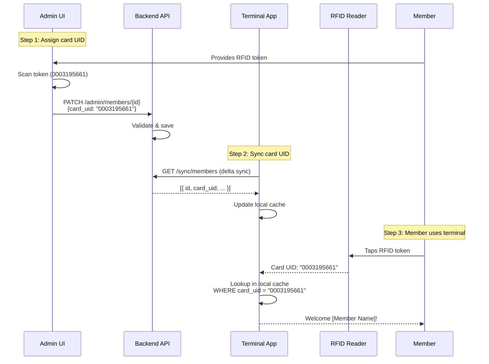
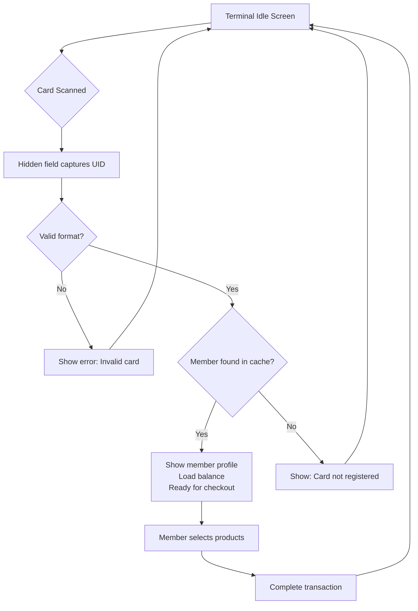

# RFID Token Member Identification - Design

**Date**: 2026-02-07
**Status**: Approved
**Author**: Claude Code (Brainstorming session)

---

## Overview

Enable members to identify themselves at the terminal using RFID/NFC tokens instead of manual selection.

**Current State**:
- ✅ Backend database already has `members.card_uid` field (VARCHAR(20), unique, nullable)
- ✅ Sync API already returns `card_uid` to terminal
- ✅ Terminal local database already caches `card_uid`
- ❌ Admin UI missing: no way to edit/assign card_uid to members
- ❌ Terminal missing: no RFID scanning logic or member lookup by card_uid

---

## Data Flow



---

## Component Changes

### 1. Admin UI - RFID Field Management

**Component**: `admin-frontend/src/pages/MembersPage.tsx`

#### 1.1 Card UID Input Field

Add to member create/edit form:

- **Field label**: i18n keys
  - `members.form.cardUid` → "Card UID" (EN) / "Karten-UID" (DE)
- **Input type**: Text field (numeric, uppercase hex)
- **Format**: 8-20 characters, hex digits (0-9, A-F)
- **Optional field** (nullable)
- **Validation**:
  - If provided, must match pattern: `/^[0-9A-F]{8,20}$/`
  - Backend enforces uniqueness constraint
  - Error message: `members.validation.invalidCardUid` → "Invalid card UID format" (EN) / "Ungültiges Karten-UID-Format" (DE)
- **Placeholder**: i18n `members.form.cardUidPlaceholder` → "e.g., 0003195661" (EN) / "z.B. 0003195661" (DE)

#### 1.2 Filter Pills for Card Assignment Status

Add filter pills next to existing "Active/Inactive" filter:

**FIX EXISTING FILTERS** - Add i18n for status filter:
- `members.filters.status.all` → "All" (EN) / "Alle" (DE)
- `members.filters.status.active` → "Active" (EN) / "Aktiv" (DE)
- `members.filters.status.inactive` → "Inactive" (EN) / "Inaktiv" (DE)

**NEW CARD FILTER** - Three states:
- `members.filters.card.all` → "All" (EN) / "Alle" (DE)
- `members.filters.card.withCard` → "With Card" (EN) / "Mit Karte" (DE)
- `members.filters.card.withoutCard` → "Without Card" (EN) / "Ohne Karte" (DE)

Filter parameter: `filters[has_card_uid]=true|false`

#### 1.3 Member List Table

Add new column:
- **Column header**: `members.table.cardUid` → "Card UID" (EN) / "Karten-UID" (DE)
- **Display**: Show card_uid value or "—" if null
- **Position**: After "Name" column, before "IBAN" column
- **Sortable**: Yes, by card_uid

#### 1.4 i18n Files to Update

- `admin-frontend/src/i18n/locales/en.json`
- `admin-frontend/src/i18n/locales/de.json`

**UI Pattern**:
```
┌─────────────────────────────────────────────────────┐
│ Members / Mitglieder                                │
├─────────────────────────────────────────────────────┤
│ Status: [Alle] [Aktiv] [Inaktiv]  ← FIX i18n       │
│ Karte:  [Alle] [Mit Karte] [Ohne Karte]  ← NEW     │
│ [Suchen: _____________]                             │
├─────────────────────────────────────────────────────┤
│ Name          Karten-UID    IBAN         Saldo     │
│ Max M.        0003195661    DE89...      12,50 €   │
│ Anna S.       —             DE12...      5,00 €    │
└─────────────────────────────────────────────────────┘
```

---

### 2. Terminal - RFID Scanning & Member Lookup

**Component**: `terminal-frontend/lib/` (Flutter/Dart)

#### 2.1 Hardware Setup

- **USB RFID reader** (keyboard emulation mode)
- Reader types UID when card is scanned (e.g., `0003195661`)
- Followed by Enter key (newline)

#### 2.2 Hidden RFID Input Field

Implementation:
- **Hidden text field** (opacity: 0, width: 0, height: 0)
- Auto-focuses on terminal start and after each transaction
- Listens for keyboard input from RFID reader
- On Enter key → trigger member lookup
- Clear field after lookup
- Re-focus field immediately to capture next scan
- User never sees this field - it's purely for capturing reader input

#### 2.3 Member Lookup Flow

```dart
Future<Member?> lookupMemberByCardUid(String cardUid) async {
  // Normalize input (uppercase, trim whitespace)
  final normalized = cardUid.trim().toUpperCase();

  // Validate format (8-20 hex chars)
  if (!RegExp(r'^[0-9A-F]{8,20}$').hasMatch(normalized)) {
    return null; // Invalid format
  }

  // Query local cache
  final member = await db.membersCache
    .select()
    .where((m) => m.cardUid.equals(normalized))
    .getSingleOrNull();

  return member;
}
```

#### 2.4 User Flow



#### 2.5 Error Messages (i18n)

- Invalid format: `terminal.errors.invalidCard` → "Invalid card" (EN) / "Ungültige Karte" (DE)
- Not registered: `terminal.errors.cardNotRegistered` → "Card not registered" (EN) / "Karte nicht registriert" (DE)

---

### 3. Backend - Card UID Filter Support

**Component**: `backend/src/Modules/Members/Controllers/AdminController.php` and `MembersRepository.php`

#### 3.1 New Filter Parameter

- Query param: `filters[has_card_uid]=true|false`
- Values:
  - `true` → Only members WITH card_uid (WHERE card_uid IS NOT NULL)
  - `false` → Only members WITHOUT card_uid (WHERE card_uid IS NULL)
  - Omitted → No filter (show all members)

#### 3.2 Repository Changes

**File**: `MembersRepository.php`

```php
// Add to getMembers() method
public function getMembers(
    int $limit,
    int $offset,
    ?bool $isActive = null,
    ?bool $hasCardUid = null,  // NEW parameter
    ?string $search = null,
    ?string $sortKey = 'created_at',
    string $sortOrder = 'DESC'
): array {
    $conditions = [];
    $params = [];

    // Existing filters...
    if ($isActive !== null) {
        $conditions[] = 'is_active = ?';
        $params[] = $isActive ? 1 : 0;
    }

    // NEW: Card UID filter
    if ($hasCardUid !== null) {
        if ($hasCardUid) {
            $conditions[] = 'card_uid IS NOT NULL';
        } else {
            $conditions[] = 'card_uid IS NULL';
        }
    }

    // ... rest of query logic
}
```

#### 3.3 Controller Changes

**File**: `AdminController.php`

```php
// In listMembers() method
$hasCardUid = null;
if (isset($filters['has_card_uid'])) {
    $hasCardUid = filter_var($filters['has_card_uid'], FILTER_VALIDATE_BOOLEAN);
}

$members = $this->repository->getMembers(
    limit: $perPage,
    offset: $offset,
    isActive: $isActive,
    hasCardUid: $hasCardUid,  // NEW
    search: $search,
    sortKey: $sortKey,
    sortOrder: $sortOrder
);
```

#### 3.4 Database

**No changes needed**:
- `card_uid` column already exists in `members` table
- Already indexed (UNIQUE constraint provides index)

---

## Implementation Order

1. **Backend first** - Add filter support (independent, easy to test)
2. **Admin UI** - Add form field, filters, table column (depends on backend)
3. **Terminal** - Add RFID scanning logic (depends on admin UI for assigning cards)

---

## Testing Strategy

### Backend (E2E API Tests)

Location: `e2etests/tests/api/members.spec.ts`

- `GET /admin/members?filters[has_card_uid]=true` → Returns only members with card_uid
- `GET /admin/members?filters[has_card_uid]=false` → Returns only members without card_uid
- `POST /admin/members` with card_uid → Creates member with card
- `PATCH /admin/members/{id}` with card_uid → Updates card_uid
- Validate card_uid uniqueness constraint

### Admin Frontend (E2E Playwright Tests)

Location: `e2etests/tests/admin/members.spec.ts`

- Create member with card_uid → Verify saved
- Edit member card_uid → Verify updated
- Filter "With Card" → Verify list shows only members with card_uid
- Filter "Without Card" → Verify list shows only members without card_uid
- Verify i18n switches correctly (EN/DE)

### Terminal (Unit + Integration Tests)

Location: `terminal-frontend/test/`

- Scan valid card → Member found and loaded
- Scan invalid format → Error shown
- Scan unregistered card → Error shown
- Hidden input field maintains focus

---

## Edge Cases

| Case | Behavior |
|------|----------|
| Card UID must be unique | Database constraint enforced; API returns 422 on duplicate |
| Null/empty card_uid is valid | Member can exist without card (optional field) |
| Card UID format validation | Must be 8-20 hex chars (0-9, A-F, uppercase) |
| Re-assigning card from one member to another | Uniqueness error - must clear from original member first |
| Card scanned but member inactive | Terminal should check `is_active` flag; reject if false |
| Card scanned but member lacks SEPA mandate | Terminal should check `is_sepa_valid`; reject if false |

---

## Summary of Changes

| Component | Changes |
|-----------|---------|
| **Backend** | Add `hasCardUid` filter parameter to `AdminController` and `MembersRepository` |
| **Admin Frontend** | 1. Add Card UID input field to member form<br/>2. Add "With Card / Without Card" filter pills<br/>3. Add Card UID column to member table<br/>4. Fix existing filter i18n (All/Active/Inactive)<br/>5. Add i18n strings (EN/DE) |
| **Terminal Frontend** | 1. Add hidden RFID input field<br/>2. Implement member lookup by card_uid<br/>3. Add error messages (i18n) |
| **Database** | ✅ No changes needed (card_uid already exists) |
| **Sync API** | ✅ Already syncs card_uid |

---

## Related ADRs

- [ADR-0015: Authentication and Authorization](../../adr/0015-authentication-and-authorization-strategy.md) - Terminal authentication
- [ADR-0020: SEPA Mandate Requirement for Terminal Access](../../adr/0020-sepa-mandate-requirement-terminal-access.md) - Member access rules

---

## Next Steps

1. Create implementation plan using `superpowers:writing-plans`
2. Set up git worktree for isolated development using `superpowers:using-git-worktrees`
3. Implement in order: Backend → Admin UI → Terminal
4. Follow TDD: Write tests first, then implementation
