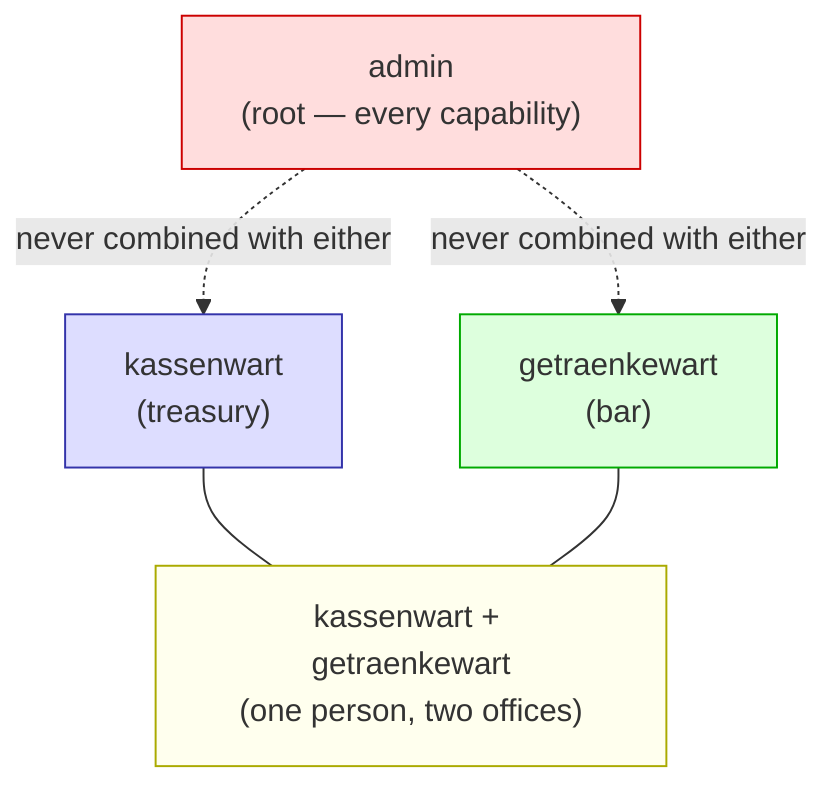
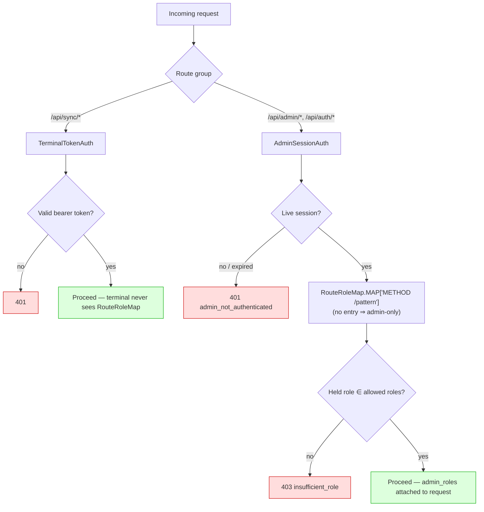
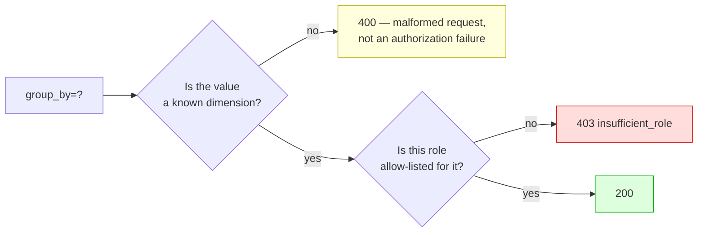
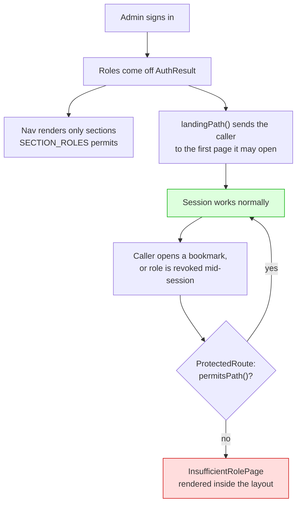
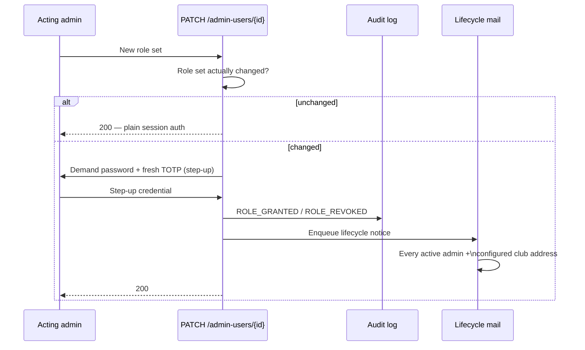

# Role-Based Admin Access

Who each admin account is *for*, how the backend enforces it on every request,
and how the panel reflects it. This page ties together the decision
([ADR-0044](../adr/0044-tiered-admin-roles.md)) and its two implementations
(`backend/patterns/pattern-015-authorization-access-control.md`,
`admin-frontend/patterns/role-visibility.md`) into one picture — read those
three for the full rationale and edge cases; this page is the map, not a
replacement for the territory.

---

## 1. The three roles

Every admin account holds either `admin` alone, or a non-empty combination of
the two lesser roles. There is no fourth combination and no "read-only" tier —
a role names an office, not a power level.

| Role | Office | Language | Holds the IBAN key? |
|---|---|---|:---:|
| `admin` | Whoever holds the server | English — not an elected office | ✅ |
| `kassenwart` | The elected treasurer: members, settlements, SEPA collection, storno | German — the word the club already uses | ✅ |
| `getraenkewart` | Whoever looks after the bar stock: drinks list, prices, availability | German, same reason | ❌ (cryptographically excluded) |

`admin` is the root of the ladder, not a further rung reachable by holding
both lesser roles — the two shapes are structurally distinct, not a spectrum.
No account can change its own role set, `admin` included: a role change is
always made by a *different* admin.

---

## 2. What each office can reach

`admin` reaches everything. The table below is what the two lesser roles gain
— see ADR-0044 §"Grant table" for the complete, endpoint-by-endpoint version.

| Area | `kassenwart` | `getraenkewart` |
|---|:---:|:---:|
| Dashboard, monthly statistics | ✅ | ❌ |
| Members — read, create, edit, collection-hold clear | ✅ | ❌ |
| Members — delete, anonymize, GDPR export | ❌ | ❌ |
| Transactions — list, export, storno | ✅ | ❌ |
| Settlements, incl. SEPA XML export | ✅ | ❌ |
| SEPA configuration — read | ✅ | ❌ |
| SEPA configuration — write | ❌ | ❌ |
| Categories, products, pricing | ❌ | ✅ |
| Product minimum legal age (`min_age`) | ❌ | ✅ ² |
| Jugendschutz violations — see and acknowledge | ✅ ³ | ❌ |
| Reports (revenue/consumption/transactions) | ✅ | ✅ ¹ |
| Admin users, terminals, encryption keys, mail config, audit log | ❌ | ❌ |

¹ `group_by=member` is withheld from `getraenkewart` — see §4.

³ Deliberately `TREASURY` rather than `admin`-only
([#622](https://github.com/dgloeckner/clubbar/issues/622)). The violation itself
is a `jugendschutz_violation` audit entry, and the audit log is `admin`-only —
which was precisely the gap: [ADR-0045](../adr/0045-age-restricted-products.md)
names the **Kassenwart** as the recipient, and before this they could not learn a
violation had happened at all. The dashboard alert and its acknowledge action are
the surface that reaches them.

It carries the drink's required age and the transaction id and **no member**,
because it renders on a screen that may be open in the clubroom (rule 6). The
transaction id resolves in the journal, which their role already permits. The
Getränkewart is excluded here as everywhere else: they set the number on the
product and learn nothing about who bought it (invariant 5).

² The Getränkewart sets, corrects and clears a drink's minimum legal age
([ADR-0045](../adr/0045-age-restricted-products.md)). It is an attribute of the
product, so it needs no new grant and no new route — the existing
`PATCH /api/admin/products/{id}` carries it. **This gains them no member data.**
The half of the Jugendschutz rule that concerns a person — the birth date, and
whether any particular member is old enough — lives entirely on `members`, which
still answers them 403. The stock keeper says what the drink requires; who may
have it is decided at the terminal, and who breached it is read from the audit
log by an `admin`.

Nothing here is reachable by holding a lesser role a second way: the account
either has the office or it doesn't. Areas with no ✅ at all in a row (member
deletion, SEPA config writes, admin users, …) are `admin`-only regardless of
what else the account holds.

---

## 2a. What each office is *mailed*

Access is not only what a session can open. Operational mail is a second
surface, and it is the one an office does not have to log in to receive — so it
follows the same table rather than a looser one of its own
([#633](https://github.com/dgloeckner/clubbar/issues/633)).

| Kind | `admin` | `kassenwart` | `getraenkewart` |
|---|:---:|:---:|:---:|
| Encryption key registered / activated / revoked, key expiry | ✅ | ❌ | ❌ |
| Terminal token issued, token expiry, terminal anomaly | ✅ | ❌ | ❌ |
| Admin account created, admin roles changed | ✅ ⁴ | ❌ | ❌ |
| Admin login address changed | the former address only | — | — |
| Jugendschutz violation | ✅ ⁴ | ✅ | ❌ |
| SEPA pre-notification, cancellation notice, Deckelauszug | — addressed to the member — | | |

⁴ Plus the configured club address, which belongs to no account
([ADR-0044](../adr/0044-tiered-admin-roles.md) rule 3).

The rule generating this table is **mirror the grant on the surface the mail
points at**. Keys, terminals and admin accounts are `admin`-only routes in §2,
so their mail is `admin`-only — including for the Kassenwart, to whom a key
fingerprint is as foreign as it is to the stock keeper. The Jugendschutz notice
is the one kind whose surface is not `admin`-only: its dashboard alert is
`TREASURY` because ADR-0045 names the Kassenwart as its recipient, so the mail
carries that same set. One source of truth, not two.

It lives in the code as `MailKind::recipientRoles()`, next to
`addressesMember()` and `addressesClub()` — a `match` with no default, so a
kind added later fails to compile until somebody answers the question for it.

**An unstaffed office does not silently swallow a warning.** If no active
account holds the office a kind is for, the notice goes to the club address
instead; with no club address configured, nothing is queued and a `WARNING` is
logged naming the kind and the offices it was for. It is deliberately *not*
"fall back to every active admin" — that is the leak this closes, arriving
exactly when the installation is least able to notice. Getting there takes a
hand-edited database: the last `admin` can be neither demoted nor deactivated.

One thing is deliberately **not** filtered: the display name in a message's
greeting. `TerminalAnomalyMailBuilder` and `JugendschutzViolationMailBuilder`
resolve it from the unfiltered account list, because the outbox row already
names who it was written to — and a filtered lookup would blank the greeting
for an account whose roles moved after the row was queued.

---

## 3. How a request is authorized

Two independent axes decide whether a request succeeds: **which credential**
made it, and — for admin sessions only — **which office** the account holds.

`RouteRoleMap` (`backend/src/Modules/Auth/Domain/RouteRoleMap.php`) is one
declarative `"METHOD /pattern" → roles` table, consulted by `AdminSessionAuth`
— never per-controller checks. That is what makes the model **fail closed**:
a route nobody classified is `admin`-only rather than silently open, and a
completeness test fails the build the day a new route is added without an
entry.

401 is always checked before 403 — telling an anonymous caller which roles a
route needs would be free reconnaissance.

---

## 4. The one boundary that isn't a route

`GET /api/admin/reports/{reportType}` is shared by all three offices, but its
`group_by` query parameter can turn an aggregate report into a list of named
members and what they personally drink. The route can't express that, so
`ReportGroupByPolicy` does — as an **allow-list**, not a deny-list:

An allow-list means a new `group_by` dimension is refused for everyone until
a human explicitly classifies it — the mistake a deny-list makes is silent:
the new dimension is visible from the moment it merges, and nobody is
reminded to add it to a list of forbidden values.

---

## 5. The panel: hide the doors, never rely on it

`admin-frontend/src/utils/adminRoles.ts` keeps a second, smaller table
(`SECTION_ROLES`) mapping SPA sections to roles. It is **not** enforcement —
the server refuses independently on every request, and would keep refusing if
this file were deleted entirely. It exists so the panel doesn't show a door
that answers 403 behind it.

Two properties keep this honest:

- **Default-deny, mirrored from the server.** A section with no entry is
  `admin`-only. `adminRoles.test.ts` reads the nav components' own source and
  fails the build on any `path:` missing from `SECTION_ROLES` — a page can't
  ship visible-but-unclassified.
- **The refusal screen exists regardless of the nav.** Hidden navigation
  stops a role from *finding* a door; it does nothing about a stale tab, a
  bookmark, or a role revoked while the session is open. `permitsPath()` is
  what actually answers each of those, every time.

---

## 6. Granting a role

Promoting an account is minting authority, so it is treated like issuing a
credential rather than like an ordinary edit.

The club-level mail address matters because a single-admin installation
promoting itself would otherwise be a message from the actor, to the actor,
about a thing they just did — silent in exactly the case that needs it loudest.
That address can only be changed under `PATCH /mail-config`, which is
`admin`-only — a compromised `kassenwart` cannot redirect the alert that would
report their own promotion.

Only `admin` may grant or revoke roles, including to a peer; no account can
change its own role set.

---

## 7. Testing this model

| Claim | Where |
|---|---|
| The route→roles map's own logic | `backend/tests/Unit/Modules/Auth/Domain/RouteRoleMapTest.php` |
| Every registered route is classified, none stale | `backend/tests/Feature/Modules/Auth/RouteRoleMapCompletenessTest.php` |
| The refusal happens through the real stack, in order | `backend/tests/Feature/Modules/Auth/RoleEnforcementHttpTest.php` |
| The `group_by` allow-list | `backend/tests/Unit/Modules/Reports/Domain/ReportGroupByPolicyTest.php` |
| The whole grant table, as data, over HTTP, per office | `e2etests/tests/api/role-access-matrix.spec.ts` |
| Each office's actual job, run to completion | `e2etests/tests/api/role-flows.spec.ts` |
| The panel hides what it cannot reach, names the refusal | `e2etests/tests/admin/role-navigation.spec.ts` |
| Which offices each mail kind is for | `backend/tests/Unit/Modules/Notifications/Enums/MailKindTest.php` |
| The fan-out narrows to those offices, and the unstaffed case | `backend/tests/Unit/Modules/Notifications/Services/AdminNotifierTest.php`, `backend/tests/Feature/Modules/Notifications/AdminNoticeRolesTest.php` |
| A Getränkewart's mailbox stays empty through a real drain | `e2etests/tests/mail-roles/office-mail.spec.ts` |
| The frontend table's own completeness | `admin-frontend/src/utils/adminRoles.test.ts` |

---

## See also

- [ADR-0044](../adr/0044-tiered-admin-roles.md) — the decision, its threat
  model, and the alternatives rejected
- [ADR-0015](../adr/0015-authentication-and-authorization-strategy.md) — the
  authentication layer this builds on
- `backend/patterns/pattern-015-authorization-access-control.md` — the
  backend implementation pattern, with the full authorization matrix
- `admin-frontend/patterns/role-visibility.md` — the frontend implementation
  pattern
- `CONTEXT.md` — glossary entries for **Role**, `admin`, `Kassenwart`,
  `Getränkewart`
