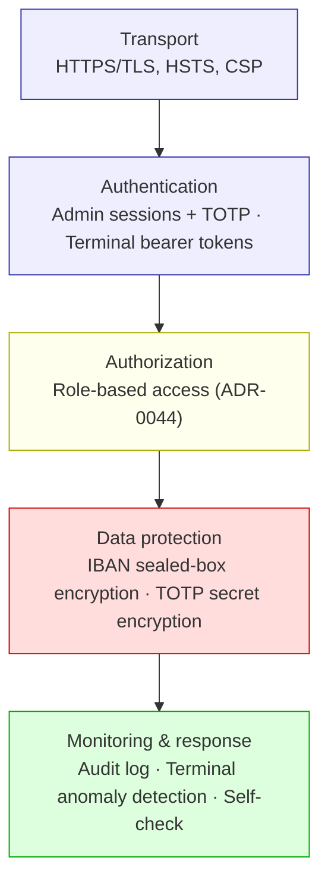
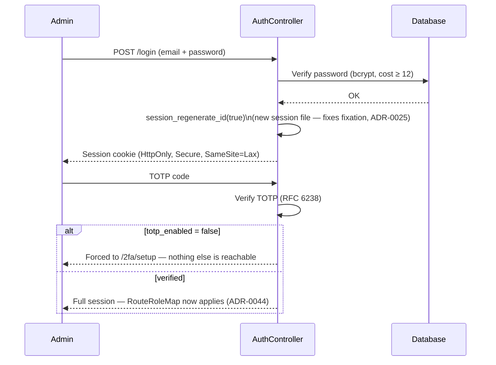
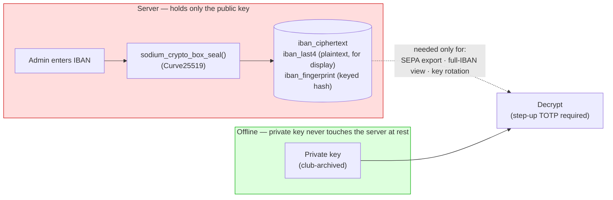
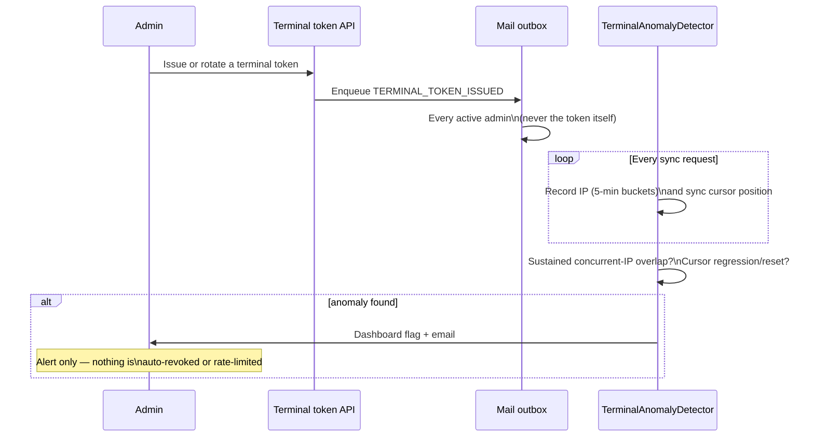

# Security Concept

How Club Bar protects member data and club funds, end to end. This page is
the map across the ADRs and backend patterns that each own one layer in
detail — it doesn't restate their reasoning or alternatives-considered
sections, it shows how the layers compose and points into the ADR for the
"why". Where this page and an ADR ever disagree, the ADR is correct.

---

## 1. Defense in depth, at a glance

No single layer is trusted to carry the whole system. A failure in one is
expected to be caught, or at least contained, by the next.

| Layer | Answers | Owning ADRs |
|---|---|---|
| Transport | Can traffic be read or tampered with in flight? | [ADR-0016](../adr/0016-transport-security.md), [ADR-0031](../adr/0031-production-hardening-on-shared-hosting.md) |
| Authentication | Is the caller who they claim to be? | [ADR-0015](../adr/0015-authentication-and-authorization-strategy.md), [ADR-0025](../adr/0025-session-fixation-protection.md), [ADR-0026](../adr/0026-mandatory-totp-two-factor-authentication.md) |
| Authorization | May this caller do this, specifically? | [ADR-0044](../adr/0044-tiered-admin-roles.md) — see [Role-Based Admin Access](./role-based-access.md) |
| Data protection | If the database is stolen, what does the thief actually get? | [ADR-0036](../adr/0036-iban-encryption-sealed-box.md), [ADR-0038 (crypto)](../adr/0038-shared-symmetric-crypto-abstraction.md) |
| Monitoring & response | If something goes wrong anyway, does anyone find out? | [ADR-0013](../adr/0013-audit-logging.md), [ADR-0041](../adr/0041-terminal-credential-anomaly-detection.md), [ADR-0043](../adr/0043-terminal-credential-issuance-is-announced.md) |

---

## 2. Transport & baseline hardening

Club Bar targets ordinary shared hosting, where `.htaccess` directives can be
silently ignored by the host and nobody is notified ([#383](https://github.com/dgloeckner/clubbar/issues/383)
was exactly that). So hardening lives in application code wherever PHP allows
it, and everything else is *measured*, not assumed — see §9.

| Control | Requirement |
|---|---|
| HTTPS | Mandatory everywhere; no HTTP fallback. TLS ≥ 1.2, 1.3 preferred |
| HSTS | `max-age=31536000; includeSubDomains` |
| Content-Security-Policy | `default-src 'self'`, no `'unsafe-eval'`, `frame-ancestors 'none'` |
| Cookies | `Secure`, `HttpOnly`, `SameSite=Lax` |
| `X-Content-Type-Options` | `nosniff` — stops an uploaded document being MIME-sniffed and executed as script in the panel's own origin |
| Config & secrets | `config.php`, logs relocated outside the document root wherever the host allows; `config.php` targets mode `0600` |

---

## 3. Authentication

Two separate mechanisms, deliberately not unified — a terminal is an
unattended kiosk device, an admin is a person, and RFID is a member
*identifier*, not a credential: card UIDs aren't secret and are trivially
cloneable, so a card alone never authenticates anything.

### Admin panel — session + mandatory TOTP

- 2FA is **mandatory**, not optional — an account with `totp_enabled=false`
  can reach nothing but its own enrollment endpoints.
- Idle timeout 2h, absolute session lifetime 24h.
- Password, email, or 2FA changes require **step-up** (current password +
  fresh TOTP code) and end every *other* session on the account —
  `credentials_changed_at` compared against each session's own timestamp, no
  session store to enumerate. When the email address changes, the *old*
  address is notified out-of-band — the one channel a hijacker who already
  has the new address can't suppress.
- No self-disable of 2FA and no recovery codes — recovery is admin-to-admin
  (Settings → Admin Users → Reset 2FA), which is why the README and
  [Admin Lockout Runbook](./runbook-admin-lockout.md) both say: keep at least
  two admin accounts.
- Login is rate-limited at 5 failed attempts / IP / 15 min (429 +
  `Retry-After`). Deliberately **not** per-account — an account-lockout rule
  is itself an account-enumeration and denial-of-service vector against a
  small admin team.

### Terminals — bearer tokens

- A 256-bit token (`random_bytes()`), shown once at issuance, stored only as
  its SHA-256 hash.
- TTL 365 days, rotated with **overlap**: a new token is staged `PENDING`
  alongside the still-`ACTIVE` one, and the terminal's first successful
  request on the new token promotes it — there is no outage window during
  rotation.
- Compared with `hash_equals()` (constant-time) to avoid a timing side
  channel.
- **Network isolation** — the terminal and the optional token dispenser
  communicate over local WiFi only; no internet access is required after
  initial setup.
- **Physical security is out of scope for software** — RFID cards are member
  *identifiers*, not credentials (see above), so an unattended, unlocked
  terminal allows a transaction on any tapped card. Keep it in a supervised
  area.

---

## 4. Authorization

`admin`, `Kassenwart`, and `Getränkewart` accounts each reach only the
routes their office needs, enforced by a default-deny, fail-closed check on
every request — a route nobody explicitly classified is `admin`-only, never
silently open.

This has its own page with diagrams for the request flow, the panel's nav
visibility, and the role-granting flow:
**[Role-Based Admin Access](./role-based-access.md)** ([ADR-0044](../adr/0044-tiered-admin-roles.md)).

---

## 5. Data protection at rest

**The question this layer answers: if the database (or a backup, or the
webspace) is stolen outright, what does the thief actually get?**

- No plaintext IBAN column exists anywhere in the schema. The server can
  *encrypt* member-entered IBANs but structurally **cannot decrypt** them —
  it never holds the private key at rest.
- The private key is supplied only transiently, behind a step-up TOTP
  challenge, for the three operations that genuinely need a readable IBAN:
  SEPA export, an exceptional full-IBAN view, and key rotation.
- Keys have a 365-day cryptoperiod with staged warnings (INFO ≤90d, WARNING
  ≤30d, CRITICAL ≤7d) delivered by email, not just a dashboard badge nobody
  is looking at.
- TOTP secrets get the same treatment at a smaller scale: authenticated
  encryption via libsodium `crypto_secretbox` ([ADR-0038, crypto](../adr/0038-shared-symmetric-crypto-abstraction.md)).
- **What this does not do:** it doesn't hide an IBAN from a `Kassenwart`,
  who holds a key copy because SEPA collection requires one. That's the
  office doing its job, not a gap — see ADR-0044 §"Consequences" for why
  that boundary is drawn by role, not by cryptography, for that one role.

---

## 6. Credential lifecycle & anomaly detection

Minting a terminal credential and noticing it might be misused are two
different problems, solved with two different postures. Both alert by email
through the same durable queue — see
[Notifications & the Mail Outbox](./notifications-and-mail.md) for how
delivery is made reliable on shared hosting.

- **Issuance is announced, never gated further** ([ADR-0043](../adr/0043-terminal-credential-issuance-is-announced.md)):
  every mint or rotation emails every active `admin` account (the office that
  can open the terminal screen — [#633](https://github.com/dgloeckner/clubbar/issues/633)).
  Four-eyes approval on
  minting was rejected — it would make issuing a credential *harder* than
  revoking one, and recovery must never be harder than compromise.
- **Anomaly detection alerts, it never enforces** ([ADR-0041](../adr/0041-terminal-credential-anomaly-detection.md)):
  a false positive costs the bar its ability to sell, so a human always
  makes the call. It watches for *sustained* concurrent IP overlap (not
  ordinary DHCP/CGNAT churn) and for a sync cursor that regresses — the
  signature of two clients sharing one stolen token.
- Neither mechanism authenticates the *device* — a token copied to a second
  machine and used at different times, against unchanging club data, is
  invisible to both. That's a known, accepted gap (device-bound credentials
  are future work), not an oversight.

---

## 7. Audit logging

| | |
|---|---|
| What's recorded | Actor, action, entity, before/after values, IP, user-agent, timestamp |
| Scope | Master data — members, products, admin users, terminals, settlements, SEPA config, exports, role grants/revokes. Transactions are self-auditing (append-only, ADR-0004) except `storno` and `price_divergence`, which are explicitly logged |
| Masking | IBAN → `DE89****...****4567`; passwords → `[CHANGED]`; API tokens are never logged at all |
| Cross-entity references | An entry keyed to a different entity may name a member by **id only** — never by name or IBAN, since GDPR erasure can't reach inside another row's JSON payload |
| Mutability | Append-only, with one exception: GDPR anonymization scrubs `old_values`/`new_values` for entries keyed to the erased member — the fact that something happened survives, the personal data in it doesn't |
| Retention | 10 years, aligned with §147 AO |

Details: [ADR-0013](../adr/0013-audit-logging.md), `backend/patterns/pattern-016-audit-logging.md`.

---

## 8. Privacy & retention (GDPR)

Erasure deletes **the person**, not the accounting record it produced. Two
tiers:

- **Operational tier** — email, phone, RFID UID, credentials, address —
  deleted outright on erasure.
- **Retention tier** — per-transaction records, settlements, IBAN, mandate
  reference (the accounting *Beleg*) — restricted (unsearchable, unexported,
  unsynced) until the legal retention period expires (last-transaction year
  + 10 years under §147 AO), then deleted via a written annual procedure.

See [ADR-0029](../adr/0029-two-tier-retention-and-erasure.md),
`docs/retention-deletion-procedure.md`, and
`docs/legal-requirements-and-how-we-meet-them.md` for the full legal mapping
(DSGVO Art. 6/13/17, AO §§ 146/147).

---

## 9. Continuous verification — the built-in self-check

Because a shared host can silently stop honoring a hardening measure after a
green install, `SecuritySelfCheck` doesn't trust configuration intent — it
*measures* live state (via `ini_get()` and, where relevant, a real HTTP
probe) and reports PASS/WARN/FAIL/UNKNOWN for each:

| Category | Examples |
|---|---|
| Runtime | `display_errors` off, `zend.exception_ignore_args` on (stops a DB password leaking via a stack trace) |
| Session | `session.use_strict_mode` on, cookies `HttpOnly`/`Secure`/`SameSite` |
| Data | `config.php` and storage outside the document root, correct file modes, no leftover mandate scans on disk |
| Exposure | Logs and sensitive files genuinely unreachable over HTTP (live canary probe, not just a path assumption) |
| Transport | Request actually arrived over HTTPS, HSTS actually present |

Available under Settings → Security Check in the admin panel, and run again
at install time and in CI. See [ADR-0031](../adr/0031-production-hardening-on-shared-hosting.md).

---

## 10. Operator checklist

- Keep **at least two** admin accounts, both with 2FA enrolled — recovery is
  admin-to-admin; a single admin who loses their authenticator has no
  in-app path back in ([runbook](./runbook-admin-lockout.md)).
- Store the TOTP **backup key** shown during enrollment in a password
  manager — there are no recovery codes.
- Keep the IBAN encryption **private key** offline and archived by the club;
  it is only ever supplied transiently, behind step-up, for export/view/
  rotation.
- Serve the panel and API over HTTPS in production — see the
  [Deployment Guide](./deployment.md).
- Run the built-in security check after every deployment, not just once.

### Recommended authenticator apps

| App | Platform | Notes |
|-----|----------|-------|
| [Aegis](https://getaegis.app/) | Android | Open source, encrypted local backups |
| [Raivo OTP](https://raivo-otp.com/) | iOS | Open source, iCloud backup |
| [Google Authenticator](https://support.google.com/accounts/answer/1066447) | Android & iOS | Simple, widely used |
| [Authy](https://authy.com/) | Android & iOS | Multi-device sync |

---

## See also

- [ADR-0015](../adr/0015-authentication-and-authorization-strategy.md) — Authentication and Authorization Strategy
- [ADR-0016](../adr/0016-transport-security.md) — Transport Security
- [ADR-0025](../adr/0025-session-fixation-protection.md) — Session Fixation Protection
- [ADR-0026](../adr/0026-mandatory-totp-two-factor-authentication.md) — Mandatory TOTP 2FA
- [ADR-0029](../adr/0029-two-tier-retention-and-erasure.md) — Two-Tier Retention and Erasure
- [ADR-0031](../adr/0031-production-hardening-on-shared-hosting.md) — Production Hardening on Shared Hosting
- [ADR-0036](../adr/0036-iban-encryption-sealed-box.md) — IBAN Encryption at Rest
- [ADR-0038 (crypto)](../adr/0038-shared-symmetric-crypto-abstraction.md) — Shared Symmetric Crypto Abstraction
- [ADR-0041](../adr/0041-terminal-credential-anomaly-detection.md) — Terminal Credential Anomaly Detection
- [ADR-0043](../adr/0043-terminal-credential-issuance-is-announced.md) — Terminal Credential Issuance Is Announced
- [ADR-0044](../adr/0044-tiered-admin-roles.md) — Tiered Admin Roles
- [Role-Based Admin Access](./role-based-access.md) — the authorization layer, in detail
- [Notifications & the Mail Outbox](./notifications-and-mail.md) — how security alerts are delivered reliably
- [Admin Lockout Runbook](./runbook-admin-lockout.md)
- `backend/patterns/pattern-012-terminal-api-token-authentication.md`
- `backend/patterns/pattern-013-admin-session-authentication.md`
- `backend/patterns/pattern-015-authorization-access-control.md`
- `backend/patterns/pattern-016-audit-logging.md`
