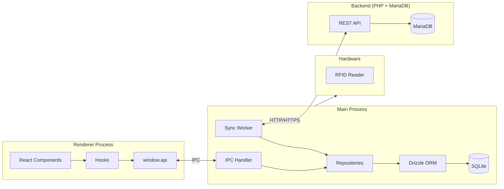
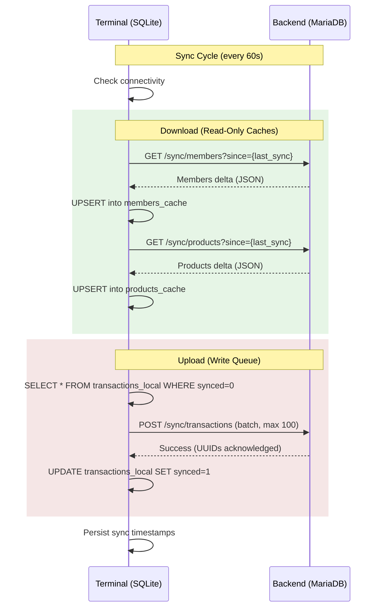

# Terminal – Frontend Technology Stack and Architecture

This is the terminal frontend where users buy products; used on a touch screen.

## Technologies

| Layer | Technology | Responsibility |
|-------|------------|----------------|
| **Runtime** | Electron | Desktop app, hardware access (RFID), filesystem |
| **UI Framework** | React | Components, state, rendering |
| **Language** | TypeScript | End-to-end type safety |
| **Styling** | CSS-in-JS (inline styles) | Custom design system, touch-optimized dark theme |
| **Database** | SQLite + better-sqlite3 | Local persistence, offline-capable |
| **ORM** | Drizzle ORM | Schema, types, queries |
| **IPC** | Electron contextBridge | Secure communication Main ↔ Renderer |
| **Build** | Vite + electron-builder | Fast dev, packaging |

---

## Architecture Layers

| Layer | Responsibility |
|-------|----------------|
| **Schema** | Single source of truth for tables + types |
| **Repository** | Encapsulated DB queries |
| **IPC Handler** | API endpoints for Renderer |
| **Preload** | Expose typed API |
| **Hooks** | React state + data fetching |
| **Components** | UI |

---

## Architecture Diagram

---

## Synchronization Flow

